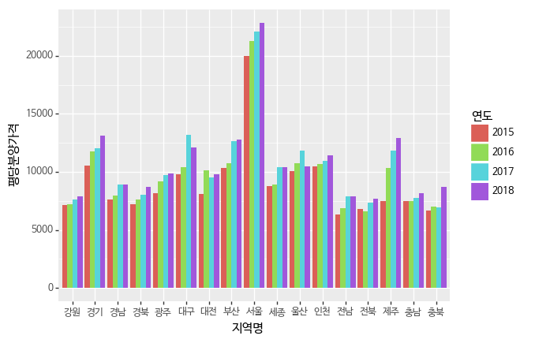
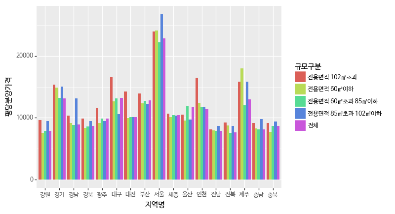

```python
import pandas as pd
```


```python
import numpy as np
import re
from plotnine import *
```


```python
%cd open-data-apt
```

    C:\Users\lunar\dataitgirls\open-data-apt
    


```python
pre_sale = pd.read_csv('data/apt_2018.06.csv', encoding = 'euc-kr')
pre_sale.shape
```


    (2805, 5)


```python
pre_sale.head()
```


<div>
<style scoped>
    .dataframe tbody tr th:only-of-type {
        vertical-align: middle;
    }

    .dataframe tbody tr th {
        vertical-align: top;
    }

    .dataframe thead th {
        text-align: right;
    }
</style>
<table border="1" class="dataframe">
  <thead>
    <tr style="text-align: right;">
      <th></th>
      <th>지역명</th>
      <th>규모구분</th>
      <th>연도</th>
      <th>월</th>
      <th>분양가격(㎡)</th>
    </tr>
  </thead>
  <tbody>
    <tr>
      <th>0</th>
      <td>서울</td>
      <td>전체</td>
      <td>2015</td>
      <td>10</td>
      <td>5841</td>
    </tr>
    <tr>
      <th>1</th>
      <td>서울</td>
      <td>전용면적 60㎡이하</td>
      <td>2015</td>
      <td>10</td>
      <td>5652</td>
    </tr>
    <tr>
      <th>2</th>
      <td>서울</td>
      <td>전용면적 60㎡초과 85㎡이하</td>
      <td>2015</td>
      <td>10</td>
      <td>5882</td>
    </tr>
    <tr>
      <th>3</th>
      <td>서울</td>
      <td>전용면적 85㎡초과 102㎡이하</td>
      <td>2015</td>
      <td>10</td>
      <td>5721</td>
    </tr>
    <tr>
      <th>4</th>
      <td>서울</td>
      <td>전용면적 102㎡초과</td>
      <td>2015</td>
      <td>10</td>
      <td>5879</td>
    </tr>
  </tbody>
</table>
</div>


```python
pre_sale.tail()
```


<div>
<style scoped>
    .dataframe tbody tr th:only-of-type {
        vertical-align: middle;
    }

    .dataframe tbody tr th {
        vertical-align: top;
    }

    .dataframe thead th {
        text-align: right;
    }
</style>
<table border="1" class="dataframe">
  <thead>
    <tr style="text-align: right;">
      <th></th>
      <th>지역명</th>
      <th>규모구분</th>
      <th>연도</th>
      <th>월</th>
      <th>분양가격(㎡)</th>
    </tr>
  </thead>
  <tbody>
    <tr>
      <th>2800</th>
      <td>제주</td>
      <td>전체</td>
      <td>2018</td>
      <td>6</td>
      <td>3925</td>
    </tr>
    <tr>
      <th>2801</th>
      <td>제주</td>
      <td>전용면적 60㎡이하</td>
      <td>2018</td>
      <td>6</td>
      <td>5462</td>
    </tr>
    <tr>
      <th>2802</th>
      <td>제주</td>
      <td>전용면적 60㎡초과 85㎡이하</td>
      <td>2018</td>
      <td>6</td>
      <td>3639</td>
    </tr>
    <tr>
      <th>2803</th>
      <td>제주</td>
      <td>전용면적 85㎡초과 102㎡이하</td>
      <td>2018</td>
      <td>6</td>
      <td>NaN</td>
    </tr>
    <tr>
      <th>2804</th>
      <td>제주</td>
      <td>전용면적 102㎡초과</td>
      <td>2018</td>
      <td>6</td>
      <td>3029</td>
    </tr>
  </tbody>
</table>
</div>


```python
pre_sale.info()

# 분양가격이 숫자 타입이 아닙니다. 숫자 타입으로 변경해줄 필요가 있다. 
```

    <class 'pandas.core.frame.DataFrame'>
    RangeIndex: 2805 entries, 0 to 2804
    Data columns (total 5 columns):
    지역명        2805 non-null object
    규모구분       2805 non-null object
    연도         2805 non-null int64
    월          2805 non-null int64
    분양가격(㎡)    2674 non-null object
    dtypes: int64(2), object(3)
    memory usage: 109.6+ KB
    


```python
pre_sale_price = pre_sale['분양가격(㎡)']
type(pre_sale['분양가격(㎡)'])
```


    pandas.core.series.Series


```python
# 연도와 월은 카테고리 형태의 데이터이기 때문에 스트링 형태로 변경 
pre_sale['연도'] = pre_sale['연도'].astype(str)
pre_sale['월']= pre_sale['월'].astype(str)
```


```python
#분양가격의 타입을 숫자로 변경해 줍니다.
# to_ numeric : Convert argument to a numeric type.
# 요소에는 list, tuple, 1-d array, series
# errors : error 처리 방법이다. raise라면 예외처리되고,\
#coerce면 NaN값으로 처리되고, ignore라면 input값을 내놓는다. 
# 여기서 pre_sale_price는 pandas.core.series.Series임. 
# 분양가격 칼럼을 새로만들자. 
pre_sale['분양가격'] = pd.to_numeric(pre_sale_price, errors = 'coerce')
# 평당 분양가격을 구할 수 있음.
# series에 3.3을 곱하면 각 행에 3.3이 곱해지나봄. 
pre_sale['평당분양가격'] = pre_sale['분양가격'] * 3.3

```


```python
pre_sale.info()
```

    <class 'pandas.core.frame.DataFrame'>
    RangeIndex: 2805 entries, 0 to 2804
    Data columns (total 7 columns):
    지역명        2805 non-null object
    규모구분       2805 non-null object
    연도         2805 non-null object
    월          2805 non-null object
    분양가격(㎡)    2674 non-null object
    분양가격       2582 non-null float64
    평당분양가격     2582 non-null float64
    dtypes: float64(2), object(5)
    memory usage: 153.5+ KB
    


```python
# 결측치 구하기.

pre_sale.isnull().sum()
# 결측치가 많다. 
```


    지역명          0
    규모구분         0
    연도           0
    월            0
    분양가격(㎡)    131
    분양가격       223
    평당분양가격     223
    dtype: int64


```python
pre_sale.describe()
```


<div>
<style scoped>
    .dataframe tbody tr th:only-of-type {
        vertical-align: middle;
    }

    .dataframe tbody tr th {
        vertical-align: top;
    }

    .dataframe thead th {
        text-align: right;
    }
</style>
<table border="1" class="dataframe">
  <thead>
    <tr style="text-align: right;">
      <th></th>
      <th>분양가격</th>
      <th>평당분양가격</th>
    </tr>
  </thead>
  <tbody>
    <tr>
      <th>count</th>
      <td>2582.000000</td>
      <td>2582.000000</td>
    </tr>
    <tr>
      <th>mean</th>
      <td>3056.522851</td>
      <td>10086.525407</td>
    </tr>
    <tr>
      <th>std</th>
      <td>1110.111932</td>
      <td>3663.369377</td>
    </tr>
    <tr>
      <th>min</th>
      <td>1868.000000</td>
      <td>6164.400000</td>
    </tr>
    <tr>
      <th>25%</th>
      <td>2339.000000</td>
      <td>7718.700000</td>
    </tr>
    <tr>
      <th>50%</th>
      <td>2738.500000</td>
      <td>9037.050000</td>
    </tr>
    <tr>
      <th>75%</th>
      <td>3289.000000</td>
      <td>10853.700000</td>
    </tr>
    <tr>
      <th>max</th>
      <td>8098.000000</td>
      <td>26723.400000</td>
    </tr>
  </tbody>
</table>
</div>


```python
pre_sale_2017 = pre_sale.loc[pre_sale['연도'] == 2017]
pre_sale_2017.shape
```


    (0, 7)


```python
pre_sale['규모구분'].value_counts()
# 값은 값을 갖고 있는 걸로 시도별로 동일하게 데이터가 들어 있는 것을 확인할 수 있다. 
```


    전체                   561
    전용면적 102㎡초과          561
    전용면적 85㎡초과 102㎡이하    561
    전용면적 60㎡초과 85㎡이하     561
    전용면적 60㎡이하           561
    Name: 규모구분, dtype: int64


# 전국평균 분양가격


```python
# {:,.0f} 십진수 같은것,,? 
# options.display.float_format : float_format으로 만들어라. 
pd.options.display.float_format = '{:,.0f}'.format
pre_sale.groupby(pre_sale.연도).describe().T
# T :표 가로세로 뒤집기. 
```


<div>
<style scoped>
    .dataframe tbody tr th:only-of-type {
        vertical-align: middle;
    }

    .dataframe tbody tr th {
        vertical-align: top;
    }

    .dataframe thead th {
        text-align: right;
    }
</style>
<table border="1" class="dataframe">
  <thead>
    <tr style="text-align: right;">
      <th></th>
      <th>연도</th>
      <th>2015</th>
      <th>2016</th>
      <th>2017</th>
      <th>2018</th>
    </tr>
  </thead>
  <tbody>
    <tr>
      <th rowspan="8" valign="top">분양가격</th>
      <th>count</th>
      <td>243</td>
      <td>984</td>
      <td>899</td>
      <td>456</td>
    </tr>
    <tr>
      <th>mean</th>
      <td>2,789</td>
      <td>2,934</td>
      <td>3,140</td>
      <td>3,299</td>
    </tr>
    <tr>
      <th>std</th>
      <td>977</td>
      <td>1,071</td>
      <td>1,108</td>
      <td>1,199</td>
    </tr>
    <tr>
      <th>min</th>
      <td>1,868</td>
      <td>1,900</td>
      <td>1,976</td>
      <td>2,076</td>
    </tr>
    <tr>
      <th>25%</th>
      <td>2,225</td>
      <td>2,282</td>
      <td>2,365</td>
      <td>2,470</td>
    </tr>
    <tr>
      <th>50%</th>
      <td>2,516</td>
      <td>2,672</td>
      <td>2,849</td>
      <td>2,912</td>
    </tr>
    <tr>
      <th>75%</th>
      <td>3,026</td>
      <td>3,148</td>
      <td>3,456</td>
      <td>3,647</td>
    </tr>
    <tr>
      <th>max</th>
      <td>7,092</td>
      <td>8,096</td>
      <td>7,887</td>
      <td>8,098</td>
    </tr>
    <tr>
      <th rowspan="8" valign="top">평당분양가격</th>
      <th>count</th>
      <td>243</td>
      <td>984</td>
      <td>899</td>
      <td>456</td>
    </tr>
    <tr>
      <th>mean</th>
      <td>9,203</td>
      <td>9,683</td>
      <td>10,360</td>
      <td>10,888</td>
    </tr>
    <tr>
      <th>std</th>
      <td>3,224</td>
      <td>3,536</td>
      <td>3,655</td>
      <td>3,958</td>
    </tr>
    <tr>
      <th>min</th>
      <td>6,164</td>
      <td>6,270</td>
      <td>6,521</td>
      <td>6,851</td>
    </tr>
    <tr>
      <th>25%</th>
      <td>7,342</td>
      <td>7,531</td>
      <td>7,804</td>
      <td>8,153</td>
    </tr>
    <tr>
      <th>50%</th>
      <td>8,303</td>
      <td>8,818</td>
      <td>9,402</td>
      <td>9,611</td>
    </tr>
    <tr>
      <th>75%</th>
      <td>9,984</td>
      <td>10,390</td>
      <td>11,405</td>
      <td>12,036</td>
    </tr>
    <tr>
      <th>max</th>
      <td>23,404</td>
      <td>26,717</td>
      <td>26,027</td>
      <td>26,723</td>
    </tr>
  </tbody>
</table>
</div>


# 규모별 전국 평균 분양가격


```python
pre_sale.pivot_table(values = ['평당분양가격'],index =['규모구분'],columns = ['연도'])

# values: a column or a list of columns to aggregate.
# aggfunc: function to use for aggregation, defaulting to numpy.mean.
# 예시 :  pd.pivot_table(df, index=['A', 'B'], columns=['C'])
```


<div>
<style scoped>
    .dataframe tbody tr th:only-of-type {
        vertical-align: middle;
    }

    .dataframe tbody tr th {
        vertical-align: top;
    }

    .dataframe thead tr th {
        text-align: left;
    }

    .dataframe thead tr:last-of-type th {
        text-align: right;
    }
</style>
<table border="1" class="dataframe">
  <thead>
    <tr>
      <th></th>
      <th colspan="4" halign="left">평당분양가격</th>
    </tr>
    <tr>
      <th>연도</th>
      <th>2015</th>
      <th>2016</th>
      <th>2017</th>
      <th>2018</th>
    </tr>
    <tr>
      <th>규모구분</th>
      <th></th>
      <th></th>
      <th></th>
      <th></th>
    </tr>
  </thead>
  <tbody>
    <tr>
      <th>전용면적 102㎡초과</th>
      <td>9,837</td>
      <td>10,389</td>
      <td>11,334</td>
      <td>11,260</td>
    </tr>
    <tr>
      <th>전용면적 60㎡이하</th>
      <td>8,952</td>
      <td>9,399</td>
      <td>10,246</td>
      <td>10,957</td>
    </tr>
    <tr>
      <th>전용면적 60㎡초과 85㎡이하</th>
      <td>8,892</td>
      <td>9,296</td>
      <td>9,825</td>
      <td>10,438</td>
    </tr>
    <tr>
      <th>전용면적 85㎡초과 102㎡이하</th>
      <td>9,519</td>
      <td>10,122</td>
      <td>10,540</td>
      <td>11,457</td>
    </tr>
    <tr>
      <th>전체</th>
      <td>8,893</td>
      <td>9,293</td>
      <td>9,901</td>
      <td>10,560</td>
    </tr>
  </tbody>
</table>
</div>


# 전국 분양가 변동금액

규모구분이 전체로 되어있는 금액으로 연도별 변동금액을 살펴봅니다.


```python
# 규모구분이 전체로 되어있는 금액으로 연도별 변동금액을 살펴봅니다.
region_year_all = pre_sale.loc[pre_sale['규모구분'] == '전체']
region_year = region_year_all.pivot_table('평당분양가격', '지역명', '연도').reset_index()

region_year['변동액'] = region_year['2018'] - region_year['2015']
max_delta_price = np.max(region_year['변동액'].astype(int)*1000)
min_delta_price = np.min(region_year['변동액'].astype(int)*1000)
mean_delta_price = np.mean(region_year['변동액'].astype(int)*1000)
#np.max / min : array 에서 최솟값, 최댓값을 찾아준다. 


print('2015년부터 2018년까지 분양가는 계속 상승했으며, 상승액이 가장 큰 지역은 제주이며 상승액은 평당 {:,.0f}원이다.'.format(max_delta_price))
print('상승액이 가장 작은 지역은 울산이며 평당 {:,.0f}원이다.'.format(min_delta_price))
print('전국 평균 변동액은 평당 {:,.0f}원이다.'.format(mean_delta_price))

region_year
```

    2015년부터 2018년까지 분양가는 계속 상승했으며, 상승액이 가장 큰 지역은 제주이며 상승액은 평당 5,335,000원이다.
    상승액이 가장 작은 지역은 울산이며 평당 387,000원이다.
    전국 평균 변동액은 평당 1,666,647원이다.
    


<div>
<style scoped>
    .dataframe tbody tr th:only-of-type {
        vertical-align: middle;
    }

    .dataframe tbody tr th {
        vertical-align: top;
    }

    .dataframe thead th {
        text-align: right;
    }
</style>
<table border="1" class="dataframe">
  <thead>
    <tr style="text-align: right;">
      <th>연도</th>
      <th>지역명</th>
      <th>2015</th>
      <th>2016</th>
      <th>2017</th>
      <th>2018</th>
      <th>변동액</th>
    </tr>
  </thead>
  <tbody>
    <tr>
      <th>0</th>
      <td>강원</td>
      <td>7,160</td>
      <td>7,011</td>
      <td>7,127</td>
      <td>7,643</td>
      <td>483</td>
    </tr>
    <tr>
      <th>1</th>
      <td>경기</td>
      <td>10,377</td>
      <td>11,220</td>
      <td>11,850</td>
      <td>12,854</td>
      <td>2,477</td>
    </tr>
    <tr>
      <th>2</th>
      <td>경남</td>
      <td>7,586</td>
      <td>7,848</td>
      <td>8,120</td>
      <td>8,894</td>
      <td>1,308</td>
    </tr>
    <tr>
      <th>3</th>
      <td>경북</td>
      <td>7,171</td>
      <td>7,361</td>
      <td>7,795</td>
      <td>8,262</td>
      <td>1,091</td>
    </tr>
    <tr>
      <th>4</th>
      <td>광주</td>
      <td>8,052</td>
      <td>8,899</td>
      <td>9,464</td>
      <td>9,630</td>
      <td>1,578</td>
    </tr>
    <tr>
      <th>5</th>
      <td>대구</td>
      <td>9,232</td>
      <td>10,310</td>
      <td>11,456</td>
      <td>11,652</td>
      <td>2,419</td>
    </tr>
    <tr>
      <th>6</th>
      <td>대전</td>
      <td>8,098</td>
      <td>8,502</td>
      <td>9,045</td>
      <td>9,589</td>
      <td>1,490</td>
    </tr>
    <tr>
      <th>7</th>
      <td>부산</td>
      <td>10,307</td>
      <td>10,430</td>
      <td>11,578</td>
      <td>12,710</td>
      <td>2,403</td>
    </tr>
    <tr>
      <th>8</th>
      <td>서울</td>
      <td>19,725</td>
      <td>20,663</td>
      <td>21,376</td>
      <td>22,299</td>
      <td>2,574</td>
    </tr>
    <tr>
      <th>9</th>
      <td>세종</td>
      <td>8,750</td>
      <td>8,860</td>
      <td>9,135</td>
      <td>10,382</td>
      <td>1,631</td>
    </tr>
    <tr>
      <th>10</th>
      <td>울산</td>
      <td>10,053</td>
      <td>10,209</td>
      <td>11,345</td>
      <td>10,441</td>
      <td>388</td>
    </tr>
    <tr>
      <th>11</th>
      <td>인천</td>
      <td>10,484</td>
      <td>10,532</td>
      <td>10,737</td>
      <td>11,218</td>
      <td>734</td>
    </tr>
    <tr>
      <th>12</th>
      <td>전남</td>
      <td>6,317</td>
      <td>6,489</td>
      <td>7,188</td>
      <td>7,794</td>
      <td>1,477</td>
    </tr>
    <tr>
      <th>13</th>
      <td>전북</td>
      <td>6,703</td>
      <td>6,418</td>
      <td>7,058</td>
      <td>7,552</td>
      <td>849</td>
    </tr>
    <tr>
      <th>14</th>
      <td>제주</td>
      <td>7,405</td>
      <td>9,129</td>
      <td>10,831</td>
      <td>12,741</td>
      <td>5,336</td>
    </tr>
    <tr>
      <th>15</th>
      <td>충남</td>
      <td>7,115</td>
      <td>7,331</td>
      <td>7,456</td>
      <td>7,973</td>
      <td>858</td>
    </tr>
    <tr>
      <th>16</th>
      <td>충북</td>
      <td>6,645</td>
      <td>6,770</td>
      <td>6,763</td>
      <td>7,893</td>
      <td>1,248</td>
    </tr>
  </tbody>
</table>
</div>


## 연도별 변동 그래프


```python
# (ggplot(region_year_all, aes(x='지역명', y='평당분양가격', fill='연도'))
#  + geom_bar(stat='identity', position='dodge')
#  + theme(text=element_text(family='NanumBarunGothic'))
# )
(ggplot(region_year_all, aes))
```

    C:\Users\lunar\Anaconda3\lib\site-packages\plotnine\utils.py:281: FutureWarning: Method .as_matrix will be removed in a future version. Use .values instead.
      ndistinct = ids.apply(len_unique, axis=0).as_matrix()
    C:\Users\lunar\Anaconda3\lib\site-packages\pandas\core\generic.py:4384: FutureWarning: Attribute 'is_copy' is deprecated and will be removed in a future version.
      object.__getattribute__(self, name)
    C:\Users\lunar\Anaconda3\lib\site-packages\pandas\core\generic.py:4385: FutureWarning: Attribute 'is_copy' is deprecated and will be removed in a future version.
      return object.__setattr__(self, name, value)
    C:\Users\lunar\Anaconda3\lib\site-packages\plotnine\positions\position.py:188: FutureWarning: Method .as_matrix will be removed in a future version. Use .values instead.
      intervals = data[xminmax].drop_duplicates().as_matrix().flatten()
    C:\Users\lunar\Anaconda3\lib\site-packages\plotnine\layer.py:450: UserWarning: geom_bar : Removed 17 rows containing missing values.
      self.data = self.geom.handle_na(self.data)
    





    <ggplot: (62952621211)>


## 지역별 평당 분양가격 합계
* 아래 데이터로 어느정도 규모로 분양사업이 이루어졌는지를 봅니다.
* 전체 데이터로 봤을 때 서울, 경기, 부산, 제주에 분양 사업이 다른 지역에 비해 규모가 큰 것으로 보여지지만 분양가격대비로 나눠볼 필요가 있습니다.


```python
pre_sale.pivot_table('평당분양가격', '규모구분', '지역명')
#pivot_table('value','index','column')
```


<div>
<style scoped>
    .dataframe tbody tr th:only-of-type {
        vertical-align: middle;
    }

    .dataframe tbody tr th {
        vertical-align: top;
    }

    .dataframe thead th {
        text-align: right;
    }
</style>
<table border="1" class="dataframe">
  <thead>
    <tr style="text-align: right;">
      <th>지역명</th>
      <th>강원</th>
      <th>경기</th>
      <th>경남</th>
      <th>경북</th>
      <th>광주</th>
      <th>대구</th>
      <th>대전</th>
      <th>부산</th>
      <th>서울</th>
      <th>세종</th>
      <th>울산</th>
      <th>인천</th>
      <th>전남</th>
      <th>전북</th>
      <th>제주</th>
      <th>충남</th>
      <th>충북</th>
    </tr>
    <tr>
      <th>규모구분</th>
      <th></th>
      <th></th>
      <th></th>
      <th></th>
      <th></th>
      <th></th>
      <th></th>
      <th></th>
      <th></th>
      <th></th>
      <th></th>
      <th></th>
      <th></th>
      <th></th>
      <th></th>
      <th></th>
      <th></th>
    </tr>
  </thead>
  <tbody>
    <tr>
      <th>전용면적 102㎡초과</th>
      <td>7,871</td>
      <td>13,601</td>
      <td>9,222</td>
      <td>8,586</td>
      <td>10,381</td>
      <td>12,303</td>
      <td>14,282</td>
      <td>12,584</td>
      <td>22,035</td>
      <td>9,259</td>
      <td>9,974</td>
      <td>13,836</td>
      <td>7,550</td>
      <td>7,793</td>
      <td>10,435</td>
      <td>8,477</td>
      <td>7,900</td>
    </tr>
    <tr>
      <th>전용면적 60㎡이하</th>
      <td>7,185</td>
      <td>12,300</td>
      <td>8,320</td>
      <td>7,646</td>
      <td>8,494</td>
      <td>11,254</td>
      <td>8,816</td>
      <td>10,656</td>
      <td>21,976</td>
      <td>9,071</td>
      <td>8,965</td>
      <td>10,853</td>
      <td>6,980</td>
      <td>7,184</td>
      <td>14,700</td>
      <td>7,772</td>
      <td>6,951</td>
    </tr>
    <tr>
      <th>전용면적 60㎡초과 85㎡이하</th>
      <td>7,216</td>
      <td>11,650</td>
      <td>8,088</td>
      <td>7,657</td>
      <td>9,159</td>
      <td>10,889</td>
      <td>8,779</td>
      <td>11,135</td>
      <td>20,718</td>
      <td>9,237</td>
      <td>10,651</td>
      <td>10,719</td>
      <td>6,943</td>
      <td>6,868</td>
      <td>9,908</td>
      <td>7,484</td>
      <td>7,019</td>
    </tr>
    <tr>
      <th>전용면적 85㎡초과 102㎡이하</th>
      <td>7,612</td>
      <td>12,029</td>
      <td>9,834</td>
      <td>8,776</td>
      <td>9,296</td>
      <td>9,497</td>
      <td>9,037</td>
      <td>10,971</td>
      <td>23,714</td>
      <td>9,210</td>
      <td>8,861</td>
      <td>11,286</td>
      <td>7,858</td>
      <td>7,739</td>
      <td>10,744</td>
      <td>9,102</td>
      <td>8,145</td>
    </tr>
    <tr>
      <th>전체</th>
      <td>7,183</td>
      <td>11,664</td>
      <td>8,113</td>
      <td>7,661</td>
      <td>9,151</td>
      <td>10,854</td>
      <td>8,854</td>
      <td>11,241</td>
      <td>21,127</td>
      <td>9,230</td>
      <td>10,628</td>
      <td>10,727</td>
      <td>6,958</td>
      <td>6,877</td>
      <td>10,230</td>
      <td>7,474</td>
      <td>6,966</td>
    </tr>
  </tbody>
</table>
</div>


```python
# 서울의 경우 전용먹적 85초과 102이하 분양가격이 가장 비싸게 나옵니다.
(ggplot(pre_sale, aes(x='지역명', y='평당분양가격', fill='규모구분'))
 +geom_bar(stat='identity', position='dodge')
 +theme(text=element_text(family='NanumBarunGothic'))
)                        

```

    C:\Users\lunar\Anaconda3\lib\site-packages\plotnine\utils.py:281: FutureWarning: Method .as_matrix will be removed in a future version. Use .values instead.
      ndistinct = ids.apply(len_unique, axis=0).as_matrix()
    C:\Users\lunar\Anaconda3\lib\site-packages\pandas\core\generic.py:4384: FutureWarning: Attribute 'is_copy' is deprecated and will be removed in a future version.
      object.__getattribute__(self, name)
    C:\Users\lunar\Anaconda3\lib\site-packages\pandas\core\generic.py:4385: FutureWarning: Attribute 'is_copy' is deprecated and will be removed in a future version.
      return object.__setattr__(self, name, value)
    C:\Users\lunar\Anaconda3\lib\site-packages\plotnine\positions\position.py:188: FutureWarning: Method .as_matrix will be removed in a future version. Use .values instead.
      intervals = data[xminmax].drop_duplicates().as_matrix().flatten()
    C:\Users\lunar\Anaconda3\lib\site-packages\plotnine\layer.py:450: UserWarning: geom_bar : Removed 223 rows containing missing values.
      self.data = self.geom.handle_na(self.data)
    





    <ggplot: (62953028563)>


```python
# 지역별로 나눠봅시다. 
pre_sale.pivot_table?
```
