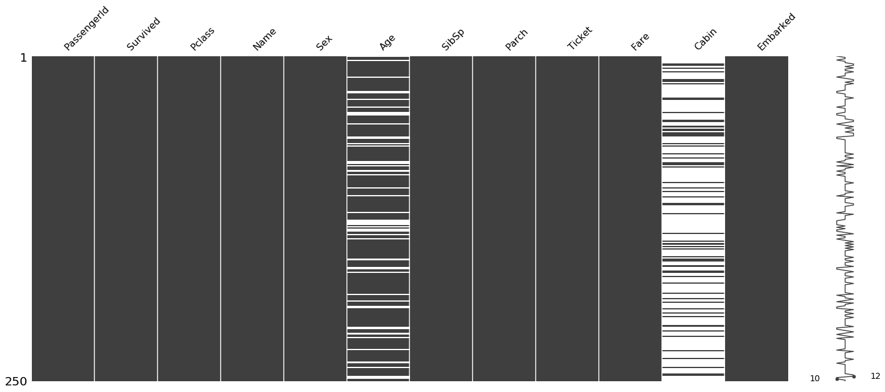
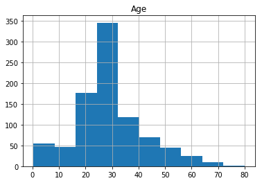

# 데이터 전처리 - 결측치 다루기
* [Missing data - Wikipedia](https://en.wikipedia.org/wiki/Missing_data)
* 예제 데이터 다운로드 : https://www.kaggle.com/c/titanic/data


```python
import pandas as pd
import numpy as np
import missingno as msno # 누락 된 데이터를 시각화 해주기 위해

import sys
print(sys.version)
print(pd.__version__)
print(np.__version__)
print(msno.__version__)
```

    3.6.5 |Anaconda, Inc.| (default, Mar 29 2018, 13:32:41) [MSC v.1900 64 bit (AMD64)]
    0.23.0
    1.14.3
    0.4.1
    


```python
% cd dataitgirls/titanic
```

    C:\Users\lunar\dataitgirls\titanic
    


```python
# 판다스를 통해 데이터를 로드해 온다.
# 여기에서는 캐글의 타이타닉 데이터를 사용한다. 
# 데이터 다운로드 : https://www.kaggle.com/c/titanic/data 
train = pd.read_csv('data/train.csv')
test = pd.read_csv('data/test.csv')

print(train.shape)
print(test.shape)
```

    (891, 12)
    (418, 11)
    


```python
train.info()
```

    <class 'pandas.core.frame.DataFrame'>
    RangeIndex: 891 entries, 0 to 890
    Data columns (total 12 columns):
    PassengerId    891 non-null int64
    Survived       891 non-null int64
    Pclass         891 non-null int64
    Name           891 non-null object
    Sex            891 non-null object
    Age            714 non-null float64
    SibSp          891 non-null int64
    Parch          891 non-null int64
    Ticket         891 non-null object
    Fare           891 non-null float64
    Cabin          204 non-null object
    Embarked       889 non-null object
    dtypes: float64(2), int64(5), object(5)
    memory usage: 83.6+ KB
    


```python
test.info()
```

    <class 'pandas.core.frame.DataFrame'>
    RangeIndex: 418 entries, 0 to 417
    Data columns (total 11 columns):
    PassengerId    418 non-null int64
    Pclass         418 non-null int64
    Name           418 non-null object
    Sex            418 non-null object
    Age            332 non-null float64
    SibSp          418 non-null int64
    Parch          418 non-null int64
    Ticket         418 non-null object
    Fare           417 non-null float64
    Cabin          91 non-null object
    Embarked       418 non-null object
    dtypes: float64(2), int64(4), object(5)
    memory usage: 36.0+ KB
    

## 결측치 보기


```python
# 결측치를 시각화
%matplotlib inline
train = train.replace("nan", np.nan)
msno.matrix(train.sample(250))
```


    <matplotlib.axes._subplots.AxesSubplot at 0x9689060400>





```python
# null 값 여부를 조회해 볼 수 있다.
train.isnull().head()
```


<div>
<style scoped>
    .dataframe tbody tr th:only-of-type {
        vertical-align: middle;
    }

    .dataframe tbody tr th {
        vertical-align: top;
    }

    .dataframe thead th {
        text-align: right;
    }
</style>
<table border="1" class="dataframe">
  <thead>
    <tr style="text-align: right;">
      <th></th>
      <th>PassengerId</th>
      <th>Survived</th>
      <th>Pclass</th>
      <th>Name</th>
      <th>Sex</th>
      <th>Age</th>
      <th>SibSp</th>
      <th>Parch</th>
      <th>Ticket</th>
      <th>Fare</th>
      <th>Cabin</th>
      <th>Embarked</th>
    </tr>
  </thead>
  <tbody>
    <tr>
      <th>0</th>
      <td>False</td>
      <td>False</td>
      <td>False</td>
      <td>False</td>
      <td>False</td>
      <td>False</td>
      <td>False</td>
      <td>False</td>
      <td>False</td>
      <td>False</td>
      <td>True</td>
      <td>False</td>
    </tr>
    <tr>
      <th>1</th>
      <td>False</td>
      <td>False</td>
      <td>False</td>
      <td>False</td>
      <td>False</td>
      <td>False</td>
      <td>False</td>
      <td>False</td>
      <td>False</td>
      <td>False</td>
      <td>False</td>
      <td>False</td>
    </tr>
    <tr>
      <th>2</th>
      <td>False</td>
      <td>False</td>
      <td>False</td>
      <td>False</td>
      <td>False</td>
      <td>False</td>
      <td>False</td>
      <td>False</td>
      <td>False</td>
      <td>False</td>
      <td>True</td>
      <td>False</td>
    </tr>
    <tr>
      <th>3</th>
      <td>False</td>
      <td>False</td>
      <td>False</td>
      <td>False</td>
      <td>False</td>
      <td>False</td>
      <td>False</td>
      <td>False</td>
      <td>False</td>
      <td>False</td>
      <td>False</td>
      <td>False</td>
    </tr>
    <tr>
      <th>4</th>
      <td>False</td>
      <td>False</td>
      <td>False</td>
      <td>False</td>
      <td>False</td>
      <td>False</td>
      <td>False</td>
      <td>False</td>
      <td>False</td>
      <td>False</td>
      <td>True</td>
      <td>False</td>
    </tr>
  </tbody>
</table>
</div>


```python
train.isnull().sum()
```


    PassengerId      0
    Survived         0
    Pclass           0
    Name             0
    Sex              0
    Age            177
    SibSp            0
    Parch            0
    Ticket           0
    Fare             0
    Cabin          687
    Embarked         2
    dtype: int64


```python
test.isnull().sum()
```


    PassengerId      0
    Pclass           0
    Name             0
    Sex              0
    Age             86
    SibSp            0
    Parch            0
    Ticket           0
    Fare             1
    Cabin          327
    Embarked         0
    dtype: int64


## 1. 중간값이나 최빈값으로 채워줌


```python
train_mean = train.copy(deep = True)
test_mean = test.copy(deep = True)
```


```python
train_mean.head()
```


<div>
<style scoped>
    .dataframe tbody tr th:only-of-type {
        vertical-align: middle;
    }

    .dataframe tbody tr th {
        vertical-align: top;
    }

    .dataframe thead th {
        text-align: right;
    }
</style>
<table border="1" class="dataframe">
  <thead>
    <tr style="text-align: right;">
      <th></th>
      <th>PassengerId</th>
      <th>Survived</th>
      <th>Pclass</th>
      <th>Name</th>
      <th>Sex</th>
      <th>Age</th>
      <th>SibSp</th>
      <th>Parch</th>
      <th>Ticket</th>
      <th>Fare</th>
      <th>Cabin</th>
      <th>Embarked</th>
    </tr>
  </thead>
  <tbody>
    <tr>
      <th>0</th>
      <td>1</td>
      <td>0</td>
      <td>3</td>
      <td>Braund, Mr. Owen Harris</td>
      <td>male</td>
      <td>22.0</td>
      <td>1</td>
      <td>0</td>
      <td>A/5 21171</td>
      <td>7.2500</td>
      <td>NaN</td>
      <td>S</td>
    </tr>
    <tr>
      <th>1</th>
      <td>2</td>
      <td>1</td>
      <td>1</td>
      <td>Cumings, Mrs. John Bradley (Florence Briggs Th...</td>
      <td>female</td>
      <td>38.0</td>
      <td>1</td>
      <td>0</td>
      <td>PC 17599</td>
      <td>71.2833</td>
      <td>C85</td>
      <td>C</td>
    </tr>
    <tr>
      <th>2</th>
      <td>3</td>
      <td>1</td>
      <td>3</td>
      <td>Heikkinen, Miss. Laina</td>
      <td>female</td>
      <td>26.0</td>
      <td>0</td>
      <td>0</td>
      <td>STON/O2. 3101282</td>
      <td>7.9250</td>
      <td>NaN</td>
      <td>S</td>
    </tr>
    <tr>
      <th>3</th>
      <td>4</td>
      <td>1</td>
      <td>1</td>
      <td>Futrelle, Mrs. Jacques Heath (Lily May Peel)</td>
      <td>female</td>
      <td>35.0</td>
      <td>1</td>
      <td>0</td>
      <td>113803</td>
      <td>53.1000</td>
      <td>C123</td>
      <td>S</td>
    </tr>
    <tr>
      <th>4</th>
      <td>5</td>
      <td>0</td>
      <td>3</td>
      <td>Allen, Mr. William Henry</td>
      <td>male</td>
      <td>35.0</td>
      <td>0</td>
      <td>0</td>
      <td>373450</td>
      <td>8.0500</td>
      <td>NaN</td>
      <td>S</td>
    </tr>
  </tbody>
</table>
</div>


```python
train['Ticket'].head()
```


    0           A/5 21171
    1            PC 17599
    2    STON/O2. 3101282
    3              113803
    4              373450
    Name: Ticket, dtype: object


```python
train['Ticket'].value_counts().head(7)
```


    CA. 2343        7
    1601            7
    347082          7
    CA 2144         6
    3101295         6
    347088          6
    S.O.C. 14879    5
    Name: Ticket, dtype: int64


```python
train['Ticket'].value_counts().tail(7)
```


    248740               1
    A/5 3540             1
    33638                1
    237565               1
    350043               1
    363294               1
    STON/O 2. 3101292    1
    Name: Ticket, dtype: int64


```python
# 정규표현식으로 티켓번호를 추출해 낸다.
# (\d{2,})에서 \d는 숫자를 의미하며, {2,}는 글자 수를 의미한다.
# 그래서 extract.('(\d{2,})')는 2자리 수 이상의 숫자를 추출하라는 의미이다.
train_mean['TicketNumber'] = train['Ticket'].str.extract('(\d{2,})', expand = True)
train_mean['TicketNumber'] = train_mean['TicketNumber'].apply(pd.to_numeric)

test_mean['TicketNumber'] = test['Ticket'].str.extract('(\d{2,})', expand = True)
test_mean['TicketNumber'] = test_mean['TicketNumber'].apply(pd.to_numeric)
```


```python
train_mean['TicketNumber'].head()
test_mean['TicketNumber'].head()
```


    0     330911.0
    1     363272.0
    2     240276.0
    3     315154.0
    4    3101298.0
    Name: TicketNumber, dtype: float64


```python
def data_fillna(dataset):
    # 중간값으로 누락된 나이 데이터를 채워준다.
    dataset['Age'].fillna(dataset['Age'].median(), inplace = True)

    # 최빈값(가장 자주 나오는 값)으로 누락된 승선위치를 채워준다.
    dataset['Embarked'].fillna(dataset['Embarked'].mode()[0], inplace = True)

    # 중간값으로 누락된 요금을 채워준다.
    dataset['Fare'].fillna(dataset['Fare'].median(), inplace = True)
    
    # 중간값으로 티켓 번호를 채워준다.
    dataset['TicketNumber'].fillna(dataset['TicketNumber'].median(), inplace=True)
```


```python
data_fillna(train_mean)
data_fillna(test_mean)
```


```python
print(train.isnull().sum())
print('-' * 20)
print(train_mean.isnull().sum())
```

    PassengerId      0
    Survived         0
    Pclass           0
    Name             0
    Sex              0
    Age            177
    SibSp            0
    Parch            0
    Ticket           0
    Fare             0
    Cabin          687
    Embarked         2
    dtype: int64
    --------------------
    PassengerId       0
    Survived          0
    Pclass            0
    Name              0
    Sex               0
    Age               0
    SibSp             0
    Parch             0
    Ticket            0
    Fare              0
    Cabin           687
    Embarked          0
    TicketNumber      0
    dtype: int64
    


```python
# 판다스의 시각화 툴을 사용해서 히스토그램 그래프를 그려본다.
# 중간값으로 채워주기 전 나이 데이터
train.hist(['Age'])
# 중간값으로 채워준 후의 나이 데이터
# 중간값이 눈에 띄게 늘어났다.
train_mean.hist(['Age'])
```


    array([[<matplotlib.axes._subplots.AxesSubplot object at 0x0000009683642828>]],
          dtype=object)





## 2. 사이킷런의 Imputer 를 사용


```python
train_imputer = train.copy()
test_imputer = test.copy()
```


```python
train_imputer['Age'][:5]
```


    0    22.0
    1    38.0
    2    26.0
    3    35.0
    4    35.0
    Name: Age, dtype: float64


#### Imputer를 사용해 보기에 앞서 shape와 reshape를 이해하고 넘어간다.


```python
# 벡터 데이터의 형태를 출력해 본다.
print(train_imputer['Age'].values.shape)
# reshape(-1,1)를 사용해 벡터 데이터를 행렬 데이터로 변환해 준다.
print(train_imputer['Age'].values.reshape(-1,1).shape)

# -1은 행렬값이 몇 차원인지 모를때쓰면된다. 
# reshape는 (행,열)로 지정해서 행렬데이터를 만들어주는 함수이다. 
```

    (891,)
    (891, 1)
    


```python
from sklearn.preprocessing import Imputer

#imputer는 결측치를 보완해주는 함수이다. 

# 결측치를 보완해 준다.
def nan_padding(data, columns):
    for column in columns:
        imputer = Imputer()
        data[column] = imputer.fit_transform(data[column].values.reshape(-1,1))
    return data


nan_columns = ['Age', 'SibSp', 'Parch', 'Fare']

train_imputer = nan_padding(train_imputer, nan_columns)
test_imputer = nan_padding(test_imputer, nan_columns)
```


```python
print(train.isnull().sum())
print('-' * 20)
print(train_imputer.isnull().sum())
```

    PassengerId      0
    Survived         0
    Pclass           0
    Name             0
    Sex              0
    Age            177
    SibSp            0
    Parch            0
    Ticket           0
    Fare             0
    Cabin          687
    Embarked         2
    dtype: int64
    --------------------
    PassengerId      0
    Survived         0
    Pclass           0
    Name             0
    Sex              0
    Age              0
    SibSp            0
    Parch            0
    Ticket           0
    Fare             0
    Cabin          687
    Embarked         2
    dtype: int64
    


```python
train_imputer[nan_columns].head()
```


<div>
<style scoped>
    .dataframe tbody tr th:only-of-type {
        vertical-align: middle;
    }

    .dataframe tbody tr th {
        vertical-align: top;
    }

    .dataframe thead th {
        text-align: right;
    }
</style>
<table border="1" class="dataframe">
  <thead>
    <tr style="text-align: right;">
      <th></th>
      <th>Age</th>
      <th>SibSp</th>
      <th>Parch</th>
      <th>Fare</th>
    </tr>
  </thead>
  <tbody>
    <tr>
      <th>0</th>
      <td>22.0</td>
      <td>1.0</td>
      <td>0.0</td>
      <td>7.2500</td>
    </tr>
    <tr>
      <th>1</th>
      <td>38.0</td>
      <td>1.0</td>
      <td>0.0</td>
      <td>71.2833</td>
    </tr>
    <tr>
      <th>2</th>
      <td>26.0</td>
      <td>0.0</td>
      <td>0.0</td>
      <td>7.9250</td>
    </tr>
    <tr>
      <th>3</th>
      <td>35.0</td>
      <td>1.0</td>
      <td>0.0</td>
      <td>53.1000</td>
    </tr>
    <tr>
      <th>4</th>
      <td>35.0</td>
      <td>0.0</td>
      <td>0.0</td>
      <td>8.0500</td>
    </tr>
  </tbody>
</table>
</div>


## 3. 다른 컬럼 정보를 사용해서 결측치를 예측


```python
train_cp = train.copy()
test_cp = test.copy()
```


```python
# 결측치가 있는 지 확인
train['Name'].isnull().sum()
```


    0


```python
# 일부의 데이터만 찍어보았지만 모든 데이터가 콤마(,)와 마침표(.)가 들어가 있다.
# 여기에서 콤마 뒤의 데이터가 호칭이며 Miss, Ms, Mrs 등으로 나이를 추측해 볼 수 있다.
train['Name'].head()
```


    0                              Braund, Mr. Owen Harris
    1    Cumings, Mrs. John Bradley (Florence Briggs Th...
    2                               Heikkinen, Miss. Laina
    3         Futrelle, Mrs. Jacques Heath (Lily May Peel)
    4                             Allen, Mr. William Henry
    Name: Name, dtype: object


```python
train['Name'].str.split(", ", expand=True).head()
```


<div>
<style scoped>
    .dataframe tbody tr th:only-of-type {
        vertical-align: middle;
    }

    .dataframe tbody tr th {
        vertical-align: top;
    }

    .dataframe thead th {
        text-align: right;
    }
</style>
<table border="1" class="dataframe">
  <thead>
    <tr style="text-align: right;">
      <th></th>
      <th>0</th>
      <th>1</th>
    </tr>
  </thead>
  <tbody>
    <tr>
      <th>0</th>
      <td>Braund</td>
      <td>Mr. Owen Harris</td>
    </tr>
    <tr>
      <th>1</th>
      <td>Cumings</td>
      <td>Mrs. John Bradley (Florence Briggs Thayer)</td>
    </tr>
    <tr>
      <th>2</th>
      <td>Heikkinen</td>
      <td>Miss. Laina</td>
    </tr>
    <tr>
      <th>3</th>
      <td>Futrelle</td>
      <td>Mrs. Jacques Heath (Lily May Peel)</td>
    </tr>
    <tr>
      <th>4</th>
      <td>Allen</td>
      <td>Mr. William Henry</td>
    </tr>
  </tbody>
</table>
</div>


```python
# 이름에서 Title 항목만 떼어낸다.
# 콤마로 분리를 하고 분리된 두 번째 데이터의 첫번째 항목을 가져온다.
train['Title'] = train['Name'].str.split(
    ", ", expand=True)[1].str.split(".", expand=True)[0]
train['Title'].head()

test['Title'] = test['Name'].str.split(
    ", ", expand=True)[1].str.split(".", expand=True)[0]
test['Title'].head()
```


    0     Mr
    1    Mrs
    2     Mr
    3     Mr
    4    Mrs
    Name: Title, dtype: object


```python
# 호칭의 갯수를 알아본다.
# Don은 스페인에서 세례명의 존칭 혹은 귀인을 뜻한다고 한다.
# Capt 또한 대위 또는 대령을 뜻한다.
train['Title'].value_counts()
```


    Mr              517
    Miss            182
    Mrs             125
    Master           40
    Dr                7
    Rev               6
    Mlle              2
    Major             2
    Col               2
    Capt              1
    Ms                1
    Lady              1
    the Countess      1
    Mme               1
    Don               1
    Jonkheer          1
    Sir               1
    Name: Title, dtype: int64


```python
train.query("Title in ('Dona', 'Lady', 'the Countess')")
```


<div>
<style scoped>
    .dataframe tbody tr th:only-of-type {
        vertical-align: middle;
    }

    .dataframe tbody tr th {
        vertical-align: top;
    }

    .dataframe thead th {
        text-align: right;
    }
</style>
<table border="1" class="dataframe">
  <thead>
    <tr style="text-align: right;">
      <th></th>
      <th>PassengerId</th>
      <th>Survived</th>
      <th>Pclass</th>
      <th>Name</th>
      <th>Sex</th>
      <th>Age</th>
      <th>SibSp</th>
      <th>Parch</th>
      <th>Ticket</th>
      <th>Fare</th>
      <th>Cabin</th>
      <th>Embarked</th>
      <th>Title</th>
    </tr>
  </thead>
  <tbody>
    <tr>
      <th>556</th>
      <td>557</td>
      <td>1</td>
      <td>1</td>
      <td>Duff Gordon, Lady. (Lucille Christiana Sutherl...</td>
      <td>female</td>
      <td>48.0</td>
      <td>1</td>
      <td>0</td>
      <td>11755</td>
      <td>39.6</td>
      <td>A16</td>
      <td>C</td>
      <td>Lady</td>
    </tr>
    <tr>
      <th>759</th>
      <td>760</td>
      <td>1</td>
      <td>1</td>
      <td>Rothes, the Countess. of (Lucy Noel Martha Dye...</td>
      <td>female</td>
      <td>33.0</td>
      <td>0</td>
      <td>0</td>
      <td>110152</td>
      <td>86.5</td>
      <td>B77</td>
      <td>S</td>
      <td>the Countess</td>
    </tr>
  </tbody>
</table>
</div>


```python
# 결혼한 여성 관련 호칭은 Mrs로 분류
train.loc[train['Title'].isin(['Dona', 'Lady', 'the Countess', 'Mme', 'Mlle']), 'Title'] = 'Ms'
test.loc[test['Title'].isin(['Dona', 'Lady', 'the Countess', 'Mme', 'Mlle']), 'Title'] = 'Ms'
train['Title'].value_counts()
```


    Mr          517
    Miss        182
    Mrs         125
    Master       40
    Dr            7
    Ms            6
    Rev           6
    Major         2
    Col           2
    Sir           1
    Jonkheer      1
    Capt          1
    Don           1
    Name: Title, dtype: int64


```python
train.loc[train['Title'].isin(['Don', 'Sir', 'Capt', 'Col', 'Major', 'Master', 'Rev', 'Dr', 'Jonkheer']), 'Title'] = 'Mr'
test.loc[test['Title'].isin(['Don', 'Sir', 'Capt', 'Col', 'Major', 'Master', 'Rev', 'Dr', 'Jonkheer']), 'Title'] = 'Mr'
train['Title'].value_counts()
```


    Mr      578
    Miss    182
    Mrs     125
    Ms        6
    Name: Title, dtype: int64


```python
train.Age.isnull().sum()
```


    177


## 4. 기계학습을 통해 예측해서 대체하기
* RandomForest로 예측하기


```python
train_groupby = train.copy()
test_groupby = test.copy()
```


```python
train_groupby['Age'].fillna(train.groupby('Title')['Age'].transform('median'), inplace=True)
test_groupby['Age'].fillna(test.groupby('Title')['Age'].transform('median'), inplace=True)
```


```python
print(train.Age.isnull().sum())
print(train_groupby.Age.isnull().sum())
```

    177
    0
    


```python
train_rf = train.copy()
test_rf = test.copy()
```


```python
train_rf.head()
```


<div>
<style scoped>
    .dataframe tbody tr th:only-of-type {
        vertical-align: middle;
    }

    .dataframe tbody tr th {
        vertical-align: top;
    }

    .dataframe thead th {
        text-align: right;
    }
</style>
<table border="1" class="dataframe">
  <thead>
    <tr style="text-align: right;">
      <th></th>
      <th>PassengerId</th>
      <th>Survived</th>
      <th>Pclass</th>
      <th>Name</th>
      <th>Sex</th>
      <th>Age</th>
      <th>SibSp</th>
      <th>Parch</th>
      <th>Ticket</th>
      <th>Fare</th>
      <th>Cabin</th>
      <th>Embarked</th>
      <th>Title</th>
    </tr>
  </thead>
  <tbody>
    <tr>
      <th>0</th>
      <td>1</td>
      <td>0</td>
      <td>3</td>
      <td>Braund, Mr. Owen Harris</td>
      <td>male</td>
      <td>22.0</td>
      <td>1</td>
      <td>0</td>
      <td>A/5 21171</td>
      <td>7.2500</td>
      <td>NaN</td>
      <td>S</td>
      <td>Mr</td>
    </tr>
    <tr>
      <th>1</th>
      <td>2</td>
      <td>1</td>
      <td>1</td>
      <td>Cumings, Mrs. John Bradley (Florence Briggs Th...</td>
      <td>female</td>
      <td>38.0</td>
      <td>1</td>
      <td>0</td>
      <td>PC 17599</td>
      <td>71.2833</td>
      <td>C85</td>
      <td>C</td>
      <td>Mrs</td>
    </tr>
    <tr>
      <th>2</th>
      <td>3</td>
      <td>1</td>
      <td>3</td>
      <td>Heikkinen, Miss. Laina</td>
      <td>female</td>
      <td>26.0</td>
      <td>0</td>
      <td>0</td>
      <td>STON/O2. 3101282</td>
      <td>7.9250</td>
      <td>NaN</td>
      <td>S</td>
      <td>Miss</td>
    </tr>
    <tr>
      <th>3</th>
      <td>4</td>
      <td>1</td>
      <td>1</td>
      <td>Futrelle, Mrs. Jacques Heath (Lily May Peel)</td>
      <td>female</td>
      <td>35.0</td>
      <td>1</td>
      <td>0</td>
      <td>113803</td>
      <td>53.1000</td>
      <td>C123</td>
      <td>S</td>
      <td>Mrs</td>
    </tr>
    <tr>
      <th>4</th>
      <td>5</td>
      <td>0</td>
      <td>3</td>
      <td>Allen, Mr. William Henry</td>
      <td>male</td>
      <td>35.0</td>
      <td>0</td>
      <td>0</td>
      <td>373450</td>
      <td>8.0500</td>
      <td>NaN</td>
      <td>S</td>
      <td>Mr</td>
    </tr>
  </tbody>
</table>
</div>


```python
train_rf['FamilySize'] = train_rf['SibSp'] + train_rf['Parch'] + 1
test_rf['FamilySize'] = test_rf['SibSp'] + test_rf['Parch'] + 1
print(train_rf['FamilySize'].value_counts())
```

    1     537
    2     161
    3     102
    4      29
    6      22
    5      15
    7      12
    11      7
    8       6
    Name: FamilySize, dtype: int64
    


```python
train_rf.loc[train_rf['FamilySize'] == 1, 'FsizeD'] = 'singleton'
train_rf.loc[(train_rf['FamilySize'] > 1)  &  (train_rf['FamilySize'] < 5) , 'FsizeD'] = 'small'
train_rf.loc[train_rf['FamilySize'] > 4, 'FsizeD'] = 'large'

test_rf.loc[test_rf['FamilySize'] == 1, 'FsizeD'] = 'singleton'
test_rf.loc[(test_rf['FamilySize'] > 1) & (test_rf['FamilySize'] <5) , 'FsizeD'] = 'small'
test_rf.loc[test_rf['FamilySize'] > 4, 'FsizeD'] = 'large'
print(train_rf['FsizeD'].unique())
print(train_rf['FsizeD'].value_counts())
```

    ['small' 'singleton' 'large']
    singleton    537
    small        292
    large         62
    Name: FsizeD, dtype: int64
    


```python
train_rf["NameLength"] = train["Name"].apply(lambda x: len(x))
test_rf["NameLength"] = test["Name"].apply(lambda x: len(x))

bins = [0, 20, 40, 57, 85]
group_names = ['short', 'okay', 'good', 'long']
train_rf['NlengthD'] = pd.cut(train_rf['NameLength'], bins, labels=group_names)
test_rf['NlengthD'] = pd.cut(test_rf['NameLength'], bins, labels=group_names)

print(train_rf["NlengthD"].unique())
```

    [okay, good, short, long]
    Categories (4, object): [short < okay < good < long]
    


```python
train_rf['Deck'] = train_rf.Cabin.str[0]
test_rf['Deck'] = test_rf.Cabin.str[0]
train_rf['Deck'].unique() # 0 is for null values
```


    array([nan, 'C', 'E', 'G', 'D', 'A', 'B', 'F', 'T'], dtype=object)


```python
def dummy_data(data, columns):
    for column in columns:
        data = pd.concat([data, pd.get_dummies(data[column], prefix = column)], axis=1)
        data = data.drop(column, axis=1)
    return data

def drop_data(data, columns):
    for column in columns:
        data = data.drop(column, axis=1)
    return data
```


```python
dummy_columns = ['Sex', 'Pclass', 'Embarked', 'Title', 'FsizeD', 'NlengthD']

train_rf = dummy_data(train_rf, dummy_columns)
test_rf = dummy_data(test_rf, dummy_columns)

drop_columns = ['Name', 'Ticket', 'Cabin', 'Fare', 'Deck', 'Parch', 'SibSp', 'FamilySize']
train_rf = drop_data(train_rf, drop_columns)
train_rf = train_rf.drop('Survived', axis=1)
test_rf = drop_data(test_rf, drop_columns)
```


```python
train_rf.shape
```


    (891, 22)


```python
test_rf.shape
```


    (418, 22)


```python
train_rf.columns
```


    Index(['PassengerId', 'Age', 'NameLength', 'Sex_female', 'Sex_male',
           'Pclass_1', 'Pclass_2', 'Pclass_3', 'Embarked_C', 'Embarked_Q',
           'Embarked_S', 'Title_Miss', 'Title_Mr', 'Title_Mrs', 'Title_Ms',
           'FsizeD_large', 'FsizeD_singleton', 'FsizeD_small', 'NlengthD_short',
           'NlengthD_okay', 'NlengthD_good', 'NlengthD_long'],
          dtype='object')


```python
train_array = np.array(train_rf.columns)
test_array = np.array(test_rf.columns)
```


```python
np.setdiff1d(train_array, test_array)

# 달라진 게 있는 지 확인.
```


    array([], dtype=object)


```python
train_rf.info()
```

    <class 'pandas.core.frame.DataFrame'>
    RangeIndex: 891 entries, 0 to 890
    Data columns (total 22 columns):
    PassengerId         891 non-null int64
    Age                 714 non-null float64
    NameLength          891 non-null int64
    Sex_female          891 non-null uint8
    Sex_male            891 non-null uint8
    Pclass_1            891 non-null uint8
    Pclass_2            891 non-null uint8
    Pclass_3            891 non-null uint8
    Embarked_C          891 non-null uint8
    Embarked_Q          891 non-null uint8
    Embarked_S          891 non-null uint8
    Title_Miss          891 non-null uint8
    Title_Mr            891 non-null uint8
    Title_Mrs           891 non-null uint8
    Title_Ms            891 non-null uint8
    FsizeD_large        891 non-null uint8
    FsizeD_singleton    891 non-null uint8
    FsizeD_small        891 non-null uint8
    NlengthD_short      891 non-null uint8
    NlengthD_okay       891 non-null uint8
    NlengthD_good       891 non-null uint8
    NlengthD_long       891 non-null uint8
    dtypes: float64(1), int64(2), uint8(19)
    memory usage: 37.5 KB
    


```python
train_rf.Age.isnull().sum()
```


    177


```python
# 전체 데이터를 가져옴
train.values[:,:]
```


    array([[1, 0, 3, ..., nan, 'S', 'Mr'],
           [2, 1, 1, ..., 'C85', 'C', 'Mrs'],
           [3, 1, 3, ..., nan, 'S', 'Miss'],
           ...,
           [889, 0, 3, ..., nan, 'S', 'Miss'],
           [890, 1, 1, ..., 'C148', 'C', 'Mr'],
           [891, 0, 3, ..., nan, 'Q', 'Mr']], dtype=object)


```python
# 전체 데이터 중 컬럼은 2번째 값 이후부터 가져옴
train.values[:, 2::]
```


    array([[3, 'Braund, Mr. Owen Harris', 'male', ..., nan, 'S', 'Mr'],
           [1, 'Cumings, Mrs. John Bradley (Florence Briggs Thayer)',
            'female', ..., 'C85', 'C', 'Mrs'],
           [3, 'Heikkinen, Miss. Laina', 'female', ..., nan, 'S', 'Miss'],
           ...,
           [3, 'Johnston, Miss. Catherine Helen "Carrie"', 'female', ...,
            nan, 'S', 'Miss'],
           [1, 'Behr, Mr. Karl Howell', 'male', ..., 'C148', 'C', 'Mr'],
           [3, 'Dooley, Mr. Patrick', 'male', ..., nan, 'Q', 'Mr']],
          dtype=object)


```python
# https://www.kaggle.com/poonaml/titanic-survival-prediction-end-to-end-ml-pipeline
from sklearn.ensemble import RandomForestRegressor

def fill_missing_age(df):
    
    # Age값을 기준으로 학습과 테스트 세트로 분리
    train  = df.loc[ (df.Age.notnull()) ]# Age 값이 있는 row 
    test = df.loc[ (df.Age.isnull()) ]# Age 값이 없는 row 
    
    print(train.columns)
    # Age Label 데이터
    y = train['Age']
    
    
    # y는 원래 우리가 갖고있는 age값. 
    
    # 피처를 생성해 준다.
    train_X = train.values[:, 2::] # 원하는 칼럼만 떼어서 슬라이싱.
    test_X = test.values[:, 2::] 
    
    print(train_X.shape)
    print(test_X.shape)
    print(len(y))
    
    # 모델을 학습시킨다.
    rtr = RandomForestRegressor(n_estimators=2000, n_jobs=-1)
    
    # rtr은 모델. 
    rtr.fit(train_X, y)
    
    # 학습한 데이터를 바탕으로 결측치를 예측한다.
    predictedAges = rtr.predict(test_X)
    
    # 예측한 값을 Age가 null 인 데이터에 채워준다. 
    df.loc[ (df.Age.isnull()), 'Age' ] = predictedAges 
    
    return df

# 우리가 갖고 있는 x값과 y값을 가지고 모델을 만든다. 
# 모델을 바탕으로 null값 = y값을 예측한다. 
```


```python
train_rf.head()
```


<div>
<style scoped>
    .dataframe tbody tr th:only-of-type {
        vertical-align: middle;
    }

    .dataframe tbody tr th {
        vertical-align: top;
    }

    .dataframe thead th {
        text-align: right;
    }
</style>
<table border="1" class="dataframe">
  <thead>
    <tr style="text-align: right;">
      <th></th>
      <th>PassengerId</th>
      <th>Age</th>
      <th>NameLength</th>
      <th>Sex_female</th>
      <th>Sex_male</th>
      <th>Pclass_1</th>
      <th>Pclass_2</th>
      <th>Pclass_3</th>
      <th>Embarked_C</th>
      <th>Embarked_Q</th>
      <th>...</th>
      <th>Title_Mr</th>
      <th>Title_Mrs</th>
      <th>Title_Ms</th>
      <th>FsizeD_large</th>
      <th>FsizeD_singleton</th>
      <th>FsizeD_small</th>
      <th>NlengthD_short</th>
      <th>NlengthD_okay</th>
      <th>NlengthD_good</th>
      <th>NlengthD_long</th>
    </tr>
  </thead>
  <tbody>
    <tr>
      <th>0</th>
      <td>1</td>
      <td>22.0</td>
      <td>23</td>
      <td>0</td>
      <td>1</td>
      <td>0</td>
      <td>0</td>
      <td>1</td>
      <td>0</td>
      <td>0</td>
      <td>...</td>
      <td>1</td>
      <td>0</td>
      <td>0</td>
      <td>0</td>
      <td>0</td>
      <td>1</td>
      <td>0</td>
      <td>1</td>
      <td>0</td>
      <td>0</td>
    </tr>
    <tr>
      <th>1</th>
      <td>2</td>
      <td>38.0</td>
      <td>51</td>
      <td>1</td>
      <td>0</td>
      <td>1</td>
      <td>0</td>
      <td>0</td>
      <td>1</td>
      <td>0</td>
      <td>...</td>
      <td>0</td>
      <td>1</td>
      <td>0</td>
      <td>0</td>
      <td>0</td>
      <td>1</td>
      <td>0</td>
      <td>0</td>
      <td>1</td>
      <td>0</td>
    </tr>
    <tr>
      <th>2</th>
      <td>3</td>
      <td>26.0</td>
      <td>22</td>
      <td>1</td>
      <td>0</td>
      <td>0</td>
      <td>0</td>
      <td>1</td>
      <td>0</td>
      <td>0</td>
      <td>...</td>
      <td>0</td>
      <td>0</td>
      <td>0</td>
      <td>0</td>
      <td>1</td>
      <td>0</td>
      <td>0</td>
      <td>1</td>
      <td>0</td>
      <td>0</td>
    </tr>
    <tr>
      <th>3</th>
      <td>4</td>
      <td>35.0</td>
      <td>44</td>
      <td>1</td>
      <td>0</td>
      <td>1</td>
      <td>0</td>
      <td>0</td>
      <td>0</td>
      <td>0</td>
      <td>...</td>
      <td>0</td>
      <td>1</td>
      <td>0</td>
      <td>0</td>
      <td>0</td>
      <td>1</td>
      <td>0</td>
      <td>0</td>
      <td>1</td>
      <td>0</td>
    </tr>
    <tr>
      <th>4</th>
      <td>5</td>
      <td>35.0</td>
      <td>24</td>
      <td>0</td>
      <td>1</td>
      <td>0</td>
      <td>0</td>
      <td>1</td>
      <td>0</td>
      <td>0</td>
      <td>...</td>
      <td>1</td>
      <td>0</td>
      <td>0</td>
      <td>0</td>
      <td>1</td>
      <td>0</td>
      <td>0</td>
      <td>1</td>
      <td>0</td>
      <td>0</td>
    </tr>
  </tbody>
</table>
<p>5 rows × 22 columns</p>
</div>


```python
train_rf = fill_missing_age(train_rf)
```

    Index(['PassengerId', 'Age', 'NameLength', 'Sex_female', 'Sex_male',
           'Pclass_1', 'Pclass_2', 'Pclass_3', 'Embarked_C', 'Embarked_Q',
           'Embarked_S', 'Title_Miss', 'Title_Mr', 'Title_Mrs', 'Title_Ms',
           'FsizeD_large', 'FsizeD_singleton', 'FsizeD_small', 'NlengthD_short',
           'NlengthD_okay', 'NlengthD_good', 'NlengthD_long'],
          dtype='object')
    (714, 20)
    (177, 20)
    714
    


```python
test_rf = fill_missing_age(test_rf)
```


```python
train_rf.Age.isnull().sum()
```


```python
train_rf.hist('Age')
```

참고 : 
* https://www.kaggle.com/ldfreeman3/a-data-science-framework-to-achieve-99-accuracy
* https://www.kaggle.com/poonaml/titanic-survival-prediction-end-to-end-ml-pipeline


```python
train.columns
```


```python
train_rf.columns
```


```python
X_train = train_rf
X_test = test_rf
y_label = train['Survived']
```


```python
X_train.shape
```


```python
y_label.shape
```

## DT로 예측하기 


```python
from sklearn.tree import DecisionTreeClassifier

dt = DecisionTreeClassifier(max_depth=5, random_state=2018)
dt
```


```python
dt.fit(X_train, y_label)
```


```python
from sklearn.model_selection import KFold, cross_val_score
k_fold = KFold(n_splits=10, shuffle=True, random_state=2018)
```


```python
scoring = 'accuracy'
dt_score = cross_val_score(dt, X_train, y_label, cv=k_fold, n_jobs=-1, scoring=scoring)
print(dt_score)
```


```python
round(np.mean(dt_score)*100, 2)
```


```python
prediction = dt.predict(X_test)
```


```python
test['Survived'] = prediction
```


```python
dt_submissions = test[['PassengerId', 'Survived']]
dt_submissions.head()
```


```python
dt_submissions.to_csv('submissions/submit_age_rf_df.csv', index=False)
```

### RF로 예측하기


```python
from sklearn.ensemble import RandomForestClassifier

rfc = RandomForestClassifier(n_estimators=1000, n_jobs=-1)
%time rfc.fit(X_train, y_label)
```


```python
# 학습한 데이터를 바탕으로 결측치를 예측한다.
%time rfc_predictions = rfc.predict(X_test)
test['Survived'] = rfc_predictions
rfc_submissions = test[['PassengerId', 'Survived']]
rfc_submissions.head()
```


```python
scoring = 'accuracy'
rfc_score = cross_val_score(rfc, X_train, y_label, cv=k_fold, n_jobs=-1, scoring=scoring)
print(rfc_score)
```


```python
rfc_score_mean = round(np.mean(rfc_score) * 100, 2)
```


```python
rfc_submissions.to_csv('submissions/submit_age_rf_rfc_{}.csv'.format(rfc_score_mean), index=False)
```
