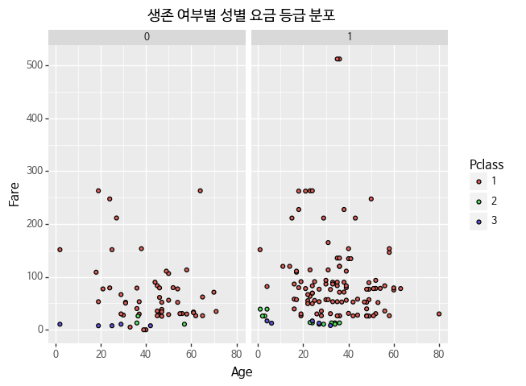

```python
import warnings
warnings.filterwarnings('ignore')

#불필요한 warnings를 지우기 위해 넣어줍니다.
```


```python
%matplotlib inline
```


```python
# 필요한 모듈을 설치합니다. 
import pandas as pd
import numpy as np
import re
from plotnine import *

# * means to import everything.

```


```python
%ls data
```

     C 드라이브의 볼륨에는 이름이 없습니다.
     볼륨 일련 번호: 58AE-615E
    
     C:\Users\lunar\dataitgirls\open-data-apt\data 디렉터리
    
    2018-08-12  오후 09:33    <DIR>          .
    2018-08-12  오후 09:33    <DIR>          ..
    2018-08-10  오후 07:22    <DIR>          .ipynb_checkpoints
    2018-08-10  오후 04:52             4,528 apt_2015.09.csv
    2018-08-10  오후 04:51           105,382 apt_2018.06.csv
    2018-08-12  오후 09:33             3,129 s_dt.csv
    2018-08-10  오후 07:15             2,803 seoulDT.csv
    2018-08-10  오후 08:54            22,128 Untitled.ipynb
                   5개 파일             137,970 바이트
                   3개 디렉터리  49,100,103,680 바이트 남음
    


```python
df = pd.read_csv('data/s_dt.csv')
```


```python
df.head()
```


<div>
<style scoped>
    .dataframe tbody tr th:only-of-type {
        vertical-align: middle;
    }

    .dataframe tbody tr th {
        vertical-align: top;
    }

    .dataframe thead th {
        text-align: right;
    }
</style>
<table border="1" class="dataframe">
  <thead>
    <tr style="text-align: right;">
      <th></th>
      <th>Unnamed: 0</th>
      <th>지점명</th>
      <th>주소</th>
      <th>도로명주소</th>
      <th>위도</th>
      <th>경도</th>
    </tr>
  </thead>
  <tbody>
    <tr>
      <th>0</th>
      <td>0</td>
      <td>가락DT점</td>
      <td>서울특별시 송파구 가락동 193-7</td>
      <td>서울특별시 송파구 동남로 196</td>
      <td>37.494854</td>
      <td>127.130785</td>
    </tr>
    <tr>
      <th>1</th>
      <td>1</td>
      <td>강남삼성DT</td>
      <td>서울특별시 강남구 삼성동 113-7</td>
      <td>서울특별시 강남구 봉은사로 432</td>
      <td>37.510800</td>
      <td>127.047316</td>
    </tr>
    <tr>
      <th>2</th>
      <td>2</td>
      <td>고척DT</td>
      <td>서울특별시 구로구 고척동 73-20</td>
      <td>서울특별시 구로구 경인로 393</td>
      <td>37.497228</td>
      <td>126.863535</td>
    </tr>
    <tr>
      <th>3</th>
      <td>3</td>
      <td>굽은다리역DT</td>
      <td>서울특별시 강동구 천호동 31-10</td>
      <td>서울특별시 강동구 양재대로 1587</td>
      <td>37.547256</td>
      <td>127.142984</td>
    </tr>
    <tr>
      <th>4</th>
      <td>4</td>
      <td>등촌DT점</td>
      <td>서울특별시 강서구 등촌동 630</td>
      <td>서울특별시 강서구 양천로 546</td>
      <td>37.558213</td>
      <td>126.859736</td>
    </tr>
  </tbody>
</table>
</div>


```python
df.describe()
```


<div>
<style scoped>
    .dataframe tbody tr th:only-of-type {
        vertical-align: middle;
    }

    .dataframe tbody tr th {
        vertical-align: top;
    }

    .dataframe thead th {
        text-align: right;
    }
</style>
<table border="1" class="dataframe">
  <thead>
    <tr style="text-align: right;">
      <th></th>
      <th>Unnamed: 0</th>
      <th>위도</th>
      <th>경도</th>
    </tr>
  </thead>
  <tbody>
    <tr>
      <th>count</th>
      <td>24.000000</td>
      <td>24.000000</td>
      <td>24.000000</td>
    </tr>
    <tr>
      <th>mean</th>
      <td>11.500000</td>
      <td>37.547453</td>
      <td>126.979425</td>
    </tr>
    <tr>
      <th>std</th>
      <td>7.071068</td>
      <td>0.060649</td>
      <td>0.105844</td>
    </tr>
    <tr>
      <th>min</th>
      <td>0.000000</td>
      <td>37.450460</td>
      <td>126.830743</td>
    </tr>
    <tr>
      <th>25%</th>
      <td>5.750000</td>
      <td>37.509190</td>
      <td>126.869509</td>
    </tr>
    <tr>
      <th>50%</th>
      <td>11.500000</td>
      <td>37.531143</td>
      <td>127.028866</td>
    </tr>
    <tr>
      <th>75%</th>
      <td>17.250000</td>
      <td>37.567563</td>
      <td>127.045763</td>
    </tr>
    <tr>
      <th>max</th>
      <td>23.000000</td>
      <td>37.672395</td>
      <td>127.142984</td>
    </tr>
  </tbody>
</table>
</div>


```python
df.drop(columns=['Unnamed: 0'],inplace=True)
```


```python
(ggplot(df)
 + aes(x='경도', y='위도')
 + geom_point()
 + theme(text=element_text(family='NanumBarunGothic'))
 + scale_fill_gradient(low = 'blue', high = 'green') 
)

```

    C:\Users\lunar\Anaconda3\lib\site-packages\plotnine\guides\guides.py:199: UserWarning: Cannot generate legend for the 'fill' aesthetic. Make sure you have mapped a variable to it
      "variable to it".format(output))
    





    <ggplot: (11836483420)>


```python
import folium
```


```python
geo_df = df.copy()

# 지도를 초기화 해줄 때 어디를 중심으로 보여줄지 설정합니다.
# 우리가 가져온 데이터프레임 안에 있는 데이터를 기준으로 출력할 수 있도록 위경도의 평균값을 구해옵니다.
map = folium.Map(location=[geo_df['위도'].mean(), geo_df['경도'].mean()], zoom_start=12)

for n in geo_df.index:
    # 팝업에 들어갈 텍스트를 지정해 줍니다.
    popup_name = geo_df['지점명'][n] + ' - ' + geo_df['도로명주소'][n]
    # 브랜드명에 따라 아이콘 색상을 달리해서 찍어줍니다.
    icon_color = 'pink'
    folium.Marker([geo_df['위도'][n], geo_df['경도'][n]], 
                  popup=popup_name, 
                  icon=folium.Icon(color=icon_color)).add_to(map)
map
```


<div style="width:100%;"><div style="position:relative;width:100%;height:0;padding-bottom:60%;"><iframe src="data:text/html;charset=utf-8;base64,PCFET0NUWVBFIGh0bWw+CjxoZWFkPiAgICAKICAgIDxtZXRhIGh0dHAtZXF1aXY9ImNvbnRlbnQtdHlwZSIgY29udGVudD0idGV4dC9odG1sOyBjaGFyc2V0PVVURi04IiAvPgogICAgPHNjcmlwdD5MX1BSRUZFUl9DQU5WQVMgPSBmYWxzZTsgTF9OT19UT1VDSCA9IGZhbHNlOyBMX0RJU0FCTEVfM0QgPSBmYWxzZTs8L3NjcmlwdD4KICAgIDxzY3JpcHQgc3JjPSJodHRwczovL2Nkbi5qc2RlbGl2ci5uZXQvbnBtL2xlYWZsZXRAMS4yLjAvZGlzdC9sZWFmbGV0LmpzIj48L3NjcmlwdD4KICAgIDxzY3JpcHQgc3JjPSJodHRwczovL2FqYXguZ29vZ2xlYXBpcy5jb20vYWpheC9saWJzL2pxdWVyeS8xLjExLjEvanF1ZXJ5Lm1pbi5qcyI+PC9zY3JpcHQ+CiAgICA8c2NyaXB0IHNyYz0iaHR0cHM6Ly9tYXhjZG4uYm9vdHN0cmFwY2RuLmNvbS9ib290c3RyYXAvMy4yLjAvanMvYm9vdHN0cmFwLm1pbi5qcyI+PC9zY3JpcHQ+CiAgICA8c2NyaXB0IHNyYz0iaHR0cHM6Ly9jZG5qcy5jbG91ZGZsYXJlLmNvbS9hamF4L2xpYnMvTGVhZmxldC5hd2Vzb21lLW1hcmtlcnMvMi4wLjIvbGVhZmxldC5hd2Vzb21lLW1hcmtlcnMuanMiPjwvc2NyaXB0PgogICAgPGxpbmsgcmVsPSJzdHlsZXNoZWV0IiBocmVmPSJodHRwczovL2Nkbi5qc2RlbGl2ci5uZXQvbnBtL2xlYWZsZXRAMS4yLjAvZGlzdC9sZWFmbGV0LmNzcyIvPgogICAgPGxpbmsgcmVsPSJzdHlsZXNoZWV0IiBocmVmPSJodHRwczovL21heGNkbi5ib290c3RyYXBjZG4uY29tL2Jvb3RzdHJhcC8zLjIuMC9jc3MvYm9vdHN0cmFwLm1pbi5jc3MiLz4KICAgIDxsaW5rIHJlbD0ic3R5bGVzaGVldCIgaHJlZj0iaHR0cHM6Ly9tYXhjZG4uYm9vdHN0cmFwY2RuLmNvbS9ib290c3RyYXAvMy4yLjAvY3NzL2Jvb3RzdHJhcC10aGVtZS5taW4uY3NzIi8+CiAgICA8bGluayByZWw9InN0eWxlc2hlZXQiIGhyZWY9Imh0dHBzOi8vbWF4Y2RuLmJvb3RzdHJhcGNkbi5jb20vZm9udC1hd2Vzb21lLzQuNi4zL2Nzcy9mb250LWF3ZXNvbWUubWluLmNzcyIvPgogICAgPGxpbmsgcmVsPSJzdHlsZXNoZWV0IiBocmVmPSJodHRwczovL2NkbmpzLmNsb3VkZmxhcmUuY29tL2FqYXgvbGlicy9MZWFmbGV0LmF3ZXNvbWUtbWFya2Vycy8yLjAuMi9sZWFmbGV0LmF3ZXNvbWUtbWFya2Vycy5jc3MiLz4KICAgIDxsaW5rIHJlbD0ic3R5bGVzaGVldCIgaHJlZj0iaHR0cHM6Ly9yYXdnaXQuY29tL3B5dGhvbi12aXN1YWxpemF0aW9uL2ZvbGl1bS9tYXN0ZXIvZm9saXVtL3RlbXBsYXRlcy9sZWFmbGV0LmF3ZXNvbWUucm90YXRlLmNzcyIvPgogICAgPHN0eWxlPmh0bWwsIGJvZHkge3dpZHRoOiAxMDAlO2hlaWdodDogMTAwJTttYXJnaW46IDA7cGFkZGluZzogMDt9PC9zdHlsZT4KICAgIDxzdHlsZT4jbWFwIHtwb3NpdGlvbjphYnNvbHV0ZTt0b3A6MDtib3R0b206MDtyaWdodDowO2xlZnQ6MDt9PC9zdHlsZT4KICAgIAogICAgICAgICAgICA8c3R5bGU+ICNtYXBfOWNkZTI1MmY3ZjllNGJlNzhjMjMxZDEzYWU5YmNjNjYgewogICAgICAgICAgICAgICAgcG9zaXRpb24gOiByZWxhdGl2ZTsKICAgICAgICAgICAgICAgIHdpZHRoIDogMTAwLjAlOwogICAgICAgICAgICAgICAgaGVpZ2h0OiAxMDAuMCU7CiAgICAgICAgICAgICAgICBsZWZ0OiAwLjAlOwogICAgICAgICAgICAgICAgdG9wOiAwLjAlOwogICAgICAgICAgICAgICAgfQogICAgICAgICAgICA8L3N0eWxlPgogICAgICAgIAo8L2hlYWQ+Cjxib2R5PiAgICAKICAgIAogICAgICAgICAgICA8ZGl2IGNsYXNzPSJmb2xpdW0tbWFwIiBpZD0ibWFwXzljZGUyNTJmN2Y5ZTRiZTc4YzIzMWQxM2FlOWJjYzY2IiA+PC9kaXY+CiAgICAgICAgCjwvYm9keT4KPHNjcmlwdD4gICAgCiAgICAKCiAgICAgICAgICAgIAogICAgICAgICAgICAgICAgdmFyIGJvdW5kcyA9IG51bGw7CiAgICAgICAgICAgIAoKICAgICAgICAgICAgdmFyIG1hcF85Y2RlMjUyZjdmOWU0YmU3OGMyMzFkMTNhZTliY2M2NiA9IEwubWFwKAogICAgICAgICAgICAgICAgICAgICAgICAgICAgICAgICAgJ21hcF85Y2RlMjUyZjdmOWU0YmU3OGMyMzFkMTNhZTliY2M2NicsCiAgICAgICAgICAgICAgICAgICAgICAgICAgICAgICAgICB7Y2VudGVyOiBbMzcuNTQ3NDUyODkxNjY2NjcsMTI2Ljk3OTQyNTM4MzMzMzMyXSwKICAgICAgICAgICAgICAgICAgICAgICAgICAgICAgICAgIHpvb206IDEyLAogICAgICAgICAgICAgICAgICAgICAgICAgICAgICAgICAgbWF4Qm91bmRzOiBib3VuZHMsCiAgICAgICAgICAgICAgICAgICAgICAgICAgICAgICAgICBsYXllcnM6IFtdLAogICAgICAgICAgICAgICAgICAgICAgICAgICAgICAgICAgd29ybGRDb3B5SnVtcDogZmFsc2UsCiAgICAgICAgICAgICAgICAgICAgICAgICAgICAgICAgICBjcnM6IEwuQ1JTLkVQU0czODU3CiAgICAgICAgICAgICAgICAgICAgICAgICAgICAgICAgIH0pOwogICAgICAgICAgICAKICAgICAgICAKICAgIAogICAgICAgICAgICB2YXIgdGlsZV9sYXllcl9kYWM1NjY4MWRiMWQ0MDJkOGY3ZGRiYzU1NGZkMjUyNyA9IEwudGlsZUxheWVyKAogICAgICAgICAgICAgICAgJ2h0dHBzOi8ve3N9LnRpbGUub3BlbnN0cmVldG1hcC5vcmcve3p9L3t4fS97eX0ucG5nJywKICAgICAgICAgICAgICAgIHsKICAiYXR0cmlidXRpb24iOiBudWxsLAogICJkZXRlY3RSZXRpbmEiOiBmYWxzZSwKICAibWF4Wm9vbSI6IDE4LAogICJtaW5ab29tIjogMSwKICAibm9XcmFwIjogZmFsc2UsCiAgInN1YmRvbWFpbnMiOiAiYWJjIgp9CiAgICAgICAgICAgICAgICApLmFkZFRvKG1hcF85Y2RlMjUyZjdmOWU0YmU3OGMyMzFkMTNhZTliY2M2Nik7CiAgICAgICAgCiAgICAKCiAgICAgICAgICAgIHZhciBtYXJrZXJfOTllYTNlYmRiOTJiNDNkZGE1YWU4MjE5M2M3NjQyN2UgPSBMLm1hcmtlcigKICAgICAgICAgICAgICAgIFszNy40OTQ4NTQxMDAwMDAwMSwxMjcuMTMwNzg0OF0sCiAgICAgICAgICAgICAgICB7CiAgICAgICAgICAgICAgICAgICAgaWNvbjogbmV3IEwuSWNvbi5EZWZhdWx0KCkKICAgICAgICAgICAgICAgICAgICB9CiAgICAgICAgICAgICAgICApCiAgICAgICAgICAgICAgICAuYWRkVG8obWFwXzljZGUyNTJmN2Y5ZTRiZTc4YzIzMWQxM2FlOWJjYzY2KTsKICAgICAgICAgICAgCiAgICAKCiAgICAgICAgICAgICAgICB2YXIgaWNvbl9jZGRjNjg4ZmMwYmI0ZmJlYWU4YTdkMTFjMWJmYzU2ZiA9IEwuQXdlc29tZU1hcmtlcnMuaWNvbih7CiAgICAgICAgICAgICAgICAgICAgaWNvbjogJ2luZm8tc2lnbicsCiAgICAgICAgICAgICAgICAgICAgaWNvbkNvbG9yOiAnd2hpdGUnLAogICAgICAgICAgICAgICAgICAgIG1hcmtlckNvbG9yOiAncGluaycsCiAgICAgICAgICAgICAgICAgICAgcHJlZml4OiAnZ2x5cGhpY29uJywKICAgICAgICAgICAgICAgICAgICBleHRyYUNsYXNzZXM6ICdmYS1yb3RhdGUtMCcKICAgICAgICAgICAgICAgICAgICB9KTsKICAgICAgICAgICAgICAgIG1hcmtlcl85OWVhM2ViZGI5MmI0M2RkYTVhZTgyMTkzYzc2NDI3ZS5zZXRJY29uKGljb25fY2RkYzY4OGZjMGJiNGZiZWFlOGE3ZDExYzFiZmM1NmYpOwogICAgICAgICAgICAKICAgIAogICAgICAgICAgICB2YXIgcG9wdXBfZjc1NjkwYmZkMDgxNGFiMDg1OGIwZDAxNDhkNjk4YzQgPSBMLnBvcHVwKHttYXhXaWR0aDogJzMwMCd9KTsKCiAgICAgICAgICAgIAogICAgICAgICAgICAgICAgdmFyIGh0bWxfYTdlODIwZWQ1M2U4NGI0NDk3NjQxY2M5NTA1ZmFkMDIgPSAkKCc8ZGl2IGlkPSJodG1sX2E3ZTgyMGVkNTNlODRiNDQ5NzY0MWNjOTUwNWZhZDAyIiBzdHlsZT0id2lkdGg6IDEwMC4wJTsgaGVpZ2h0OiAxMDAuMCU7Ij7qsIDrnb1EVOygkCAtIOyEnOyauO2KueuzhOyLnCDshqHtjIzqtawg64+Z64Ko66GcIDE5NiA8L2Rpdj4nKVswXTsKICAgICAgICAgICAgICAgIHBvcHVwX2Y3NTY5MGJmZDA4MTRhYjA4NThiMGQwMTQ4ZDY5OGM0LnNldENvbnRlbnQoaHRtbF9hN2U4MjBlZDUzZTg0YjQ0OTc2NDFjYzk1MDVmYWQwMik7CiAgICAgICAgICAgIAoKICAgICAgICAgICAgbWFya2VyXzk5ZWEzZWJkYjkyYjQzZGRhNWFlODIxOTNjNzY0MjdlLmJpbmRQb3B1cChwb3B1cF9mNzU2OTBiZmQwODE0YWIwODU4YjBkMDE0OGQ2OThjNCk7CgogICAgICAgICAgICAKICAgICAgICAKICAgIAoKICAgICAgICAgICAgdmFyIG1hcmtlcl80ZTkwMWNlOWM3Zjg0ZDYyOTA5N2YwYTdlZGE1NjZmMyA9IEwubWFya2VyKAogICAgICAgICAgICAgICAgWzM3LjUxMDc5OTcsMTI3LjA0NzMxNTZdLAogICAgICAgICAgICAgICAgewogICAgICAgICAgICAgICAgICAgIGljb246IG5ldyBMLkljb24uRGVmYXVsdCgpCiAgICAgICAgICAgICAgICAgICAgfQogICAgICAgICAgICAgICAgKQogICAgICAgICAgICAgICAgLmFkZFRvKG1hcF85Y2RlMjUyZjdmOWU0YmU3OGMyMzFkMTNhZTliY2M2Nik7CiAgICAgICAgICAgIAogICAgCgogICAgICAgICAgICAgICAgdmFyIGljb25fMGJkMGU4Y2RjNzQzNDBlZTliZjJhMmQ2Yjk4OWY1NjAgPSBMLkF3ZXNvbWVNYXJrZXJzLmljb24oewogICAgICAgICAgICAgICAgICAgIGljb246ICdpbmZvLXNpZ24nLAogICAgICAgICAgICAgICAgICAgIGljb25Db2xvcjogJ3doaXRlJywKICAgICAgICAgICAgICAgICAgICBtYXJrZXJDb2xvcjogJ3BpbmsnLAogICAgICAgICAgICAgICAgICAgIHByZWZpeDogJ2dseXBoaWNvbicsCiAgICAgICAgICAgICAgICAgICAgZXh0cmFDbGFzc2VzOiAnZmEtcm90YXRlLTAnCiAgICAgICAgICAgICAgICAgICAgfSk7CiAgICAgICAgICAgICAgICBtYXJrZXJfNGU5MDFjZTljN2Y4NGQ2MjkwOTdmMGE3ZWRhNTY2ZjMuc2V0SWNvbihpY29uXzBiZDBlOGNkYzc0MzQwZWU5YmYyYTJkNmI5ODlmNTYwKTsKICAgICAgICAgICAgCiAgICAKICAgICAgICAgICAgdmFyIHBvcHVwX2EwY2Q2ZWM3NzZmNDQ5OTQ4ZTJhY2U4OWUwNzZjNGYxID0gTC5wb3B1cCh7bWF4V2lkdGg6ICczMDAnfSk7CgogICAgICAgICAgICAKICAgICAgICAgICAgICAgIHZhciBodG1sXzk1MjA0YTU2MGM1YTQwZjBiOTg1MDQxMjI2N2ZlYTg0ID0gJCgnPGRpdiBpZD0iaHRtbF85NTIwNGE1NjBjNWE0MGYwYjk4NTA0MTIyNjdmZWE4NCIgc3R5bGU9IndpZHRoOiAxMDAuMCU7IGhlaWdodDogMTAwLjAlOyI+6rCV64Ko7IK87ISxRFQgLSDshJzsmrjtirnrs4Tsi5wg6rCV64Ko6rWsIOu0ieydgOyCrOuhnCA0MzI8L2Rpdj4nKVswXTsKICAgICAgICAgICAgICAgIHBvcHVwX2EwY2Q2ZWM3NzZmNDQ5OTQ4ZTJhY2U4OWUwNzZjNGYxLnNldENvbnRlbnQoaHRtbF85NTIwNGE1NjBjNWE0MGYwYjk4NTA0MTIyNjdmZWE4NCk7CiAgICAgICAgICAgIAoKICAgICAgICAgICAgbWFya2VyXzRlOTAxY2U5YzdmODRkNjI5MDk3ZjBhN2VkYTU2NmYzLmJpbmRQb3B1cChwb3B1cF9hMGNkNmVjNzc2ZjQ0OTk0OGUyYWNlODllMDc2YzRmMSk7CgogICAgICAgICAgICAKICAgICAgICAKICAgIAoKICAgICAgICAgICAgdmFyIG1hcmtlcl8xM2QyZjQ4Y2Y3YWY0MjNiOTJiZWQ5MTdmZDY5MjBlZSA9IEwubWFya2VyKAogICAgICAgICAgICAgICAgWzM3LjQ5NzIyNzYsMTI2Ljg2MzUzNTVdLAogICAgICAgICAgICAgICAgewogICAgICAgICAgICAgICAgICAgIGljb246IG5ldyBMLkljb24uRGVmYXVsdCgpCiAgICAgICAgICAgICAgICAgICAgfQogICAgICAgICAgICAgICAgKQogICAgICAgICAgICAgICAgLmFkZFRvKG1hcF85Y2RlMjUyZjdmOWU0YmU3OGMyMzFkMTNhZTliY2M2Nik7CiAgICAgICAgICAgIAogICAgCgogICAgICAgICAgICAgICAgdmFyIGljb25fZTUzNDRiNjQzODU1NDYyNWExZTcxNjg0YzZjYmRiZjcgPSBMLkF3ZXNvbWVNYXJrZXJzLmljb24oewogICAgICAgICAgICAgICAgICAgIGljb246ICdpbmZvLXNpZ24nLAogICAgICAgICAgICAgICAgICAgIGljb25Db2xvcjogJ3doaXRlJywKICAgICAgICAgICAgICAgICAgICBtYXJrZXJDb2xvcjogJ3BpbmsnLAogICAgICAgICAgICAgICAgICAgIHByZWZpeDogJ2dseXBoaWNvbicsCiAgICAgICAgICAgICAgICAgICAgZXh0cmFDbGFzc2VzOiAnZmEtcm90YXRlLTAnCiAgICAgICAgICAgICAgICAgICAgfSk7CiAgICAgICAgICAgICAgICBtYXJrZXJfMTNkMmY0OGNmN2FmNDIzYjkyYmVkOTE3ZmQ2OTIwZWUuc2V0SWNvbihpY29uX2U1MzQ0YjY0Mzg1NTQ2MjVhMWU3MTY4NGM2Y2JkYmY3KTsKICAgICAgICAgICAgCiAgICAKICAgICAgICAgICAgdmFyIHBvcHVwXzg1NWIxOTU5OTI5NzRmYTJhN2U5MmQ5ZjQ3MmM4MzFlID0gTC5wb3B1cCh7bWF4V2lkdGg6ICczMDAnfSk7CgogICAgICAgICAgICAKICAgICAgICAgICAgICAgIHZhciBodG1sXzRhZjhkNWIzNGFiMDRiZDNhNWMyNjdhNTNhMTI1Y2U5ID0gJCgnPGRpdiBpZD0iaHRtbF80YWY4ZDViMzRhYjA0YmQzYTVjMjY3YTUzYTEyNWNlOSIgc3R5bGU9IndpZHRoOiAxMDAuMCU7IGhlaWdodDogMTAwLjAlOyI+6rOg7LKZRFQgLSDshJzsmrjtirnrs4Tsi5wg6rWs66Gc6rWsIOqyveyduOuhnCAzOTM8L2Rpdj4nKVswXTsKICAgICAgICAgICAgICAgIHBvcHVwXzg1NWIxOTU5OTI5NzRmYTJhN2U5MmQ5ZjQ3MmM4MzFlLnNldENvbnRlbnQoaHRtbF80YWY4ZDViMzRhYjA0YmQzYTVjMjY3YTUzYTEyNWNlOSk7CiAgICAgICAgICAgIAoKICAgICAgICAgICAgbWFya2VyXzEzZDJmNDhjZjdhZjQyM2I5MmJlZDkxN2ZkNjkyMGVlLmJpbmRQb3B1cChwb3B1cF84NTViMTk1OTkyOTc0ZmEyYTdlOTJkOWY0NzJjODMxZSk7CgogICAgICAgICAgICAKICAgICAgICAKICAgIAoKICAgICAgICAgICAgdmFyIG1hcmtlcl8yNDFlNDdhNGU4ZTk0MGQ2ODRiODY4YzkxN2RmZGIzYyA9IEwubWFya2VyKAogICAgICAgICAgICAgICAgWzM3LjU0NzI1NTcsMTI3LjE0Mjk4MzhdLAogICAgICAgICAgICAgICAgewogICAgICAgICAgICAgICAgICAgIGljb246IG5ldyBMLkljb24uRGVmYXVsdCgpCiAgICAgICAgICAgICAgICAgICAgfQogICAgICAgICAgICAgICAgKQogICAgICAgICAgICAgICAgLmFkZFRvKG1hcF85Y2RlMjUyZjdmOWU0YmU3OGMyMzFkMTNhZTliY2M2Nik7CiAgICAgICAgICAgIAogICAgCgogICAgICAgICAgICAgICAgdmFyIGljb25fMzIzMmMxNTQ0NTI0NGEzODkyYTUzM2I0MzM2ZTgzN2UgPSBMLkF3ZXNvbWVNYXJrZXJzLmljb24oewogICAgICAgICAgICAgICAgICAgIGljb246ICdpbmZvLXNpZ24nLAogICAgICAgICAgICAgICAgICAgIGljb25Db2xvcjogJ3doaXRlJywKICAgICAgICAgICAgICAgICAgICBtYXJrZXJDb2xvcjogJ3BpbmsnLAogICAgICAgICAgICAgICAgICAgIHByZWZpeDogJ2dseXBoaWNvbicsCiAgICAgICAgICAgICAgICAgICAgZXh0cmFDbGFzc2VzOiAnZmEtcm90YXRlLTAnCiAgICAgICAgICAgICAgICAgICAgfSk7CiAgICAgICAgICAgICAgICBtYXJrZXJfMjQxZTQ3YTRlOGU5NDBkNjg0Yjg2OGM5MTdkZmRiM2Muc2V0SWNvbihpY29uXzMyMzJjMTU0NDUyNDRhMzg5MmE1MzNiNDMzNmU4MzdlKTsKICAgICAgICAgICAgCiAgICAKICAgICAgICAgICAgdmFyIHBvcHVwXzVmNTU3YzZmYzg3YjRkYmFiMTZmMThlMDY2ZmE4ODIyID0gTC5wb3B1cCh7bWF4V2lkdGg6ICczMDAnfSk7CgogICAgICAgICAgICAKICAgICAgICAgICAgICAgIHZhciBodG1sXzBkZjc4YTNiNDFmZDQxZGM5NDU4YWZjM2FkYWI3MWFmID0gJCgnPGRpdiBpZD0iaHRtbF8wZGY3OGEzYjQxZmQ0MWRjOTQ1OGFmYzNhZGFiNzFhZiIgc3R5bGU9IndpZHRoOiAxMDAuMCU7IGhlaWdodDogMTAwLjAlOyI+6rW97J2A64uk66as7JetRFQgLSDshJzsmrjtirnrs4Tsi5wg6rCV64+Z6rWsIOyWkeyerOuMgOuhnCAxNTg3PC9kaXY+JylbMF07CiAgICAgICAgICAgICAgICBwb3B1cF81ZjU1N2M2ZmM4N2I0ZGJhYjE2ZjE4ZTA2NmZhODgyMi5zZXRDb250ZW50KGh0bWxfMGRmNzhhM2I0MWZkNDFkYzk0NThhZmMzYWRhYjcxYWYpOwogICAgICAgICAgICAKCiAgICAgICAgICAgIG1hcmtlcl8yNDFlNDdhNGU4ZTk0MGQ2ODRiODY4YzkxN2RmZGIzYy5iaW5kUG9wdXAocG9wdXBfNWY1NTdjNmZjODdiNGRiYWIxNmYxOGUwNjZmYTg4MjIpOwoKICAgICAgICAgICAgCiAgICAgICAgCiAgICAKCiAgICAgICAgICAgIHZhciBtYXJrZXJfZTA4NjMyZTA1YjM5NGVmMTk1NTNkYjQ3N2ZlMmYwMWQgPSBMLm1hcmtlcigKICAgICAgICAgICAgICAgIFszNy41NTgyMTM0LDEyNi44NTk3MzYyXSwKICAgICAgICAgICAgICAgIHsKICAgICAgICAgICAgICAgICAgICBpY29uOiBuZXcgTC5JY29uLkRlZmF1bHQoKQogICAgICAgICAgICAgICAgICAgIH0KICAgICAgICAgICAgICAgICkKICAgICAgICAgICAgICAgIC5hZGRUbyhtYXBfOWNkZTI1MmY3ZjllNGJlNzhjMjMxZDEzYWU5YmNjNjYpOwogICAgICAgICAgICAKICAgIAoKICAgICAgICAgICAgICAgIHZhciBpY29uX2M4NjZmY2ZjODE5ZDRjMzg5N2ZiMjViMmI4ZWJkZDg5ID0gTC5Bd2Vzb21lTWFya2Vycy5pY29uKHsKICAgICAgICAgICAgICAgICAgICBpY29uOiAnaW5mby1zaWduJywKICAgICAgICAgICAgICAgICAgICBpY29uQ29sb3I6ICd3aGl0ZScsCiAgICAgICAgICAgICAgICAgICAgbWFya2VyQ29sb3I6ICdwaW5rJywKICAgICAgICAgICAgICAgICAgICBwcmVmaXg6ICdnbHlwaGljb24nLAogICAgICAgICAgICAgICAgICAgIGV4dHJhQ2xhc3NlczogJ2ZhLXJvdGF0ZS0wJwogICAgICAgICAgICAgICAgICAgIH0pOwogICAgICAgICAgICAgICAgbWFya2VyX2UwODYzMmUwNWIzOTRlZjE5NTUzZGI0NzdmZTJmMDFkLnNldEljb24oaWNvbl9jODY2ZmNmYzgxOWQ0YzM4OTdmYjI1YjJiOGViZGQ4OSk7CiAgICAgICAgICAgIAogICAgCiAgICAgICAgICAgIHZhciBwb3B1cF9lZGM1MDg5MGFhZjk0MDAwYTgwMDU4NTY3NGJmYTJlYyA9IEwucG9wdXAoe21heFdpZHRoOiAnMzAwJ30pOwoKICAgICAgICAgICAgCiAgICAgICAgICAgICAgICB2YXIgaHRtbF8xYWY0YTlmYzBiZWQ0NjRhOTljMDVjMGQ5NzFiOGNhOCA9ICQoJzxkaXYgaWQ9Imh0bWxfMWFmNGE5ZmMwYmVkNDY0YTk5YzA1YzBkOTcxYjhjYTgiIHN0eWxlPSJ3aWR0aDogMTAwLjAlOyBoZWlnaHQ6IDEwMC4wJTsiPuuTsey0jERU7KCQIC0g7ISc7Jq47Yq567OE7IucIOqwleyEnOq1rCDslpHsspzroZwgNTQ2IDwvZGl2PicpWzBdOwogICAgICAgICAgICAgICAgcG9wdXBfZWRjNTA4OTBhYWY5NDAwMGE4MDA1ODU2NzRiZmEyZWMuc2V0Q29udGVudChodG1sXzFhZjRhOWZjMGJlZDQ2NGE5OWMwNWMwZDk3MWI4Y2E4KTsKICAgICAgICAgICAgCgogICAgICAgICAgICBtYXJrZXJfZTA4NjMyZTA1YjM5NGVmMTk1NTNkYjQ3N2ZlMmYwMWQuYmluZFBvcHVwKHBvcHVwX2VkYzUwODkwYWFmOTQwMDBhODAwNTg1Njc0YmZhMmVjKTsKCiAgICAgICAgICAgIAogICAgICAgIAogICAgCgogICAgICAgICAgICB2YXIgbWFya2VyXzI1YjQ1YjM2OTgwMjQyODdhYmVhYjg3MjRhOTM4ZWUzID0gTC5tYXJrZXIoCiAgICAgICAgICAgICAgICBbMzcuNjE4MzY1LDEyNy4wMjE3MDhdLAogICAgICAgICAgICAgICAgewogICAgICAgICAgICAgICAgICAgIGljb246IG5ldyBMLkljb24uRGVmYXVsdCgpCiAgICAgICAgICAgICAgICAgICAgfQogICAgICAgICAgICAgICAgKQogICAgICAgICAgICAgICAgLmFkZFRvKG1hcF85Y2RlMjUyZjdmOWU0YmU3OGMyMzFkMTNhZTliY2M2Nik7CiAgICAgICAgICAgIAogICAgCgogICAgICAgICAgICAgICAgdmFyIGljb25fNTYyNDM0YzdhMWM4NDQ0NWI5NWJiOTE2YzBjYmM4MTkgPSBMLkF3ZXNvbWVNYXJrZXJzLmljb24oewogICAgICAgICAgICAgICAgICAgIGljb246ICdpbmZvLXNpZ24nLAogICAgICAgICAgICAgICAgICAgIGljb25Db2xvcjogJ3doaXRlJywKICAgICAgICAgICAgICAgICAgICBtYXJrZXJDb2xvcjogJ3BpbmsnLAogICAgICAgICAgICAgICAgICAgIHByZWZpeDogJ2dseXBoaWNvbicsCiAgICAgICAgICAgICAgICAgICAgZXh0cmFDbGFzc2VzOiAnZmEtcm90YXRlLTAnCiAgICAgICAgICAgICAgICAgICAgfSk7CiAgICAgICAgICAgICAgICBtYXJrZXJfMjViNDViMzY5ODAyNDI4N2FiZWFiODcyNGE5MzhlZTMuc2V0SWNvbihpY29uXzU2MjQzNGM3YTFjODQ0NDViOTViYjkxNmMwY2JjODE5KTsKICAgICAgICAgICAgCiAgICAKICAgICAgICAgICAgdmFyIHBvcHVwX2E1MGQyNjUxM2U5MTQ2YjA5NTU5N2UwZmU3MWI0NjBiID0gTC5wb3B1cCh7bWF4V2lkdGg6ICczMDAnfSk7CgogICAgICAgICAgICAKICAgICAgICAgICAgICAgIHZhciBodG1sX2ZlODNjODVhNWRmODRhZjNiOTc0N2E0Zjg5NTA2OTEzID0gJCgnPGRpdiBpZD0iaHRtbF9mZTgzYzg1YTVkZjg0YWYzYjk3NDdhNGY4OTUwNjkxMyIgc3R5bGU9IndpZHRoOiAxMDAuMCU7IGhlaWdodDogMTAwLjAlOyI+66+47JWERFTsoJAgLSDshJzsmrjtirnrs4Tsi5wg64+E67SJ6rWsIOuPhOu0ieuhnCA3MzU8L2Rpdj4nKVswXTsKICAgICAgICAgICAgICAgIHBvcHVwX2E1MGQyNjUxM2U5MTQ2YjA5NTU5N2UwZmU3MWI0NjBiLnNldENvbnRlbnQoaHRtbF9mZTgzYzg1YTVkZjg0YWYzYjk3NDdhNGY4OTUwNjkxMyk7CiAgICAgICAgICAgIAoKICAgICAgICAgICAgbWFya2VyXzI1YjQ1YjM2OTgwMjQyODdhYmVhYjg3MjRhOTM4ZWUzLmJpbmRQb3B1cChwb3B1cF9hNTBkMjY1MTNlOTE0NmIwOTU1OTdlMGZlNzFiNDYwYik7CgogICAgICAgICAgICAKICAgICAgICAKICAgIAoKICAgICAgICAgICAgdmFyIG1hcmtlcl8zY2NiY2FjZTQxNzM0MzVkOTQ5MjA5NzM1MjU1MTc0MCA9IEwubWFya2VyKAogICAgICAgICAgICAgICAgWzM3LjY3MDA0NzksMTI3LjA0MzI3MzhdLAogICAgICAgICAgICAgICAgewogICAgICAgICAgICAgICAgICAgIGljb246IG5ldyBMLkljb24uRGVmYXVsdCgpCiAgICAgICAgICAgICAgICAgICAgfQogICAgICAgICAgICAgICAgKQogICAgICAgICAgICAgICAgLmFkZFRvKG1hcF85Y2RlMjUyZjdmOWU0YmU3OGMyMzFkMTNhZTliY2M2Nik7CiAgICAgICAgICAgIAogICAgCgogICAgICAgICAgICAgICAgdmFyIGljb25fMmYxZGQ5YzBiMjRlNDQ4NGFjNGNhOGQ5M2Y2NjE3MDAgPSBMLkF3ZXNvbWVNYXJrZXJzLmljb24oewogICAgICAgICAgICAgICAgICAgIGljb246ICdpbmZvLXNpZ24nLAogICAgICAgICAgICAgICAgICAgIGljb25Db2xvcjogJ3doaXRlJywKICAgICAgICAgICAgICAgICAgICBtYXJrZXJDb2xvcjogJ3BpbmsnLAogICAgICAgICAgICAgICAgICAgIHByZWZpeDogJ2dseXBoaWNvbicsCiAgICAgICAgICAgICAgICAgICAgZXh0cmFDbGFzc2VzOiAnZmEtcm90YXRlLTAnCiAgICAgICAgICAgICAgICAgICAgfSk7CiAgICAgICAgICAgICAgICBtYXJrZXJfM2NjYmNhY2U0MTczNDM1ZDk0OTIwOTczNTI1NTE3NDAuc2V0SWNvbihpY29uXzJmMWRkOWMwYjI0ZTQ0ODRhYzRjYThkOTNmNjYxNzAwKTsKICAgICAgICAgICAgCiAgICAKICAgICAgICAgICAgdmFyIHBvcHVwXzhkNzc3YWM5NWZiMzQ3OWZiYjI1MjU1MjdmMTI1ODI4ID0gTC5wb3B1cCh7bWF4V2lkdGg6ICczMDAnfSk7CgogICAgICAgICAgICAKICAgICAgICAgICAgICAgIHZhciBodG1sXzk0MDVmZDNlNzgyNjRmOGI5Y2E2YjY5MWNlZTE1MTFkID0gJCgnPGRpdiBpZD0iaHRtbF85NDA1ZmQzZTc4MjY0ZjhiOWNhNmI2OTFjZWUxNTExZCIgc3R5bGU9IndpZHRoOiAxMDAuMCU7IGhlaWdodDogMTAwLjAlOyI+67Cp7ZWZ7JetRFTsoJAgLSDshJzsmrjtirnrs4Tsi5wg64+E67SJ6rWsIOuPhOu0ieuhnCA3MzU8L2Rpdj4nKVswXTsKICAgICAgICAgICAgICAgIHBvcHVwXzhkNzc3YWM5NWZiMzQ3OWZiYjI1MjU1MjdmMTI1ODI4LnNldENvbnRlbnQoaHRtbF85NDA1ZmQzZTc4MjY0ZjhiOWNhNmI2OTFjZWUxNTExZCk7CiAgICAgICAgICAgIAoKICAgICAgICAgICAgbWFya2VyXzNjY2JjYWNlNDE3MzQzNWQ5NDkyMDk3MzUyNTUxNzQwLmJpbmRQb3B1cChwb3B1cF84ZDc3N2FjOTVmYjM0NzlmYmIyNTI1NTI3ZjEyNTgyOCk7CgogICAgICAgICAgICAKICAgICAgICAKICAgIAoKICAgICAgICAgICAgdmFyIG1hcmtlcl9mZWUzMjRmOGUxNjM0ODQ2OGYyNDhmN2UwOTc2ZWM5YyA9IEwubWFya2VyKAogICAgICAgICAgICAgICAgWzM3LjY3MjM5NDgsMTI3LjA1NjIyM10sCiAgICAgICAgICAgICAgICB7CiAgICAgICAgICAgICAgICAgICAgaWNvbjogbmV3IEwuSWNvbi5EZWZhdWx0KCkKICAgICAgICAgICAgICAgICAgICB9CiAgICAgICAgICAgICAgICApCiAgICAgICAgICAgICAgICAuYWRkVG8obWFwXzljZGUyNTJmN2Y5ZTRiZTc4YzIzMWQxM2FlOWJjYzY2KTsKICAgICAgICAgICAgCiAgICAKCiAgICAgICAgICAgICAgICB2YXIgaWNvbl83ZjU3NzhlNDI3ZTc0YjAwODEwOTg0MDc1NTllNjAwOCA9IEwuQXdlc29tZU1hcmtlcnMuaWNvbih7CiAgICAgICAgICAgICAgICAgICAgaWNvbjogJ2luZm8tc2lnbicsCiAgICAgICAgICAgICAgICAgICAgaWNvbkNvbG9yOiAnd2hpdGUnLAogICAgICAgICAgICAgICAgICAgIG1hcmtlckNvbG9yOiAncGluaycsCiAgICAgICAgICAgICAgICAgICAgcHJlZml4OiAnZ2x5cGhpY29uJywKICAgICAgICAgICAgICAgICAgICBleHRyYUNsYXNzZXM6ICdmYS1yb3RhdGUtMCcKICAgICAgICAgICAgICAgICAgICB9KTsKICAgICAgICAgICAgICAgIG1hcmtlcl9mZWUzMjRmOGUxNjM0ODQ2OGYyNDhmN2UwOTc2ZWM5Yy5zZXRJY29uKGljb25fN2Y1Nzc4ZTQyN2U3NGIwMDgxMDk4NDA3NTU5ZTYwMDgpOwogICAgICAgICAgICAKICAgIAogICAgICAgICAgICB2YXIgcG9wdXBfOTljYjM0MzgzMzI3NDA0NGJiZWY2ZGI5NWI1OGYyNzYgPSBMLnBvcHVwKHttYXhXaWR0aDogJzMwMCd9KTsKCiAgICAgICAgICAgIAogICAgICAgICAgICAgICAgdmFyIGh0bWxfYTViZjA1MzNmMjkzNDNjMzliM2UyMjY4NTliNzA3OTUgPSAkKCc8ZGl2IGlkPSJodG1sX2E1YmYwNTMzZjI5MzQzYzM5YjNlMjI2ODU5YjcwNzk1IiBzdHlsZT0id2lkdGg6IDEwMC4wJTsgaGVpZ2h0OiAxMDAuMCU7Ij7sg4Hqs4REVOygkCAtIOyEnOyauO2KueuzhOyLnCDrhbjsm5Dqtawg64+Z7J2866GcIDE2MTI8L2Rpdj4nKVswXTsKICAgICAgICAgICAgICAgIHBvcHVwXzk5Y2IzNDM4MzMyNzQwNDRiYmVmNmRiOTViNThmMjc2LnNldENvbnRlbnQoaHRtbF9hNWJmMDUzM2YyOTM0M2MzOWIzZTIyNjg1OWI3MDc5NSk7CiAgICAgICAgICAgIAoKICAgICAgICAgICAgbWFya2VyX2ZlZTMyNGY4ZTE2MzQ4NDY4ZjI0OGY3ZTA5NzZlYzljLmJpbmRQb3B1cChwb3B1cF85OWNiMzQzODMzMjc0MDQ0YmJlZjZkYjk1YjU4ZjI3Nik7CgogICAgICAgICAgICAKICAgICAgICAKICAgIAoKICAgICAgICAgICAgdmFyIG1hcmtlcl8wNDg5NzY2N2Q0OTM0ODFiOWRiYTc2YzFiMGU3M2YxOSA9IEwubWFya2VyKAogICAgICAgICAgICAgICAgWzM3LjUyOTI4MDEsMTI3LjEzNzMzNDVdLAogICAgICAgICAgICAgICAgewogICAgICAgICAgICAgICAgICAgIGljb246IG5ldyBMLkljb24uRGVmYXVsdCgpCiAgICAgICAgICAgICAgICAgICAgfQogICAgICAgICAgICAgICAgKQogICAgICAgICAgICAgICAgLmFkZFRvKG1hcF85Y2RlMjUyZjdmOWU0YmU3OGMyMzFkMTNhZTliY2M2Nik7CiAgICAgICAgICAgIAogICAgCgogICAgICAgICAgICAgICAgdmFyIGljb25fNmVkOWEzMjU0ODkzNDg3Y2EwODUyMWIyM2M5ZWQwZTggPSBMLkF3ZXNvbWVNYXJrZXJzLmljb24oewogICAgICAgICAgICAgICAgICAgIGljb246ICdpbmZvLXNpZ24nLAogICAgICAgICAgICAgICAgICAgIGljb25Db2xvcjogJ3doaXRlJywKICAgICAgICAgICAgICAgICAgICBtYXJrZXJDb2xvcjogJ3BpbmsnLAogICAgICAgICAgICAgICAgICAgIHByZWZpeDogJ2dseXBoaWNvbicsCiAgICAgICAgICAgICAgICAgICAgZXh0cmFDbGFzc2VzOiAnZmEtcm90YXRlLTAnCiAgICAgICAgICAgICAgICAgICAgfSk7CiAgICAgICAgICAgICAgICBtYXJrZXJfMDQ4OTc2NjdkNDkzNDgxYjlkYmE3NmMxYjBlNzNmMTkuc2V0SWNvbihpY29uXzZlZDlhMzI1NDg5MzQ4N2NhMDg1MjFiMjNjOWVkMGU4KTsKICAgICAgICAgICAgCiAgICAKICAgICAgICAgICAgdmFyIHBvcHVwXzkwNzZlNTJkZDNjOTRhMDY5Yzg1MjNjMjliNDgzN2IwID0gTC5wb3B1cCh7bWF4V2lkdGg6ICczMDAnfSk7CgogICAgICAgICAgICAKICAgICAgICAgICAgICAgIHZhciBodG1sXzA4OWFjZTE2ZTBjNjRlZDdhZTEwMjYxNmYxZTlkNDVjID0gJCgnPGRpdiBpZD0iaHRtbF8wODlhY2UxNmUwYzY0ZWQ3YWUxMDI2MTZmMWU5ZDQ1YyIgc3R5bGU9IndpZHRoOiAxMDAuMCU7IGhlaWdodDogMTAwLjAlOyI+7ISc7Jq465GU7LSMRFQgLSDshJzsmrjtirnrs4Tsi5wg6rCV64+Z6rWsIOyWkeyerOuMgOuhnCAxMzgyPC9kaXY+JylbMF07CiAgICAgICAgICAgICAgICBwb3B1cF85MDc2ZTUyZGQzYzk0YTA2OWM4NTIzYzI5YjQ4MzdiMC5zZXRDb250ZW50KGh0bWxfMDg5YWNlMTZlMGM2NGVkN2FlMTAyNjE2ZjFlOWQ0NWMpOwogICAgICAgICAgICAKCiAgICAgICAgICAgIG1hcmtlcl8wNDg5NzY2N2Q0OTM0ODFiOWRiYTc2YzFiMGU3M2YxOS5iaW5kUG9wdXAocG9wdXBfOTA3NmU1MmRkM2M5NGEwNjljODUyM2MyOWI0ODM3YjApOwoKICAgICAgICAgICAgCiAgICAgICAgCiAgICAKCiAgICAgICAgICAgIHZhciBtYXJrZXJfYmIxN2NiNDNiOWVhNDk2MjhmMWY4MGJhMzEyNWY5MzYgPSBMLm1hcmtlcigKICAgICAgICAgICAgICAgIFszNy42MjExNDE2LDEyNy4wNDUyNDU1XSwKICAgICAgICAgICAgICAgIHsKICAgICAgICAgICAgICAgICAgICBpY29uOiBuZXcgTC5JY29uLkRlZmF1bHQoKQogICAgICAgICAgICAgICAgICAgIH0KICAgICAgICAgICAgICAgICkKICAgICAgICAgICAgICAgIC5hZGRUbyhtYXBfOWNkZTI1MmY3ZjllNGJlNzhjMjMxZDEzYWU5YmNjNjYpOwogICAgICAgICAgICAKICAgIAoKICAgICAgICAgICAgICAgIHZhciBpY29uX2I0NzEwNTc3MTRiZTQ0MTBiNmIwNDU0MTUyN2ZlZmE2ID0gTC5Bd2Vzb21lTWFya2Vycy5pY29uKHsKICAgICAgICAgICAgICAgICAgICBpY29uOiAnaW5mby1zaWduJywKICAgICAgICAgICAgICAgICAgICBpY29uQ29sb3I6ICd3aGl0ZScsCiAgICAgICAgICAgICAgICAgICAgbWFya2VyQ29sb3I6ICdwaW5rJywKICAgICAgICAgICAgICAgICAgICBwcmVmaXg6ICdnbHlwaGljb24nLAogICAgICAgICAgICAgICAgICAgIGV4dHJhQ2xhc3NlczogJ2ZhLXJvdGF0ZS0wJwogICAgICAgICAgICAgICAgICAgIH0pOwogICAgICAgICAgICAgICAgbWFya2VyX2JiMTdjYjQzYjllYTQ5NjI4ZjFmODBiYTMxMjVmOTM2LnNldEljb24oaWNvbl9iNDcxMDU3NzE0YmU0NDEwYjZiMDQ1NDE1MjdmZWZhNik7CiAgICAgICAgICAgIAogICAgCiAgICAgICAgICAgIHZhciBwb3B1cF9hMWExNmY4YWFlZDc0NWZlOTJmNDNhOGIzODU3NTEzMiA9IEwucG9wdXAoe21heFdpZHRoOiAnMzAwJ30pOwoKICAgICAgICAgICAgCiAgICAgICAgICAgICAgICB2YXIgaHRtbF9hMmQxNWNhMWNlOTc0NjE4OGM2ZTk5ZWUwMjg1NTQ2YiA9ICQoJzxkaXYgaWQ9Imh0bWxfYTJkMTVjYTFjZTk3NDYxODhjNmU5OWVlMDI4NTU0NmIiIHN0eWxlPSJ3aWR0aDogMTAwLjAlOyBoZWlnaHQ6IDEwMC4wJTsiPuyEnOyauOuyiOuPmURU7KCQIC0g7ISc7Jq47Yq567OE7IucIOqwleu2geq1rCDsm5Tqs4TroZwgMTkxPC9kaXY+JylbMF07CiAgICAgICAgICAgICAgICBwb3B1cF9hMWExNmY4YWFlZDc0NWZlOTJmNDNhOGIzODU3NTEzMi5zZXRDb250ZW50KGh0bWxfYTJkMTVjYTFjZTk3NDYxODhjNmU5OWVlMDI4NTU0NmIpOwogICAgICAgICAgICAKCiAgICAgICAgICAgIG1hcmtlcl9iYjE3Y2I0M2I5ZWE0OTYyOGYxZjgwYmEzMTI1ZjkzNi5iaW5kUG9wdXAocG9wdXBfYTFhMTZmOGFhZWQ3NDVmZTkyZjQzYThiMzg1NzUxMzIpOwoKICAgICAgICAgICAgCiAgICAgICAgCiAgICAKCiAgICAgICAgICAgIHZhciBtYXJrZXJfODZmNjFiZWJkMjY2NGEzOWE0MjU4MmRjODNhYzNjMzIgPSBMLm1hcmtlcigKICAgICAgICAgICAgICAgIFszNy40NTA0NiwxMjYuOTAyNjIxNDAwMDAwMDJdLAogICAgICAgICAgICAgICAgewogICAgICAgICAgICAgICAgICAgIGljb246IG5ldyBMLkljb24uRGVmYXVsdCgpCiAgICAgICAgICAgICAgICAgICAgfQogICAgICAgICAgICAgICAgKQogICAgICAgICAgICAgICAgLmFkZFRvKG1hcF85Y2RlMjUyZjdmOWU0YmU3OGMyMzFkMTNhZTliY2M2Nik7CiAgICAgICAgICAgIAogICAgCgogICAgICAgICAgICAgICAgdmFyIGljb25fNjMyZTU5YzBlY2Q1NGUwOGI0ZWFjN2I2NjE2MjMwZjEgPSBMLkF3ZXNvbWVNYXJrZXJzLmljb24oewogICAgICAgICAgICAgICAgICAgIGljb246ICdpbmZvLXNpZ24nLAogICAgICAgICAgICAgICAgICAgIGljb25Db2xvcjogJ3doaXRlJywKICAgICAgICAgICAgICAgICAgICBtYXJrZXJDb2xvcjogJ3BpbmsnLAogICAgICAgICAgICAgICAgICAgIHByZWZpeDogJ2dseXBoaWNvbicsCiAgICAgICAgICAgICAgICAgICAgZXh0cmFDbGFzc2VzOiAnZmEtcm90YXRlLTAnCiAgICAgICAgICAgICAgICAgICAgfSk7CiAgICAgICAgICAgICAgICBtYXJrZXJfODZmNjFiZWJkMjY2NGEzOWE0MjU4MmRjODNhYzNjMzIuc2V0SWNvbihpY29uXzYzMmU1OWMwZWNkNTRlMDhiNGVhYzdiNjYxNjIzMGYxKTsKICAgICAgICAgICAgCiAgICAKICAgICAgICAgICAgdmFyIHBvcHVwX2Y0NDA4ZmQ3NmUxYzQ0YTQ4NmI1NDQwYTA0NGI2MzNlID0gTC5wb3B1cCh7bWF4V2lkdGg6ICczMDAnfSk7CgogICAgICAgICAgICAKICAgICAgICAgICAgICAgIHZhciBodG1sXzM1ZWViMTQyNGVkMTQyMjE4YTdhNDM3YTY3ZDIxNjI3ID0gJCgnPGRpdiBpZD0iaHRtbF8zNWVlYjE0MjRlZDE0MjIxOGE3YTQzN2E2N2QyMTYyNyIgc3R5bGU9IndpZHRoOiAxMDAuMCU7IGhlaWdodDogMTAwLjAlOyI+7ISc7Jq47Iuc7Z2lRFTsoJAgLSDshJzsmrjtirnrs4Tsi5wg6riI7LKc6rWsIOyLnO2dpeuMgOuhnCAxODQ8L2Rpdj4nKVswXTsKICAgICAgICAgICAgICAgIHBvcHVwX2Y0NDA4ZmQ3NmUxYzQ0YTQ4NmI1NDQwYTA0NGI2MzNlLnNldENvbnRlbnQoaHRtbF8zNWVlYjE0MjRlZDE0MjIxOGE3YTQzN2E2N2QyMTYyNyk7CiAgICAgICAgICAgIAoKICAgICAgICAgICAgbWFya2VyXzg2ZjYxYmViZDI2NjRhMzlhNDI1ODJkYzgzYWMzYzMyLmJpbmRQb3B1cChwb3B1cF9mNDQwOGZkNzZlMWM0NGE0ODZiNTQ0MGEwNDRiNjMzZSk7CgogICAgICAgICAgICAKICAgICAgICAKICAgIAoKICAgICAgICAgICAgdmFyIG1hcmtlcl9lZThmOWMwNDQxOGQ0NjI3YjIyZjg3ZDAyZGY4Y2FhMCA9IEwubWFya2VyKAogICAgICAgICAgICAgICAgWzM3LjQ4NjE5ODMsMTI3LjAwOTcyNDVdLAogICAgICAgICAgICAgICAgewogICAgICAgICAgICAgICAgICAgIGljb246IG5ldyBMLkljb24uRGVmYXVsdCgpCiAgICAgICAgICAgICAgICAgICAgfQogICAgICAgICAgICAgICAgKQogICAgICAgICAgICAgICAgLmFkZFRvKG1hcF85Y2RlMjUyZjdmOWU0YmU3OGMyMzFkMTNhZTliY2M2Nik7CiAgICAgICAgICAgIAogICAgCgogICAgICAgICAgICAgICAgdmFyIGljb25fZDNmZTM2MWZjNzUxNGJlNWE4ZDY3YzhlMjJjM2M2N2YgPSBMLkF3ZXNvbWVNYXJrZXJzLmljb24oewogICAgICAgICAgICAgICAgICAgIGljb246ICdpbmZvLXNpZ24nLAogICAgICAgICAgICAgICAgICAgIGljb25Db2xvcjogJ3doaXRlJywKICAgICAgICAgICAgICAgICAgICBtYXJrZXJDb2xvcjogJ3BpbmsnLAogICAgICAgICAgICAgICAgICAgIHByZWZpeDogJ2dseXBoaWNvbicsCiAgICAgICAgICAgICAgICAgICAgZXh0cmFDbGFzc2VzOiAnZmEtcm90YXRlLTAnCiAgICAgICAgICAgICAgICAgICAgfSk7CiAgICAgICAgICAgICAgICBtYXJrZXJfZWU4ZjljMDQ0MThkNDYyN2IyMmY4N2QwMmRmOGNhYTAuc2V0SWNvbihpY29uX2QzZmUzNjFmYzc1MTRiZTVhOGQ2N2M4ZTIyYzNjNjdmKTsKICAgICAgICAgICAgCiAgICAKICAgICAgICAgICAgdmFyIHBvcHVwXzljMzc3ZDMzZmMzYzQ5NDNhOWUxN2VhY2E5YzNlNDk1ID0gTC5wb3B1cCh7bWF4V2lkdGg6ICczMDAnfSk7CgogICAgICAgICAgICAKICAgICAgICAgICAgICAgIHZhciBodG1sXzM2YTQxYWZjYzU2YTRmNTc4MTIxMDExNDM3NDYzYmIzID0gJCgnPGRpdiBpZD0iaHRtbF8zNmE0MWFmY2M1NmE0ZjU3ODEyMTAxMTQzNzQ2M2JiMyIgc3R5bGU9IndpZHRoOiAxMDAuMCU7IGhlaWdodDogMTAwLjAlOyI+7ISc7LSIR1PsoJAgLSDshJzsmrjtirnrs4Tsi5wg7ISc7LSI6rWsIO2aqOugueuhnDQ56ri4IDUyIDwvZGl2PicpWzBdOwogICAgICAgICAgICAgICAgcG9wdXBfOWMzNzdkMzNmYzNjNDk0M2E5ZTE3ZWFjYTljM2U0OTUuc2V0Q29udGVudChodG1sXzM2YTQxYWZjYzU2YTRmNTc4MTIxMDExNDM3NDYzYmIzKTsKICAgICAgICAgICAgCgogICAgICAgICAgICBtYXJrZXJfZWU4ZjljMDQ0MThkNDYyN2IyMmY4N2QwMmRmOGNhYTAuYmluZFBvcHVwKHBvcHVwXzljMzc3ZDMzZmMzYzQ5NDNhOWUxN2VhY2E5YzNlNDk1KTsKCiAgICAgICAgICAgIAogICAgICAgIAogICAgCgogICAgICAgICAgICB2YXIgbWFya2VyX2U1ZTA5NjQzNTVhMjRhNzA5NDlmOTYwM2E5M2I5Yzg3ID0gTC5tYXJrZXIoCiAgICAgICAgICAgICAgICBbMzcuNTA0MzYwNzk5OTk5OTksMTI3LjA3NzA1MDQ5OTk5OTk4XSwKICAgICAgICAgICAgICAgIHsKICAgICAgICAgICAgICAgICAgICBpY29uOiBuZXcgTC5JY29uLkRlZmF1bHQoKQogICAgICAgICAgICAgICAgICAgIH0KICAgICAgICAgICAgICAgICkKICAgICAgICAgICAgICAgIC5hZGRUbyhtYXBfOWNkZTI1MmY3ZjllNGJlNzhjMjMxZDEzYWU5YmNjNjYpOwogICAgICAgICAgICAKICAgIAoKICAgICAgICAgICAgICAgIHZhciBpY29uXzM5MjNhMGYyMzI5NjQ4ZjI5MWVhOTkzM2Y1MDNhNDRmID0gTC5Bd2Vzb21lTWFya2Vycy5pY29uKHsKICAgICAgICAgICAgICAgICAgICBpY29uOiAnaW5mby1zaWduJywKICAgICAgICAgICAgICAgICAgICBpY29uQ29sb3I6ICd3aGl0ZScsCiAgICAgICAgICAgICAgICAgICAgbWFya2VyQ29sb3I6ICdwaW5rJywKICAgICAgICAgICAgICAgICAgICBwcmVmaXg6ICdnbHlwaGljb24nLAogICAgICAgICAgICAgICAgICAgIGV4dHJhQ2xhc3NlczogJ2ZhLXJvdGF0ZS0wJwogICAgICAgICAgICAgICAgICAgIH0pOwogICAgICAgICAgICAgICAgbWFya2VyX2U1ZTA5NjQzNTVhMjRhNzA5NDlmOTYwM2E5M2I5Yzg3LnNldEljb24oaWNvbl8zOTIzYTBmMjMyOTY0OGYyOTFlYTk5MzNmNTAzYTQ0Zik7CiAgICAgICAgICAgIAogICAgCiAgICAgICAgICAgIHZhciBwb3B1cF83OTUyYjExMzYxYmI0OWM1YTMyNDc5MjRiNzE4NmY2NyA9IEwucG9wdXAoe21heFdpZHRoOiAnMzAwJ30pOwoKICAgICAgICAgICAgCiAgICAgICAgICAgICAgICB2YXIgaHRtbF83M2FmMjlhYzU5ZTI0YzA1YTc3YTZiMWI4NDhhZGI1YiA9ICQoJzxkaXYgaWQ9Imh0bWxfNzNhZjI5YWM1OWUyNGMwNWE3N2E2YjFiODQ4YWRiNWIiIHN0eWxlPSJ3aWR0aDogMTAwLjAlOyBoZWlnaHQ6IDEwMC4wJTsiPuyGoe2MjOyeoOyLpERU7KCQIC0g7ISc7Jq47Yq567OE7IucIOyGoe2MjOq1rCDrj4Tqs6HroZwgNDM0PC9kaXY+JylbMF07CiAgICAgICAgICAgICAgICBwb3B1cF83OTUyYjExMzYxYmI0OWM1YTMyNDc5MjRiNzE4NmY2Ny5zZXRDb250ZW50KGh0bWxfNzNhZjI5YWM1OWUyNGMwNWE3N2E2YjFiODQ4YWRiNWIpOwogICAgICAgICAgICAKCiAgICAgICAgICAgIG1hcmtlcl9lNWUwOTY0MzU1YTI0YTcwOTQ5Zjk2MDNhOTNiOWM4Ny5iaW5kUG9wdXAocG9wdXBfNzk1MmIxMTM2MWJiNDljNWEzMjQ3OTI0YjcxODZmNjcpOwoKICAgICAgICAgICAgCiAgICAgICAgCiAgICAKCiAgICAgICAgICAgIHZhciBtYXJrZXJfZjBkNjBhZmUxZGNmNDcyNThkZDA1M2EyMmU4MjUwMzAgPSBMLm1hcmtlcigKICAgICAgICAgICAgICAgIFszNy41MzEzMDQ1LDEyNi44MzA3NDMxXSwKICAgICAgICAgICAgICAgIHsKICAgICAgICAgICAgICAgICAgICBpY29uOiBuZXcgTC5JY29uLkRlZmF1bHQoKQogICAgICAgICAgICAgICAgICAgIH0KICAgICAgICAgICAgICAgICkKICAgICAgICAgICAgICAgIC5hZGRUbyhtYXBfOWNkZTI1MmY3ZjllNGJlNzhjMjMxZDEzYWU5YmNjNjYpOwogICAgICAgICAgICAKICAgIAoKICAgICAgICAgICAgICAgIHZhciBpY29uXzM2MzZhOTEzY2JiODQwMGZhMzc2NjVhNzhjNjlmNWQyID0gTC5Bd2Vzb21lTWFya2Vycy5pY29uKHsKICAgICAgICAgICAgICAgICAgICBpY29uOiAnaW5mby1zaWduJywKICAgICAgICAgICAgICAgICAgICBpY29uQ29sb3I6ICd3aGl0ZScsCiAgICAgICAgICAgICAgICAgICAgbWFya2VyQ29sb3I6ICdwaW5rJywKICAgICAgICAgICAgICAgICAgICBwcmVmaXg6ICdnbHlwaGljb24nLAogICAgICAgICAgICAgICAgICAgIGV4dHJhQ2xhc3NlczogJ2ZhLXJvdGF0ZS0wJwogICAgICAgICAgICAgICAgICAgIH0pOwogICAgICAgICAgICAgICAgbWFya2VyX2YwZDYwYWZlMWRjZjQ3MjU4ZGQwNTNhMjJlODI1MDMwLnNldEljb24oaWNvbl8zNjM2YTkxM2NiYjg0MDBmYTM3NjY1YTc4YzY5ZjVkMik7CiAgICAgICAgICAgIAogICAgCiAgICAgICAgICAgIHZhciBwb3B1cF9mNGM4ZDU1NTAyZDk0ZTc3YjlkZGIzZmU4MGU5YTYyYSA9IEwucG9wdXAoe21heFdpZHRoOiAnMzAwJ30pOwoKICAgICAgICAgICAgCiAgICAgICAgICAgICAgICB2YXIgaHRtbF81ZTE3MDI0NWVlY2Q0ZmI4OWZkYzE3NmEzMGJiNWE4YSA9ICQoJzxkaXYgaWQ9Imh0bWxfNWUxNzAyNDVlZWNkNGZiODlmZGMxNzZhMzBiYjVhOGEiIHN0eWxlPSJ3aWR0aDogMTAwLjAlOyBoZWlnaHQ6IDEwMC4wJTsiPuyLoOyblERU7KCQIC0g7ISc7Jq47Yq567OE7IucIOyWkeyynOq1rCDrgqjrtoDsiJztmZjroZwgNDA0IDwvZGl2PicpWzBdOwogICAgICAgICAgICAgICAgcG9wdXBfZjRjOGQ1NTUwMmQ5NGU3N2I5ZGRiM2ZlODBlOWE2MmEuc2V0Q29udGVudChodG1sXzVlMTcwMjQ1ZWVjZDRmYjg5ZmRjMTc2YTMwYmI1YThhKTsKICAgICAgICAgICAgCgogICAgICAgICAgICBtYXJrZXJfZjBkNjBhZmUxZGNmNDcyNThkZDA1M2EyMmU4MjUwMzAuYmluZFBvcHVwKHBvcHVwX2Y0YzhkNTU1MDJkOTRlNzdiOWRkYjNmZTgwZTlhNjJhKTsKCiAgICAgICAgICAgIAogICAgICAgIAogICAgCgogICAgICAgICAgICB2YXIgbWFya2VyXzZiNjAzZjhiNWI2ZjQzYjBhM2ZlNzUwNTVkMTlmNWZiID0gTC5tYXJrZXIoCiAgICAgICAgICAgICAgICBbMzcuNTE5NTU5MSwxMjYuODM4NzM0MV0sCiAgICAgICAgICAgICAgICB7CiAgICAgICAgICAgICAgICAgICAgaWNvbjogbmV3IEwuSWNvbi5EZWZhdWx0KCkKICAgICAgICAgICAgICAgICAgICB9CiAgICAgICAgICAgICAgICApCiAgICAgICAgICAgICAgICAuYWRkVG8obWFwXzljZGUyNTJmN2Y5ZTRiZTc4YzIzMWQxM2FlOWJjYzY2KTsKICAgICAgICAgICAgCiAgICAKCiAgICAgICAgICAgICAgICB2YXIgaWNvbl8xYzQ4NmY3OWJlNTM0YmRlYTk1N2EwNmIxMGRiNzI4ZSA9IEwuQXdlc29tZU1hcmtlcnMuaWNvbih7CiAgICAgICAgICAgICAgICAgICAgaWNvbjogJ2luZm8tc2lnbicsCiAgICAgICAgICAgICAgICAgICAgaWNvbkNvbG9yOiAnd2hpdGUnLAogICAgICAgICAgICAgICAgICAgIG1hcmtlckNvbG9yOiAncGluaycsCiAgICAgICAgICAgICAgICAgICAgcHJlZml4OiAnZ2x5cGhpY29uJywKICAgICAgICAgICAgICAgICAgICBleHRyYUNsYXNzZXM6ICdmYS1yb3RhdGUtMCcKICAgICAgICAgICAgICAgICAgICB9KTsKICAgICAgICAgICAgICAgIG1hcmtlcl82YjYwM2Y4YjViNmY0M2IwYTNmZTc1MDU1ZDE5ZjVmYi5zZXRJY29uKGljb25fMWM0ODZmNzliZTUzNGJkZWE5NTdhMDZiMTBkYjcyOGUpOwogICAgICAgICAgICAKICAgIAogICAgICAgICAgICB2YXIgcG9wdXBfNDI1NDk0OGNhMmUyNDgzMjhjMDFkMzA2YmUwYmI0N2MgPSBMLnBvcHVwKHttYXhXaWR0aDogJzMwMCd9KTsKCiAgICAgICAgICAgIAogICAgICAgICAgICAgICAgdmFyIGh0bWxfNDJmMjQ4NmRjNTg4NDZkNWEzMjNjNDVhODc1ZDI1MDUgPSAkKCc8ZGl2IGlkPSJodG1sXzQyZjI0ODZkYzU4ODQ2ZDVhMzIzYzQ1YTg3NWQyNTA1IiBzdHlsZT0id2lkdGg6IDEwMC4wJTsgaGVpZ2h0OiAxMDAuMCU7Ij7si6Dsm5RTS0RU7KCQIC0g7ISc7Jq47Yq567OE7IucIOyWkeyynOq1rCDrgqjrtoDsiJztmZjroZwgNTUzIDwvZGl2PicpWzBdOwogICAgICAgICAgICAgICAgcG9wdXBfNDI1NDk0OGNhMmUyNDgzMjhjMDFkMzA2YmUwYmI0N2Muc2V0Q29udGVudChodG1sXzQyZjI0ODZkYzU4ODQ2ZDVhMzIzYzQ1YTg3NWQyNTA1KTsKICAgICAgICAgICAgCgogICAgICAgICAgICBtYXJrZXJfNmI2MDNmOGI1YjZmNDNiMGEzZmU3NTA1NWQxOWY1ZmIuYmluZFBvcHVwKHBvcHVwXzQyNTQ5NDhjYTJlMjQ4MzI4YzAxZDMwNmJlMGJiNDdjKTsKCiAgICAgICAgICAgIAogICAgICAgIAogICAgCgogICAgICAgICAgICB2YXIgbWFya2VyXzgzNzkzYmIzMzM0ZjRiZmZhZjAxODlkOGE3YWE0NGFjID0gTC5tYXJrZXIoCiAgICAgICAgICAgICAgICBbMzcuNjUzNTgxNiwxMjcuMDM3MTg1Ml0sCiAgICAgICAgICAgICAgICB7CiAgICAgICAgICAgICAgICAgICAgaWNvbjogbmV3IEwuSWNvbi5EZWZhdWx0KCkKICAgICAgICAgICAgICAgICAgICB9CiAgICAgICAgICAgICAgICApCiAgICAgICAgICAgICAgICAuYWRkVG8obWFwXzljZGUyNTJmN2Y5ZTRiZTc4YzIzMWQxM2FlOWJjYzY2KTsKICAgICAgICAgICAgCiAgICAKCiAgICAgICAgICAgICAgICB2YXIgaWNvbl85NGNjMjJlMDgzMjI0MGZlOGE2YzlkYzFlYjUwM2ZiZSA9IEwuQXdlc29tZU1hcmtlcnMuaWNvbih7CiAgICAgICAgICAgICAgICAgICAgaWNvbjogJ2luZm8tc2lnbicsCiAgICAgICAgICAgICAgICAgICAgaWNvbkNvbG9yOiAnd2hpdGUnLAogICAgICAgICAgICAgICAgICAgIG1hcmtlckNvbG9yOiAncGluaycsCiAgICAgICAgICAgICAgICAgICAgcHJlZml4OiAnZ2x5cGhpY29uJywKICAgICAgICAgICAgICAgICAgICBleHRyYUNsYXNzZXM6ICdmYS1yb3RhdGUtMCcKICAgICAgICAgICAgICAgICAgICB9KTsKICAgICAgICAgICAgICAgIG1hcmtlcl84Mzc5M2JiMzMzNGY0YmZmYWYwMTg5ZDhhN2FhNDRhYy5zZXRJY29uKGljb25fOTRjYzIyZTA4MzIyNDBmZThhNmM5ZGMxZWI1MDNmYmUpOwogICAgICAgICAgICAKICAgIAogICAgICAgICAgICB2YXIgcG9wdXBfNDIzNzQ3YTAwYjgyNDhlNWI4MjJlZmVlZDg1ODYwNWUgPSBMLnBvcHVwKHttYXhXaWR0aDogJzMwMCd9KTsKCiAgICAgICAgICAgIAogICAgICAgICAgICAgICAgdmFyIGh0bWxfNmMxNDE0YmFkNDhhNGU2NmFlZTQ3ODhhZmZjNDRjYWEgPSAkKCc8ZGl2IGlkPSJodG1sXzZjMTQxNGJhZDQ4YTRlNjZhZWU0Nzg4YWZmYzQ0Y2FhIiBzdHlsZT0id2lkdGg6IDEwMC4wJTsgaGVpZ2h0OiAxMDAuMCU7Ij7sjI3rrLhEVOygkCAtIOyEnOyauO2KueuzhOyLnCDrj4TrtInqtawg64+E67SJ66GcIDU0MSA8L2Rpdj4nKVswXTsKICAgICAgICAgICAgICAgIHBvcHVwXzQyMzc0N2EwMGI4MjQ4ZTViODIyZWZlZWQ4NTg2MDVlLnNldENvbnRlbnQoaHRtbF82YzE0MTRiYWQ0OGE0ZTY2YWVlNDc4OGFmZmM0NGNhYSk7CiAgICAgICAgICAgIAoKICAgICAgICAgICAgbWFya2VyXzgzNzkzYmIzMzM0ZjRiZmZhZjAxODlkOGE3YWE0NGFjLmJpbmRQb3B1cChwb3B1cF80MjM3NDdhMDBiODI0OGU1YjgyMmVmZWVkODU4NjA1ZSk7CgogICAgICAgICAgICAKICAgICAgICAKICAgIAoKICAgICAgICAgICAgdmFyIG1hcmtlcl80YTJkYTFjZjVkMjc0YzMyODkyMzE2NmI1YmVmNzZhMiA9IEwubWFya2VyKAogICAgICAgICAgICAgICAgWzM3LjQ3ODA3MDYsMTI3LjAzOTYxXSwKICAgICAgICAgICAgICAgIHsKICAgICAgICAgICAgICAgICAgICBpY29uOiBuZXcgTC5JY29uLkRlZmF1bHQoKQogICAgICAgICAgICAgICAgICAgIH0KICAgICAgICAgICAgICAgICkKICAgICAgICAgICAgICAgIC5hZGRUbyhtYXBfOWNkZTI1MmY3ZjllNGJlNzhjMjMxZDEzYWU5YmNjNjYpOwogICAgICAgICAgICAKICAgIAoKICAgICAgICAgICAgICAgIHZhciBpY29uXzM1MGVjYzg5OTg0NzQyYjNhYWU5YjUyNmFhNzQxOGRmID0gTC5Bd2Vzb21lTWFya2Vycy5pY29uKHsKICAgICAgICAgICAgICAgICAgICBpY29uOiAnaW5mby1zaWduJywKICAgICAgICAgICAgICAgICAgICBpY29uQ29sb3I6ICd3aGl0ZScsCiAgICAgICAgICAgICAgICAgICAgbWFya2VyQ29sb3I6ICdwaW5rJywKICAgICAgICAgICAgICAgICAgICBwcmVmaXg6ICdnbHlwaGljb24nLAogICAgICAgICAgICAgICAgICAgIGV4dHJhQ2xhc3NlczogJ2ZhLXJvdGF0ZS0wJwogICAgICAgICAgICAgICAgICAgIH0pOwogICAgICAgICAgICAgICAgbWFya2VyXzRhMmRhMWNmNWQyNzRjMzI4OTIzMTY2YjViZWY3NmEyLnNldEljb24oaWNvbl8zNTBlY2M4OTk4NDc0MmIzYWFlOWI1MjZhYTc0MThkZik7CiAgICAgICAgICAgIAogICAgCiAgICAgICAgICAgIHZhciBwb3B1cF82OTRkZGU2MDEzYWM0MDA4YjQwODczNDc0YWQ1OThmYiA9IEwucG9wdXAoe21heFdpZHRoOiAnMzAwJ30pOwoKICAgICAgICAgICAgCiAgICAgICAgICAgICAgICB2YXIgaHRtbF9mNTI0MDMzMjY3ZWE0NzMzOWQ0ZGM3MmVhYTNhNjAxZiA9ICQoJzxkaXYgaWQ9Imh0bWxfZjUyNDAzMzI2N2VhNDczMzlkNGRjNzJlYWEzYTYwMWYiIHN0eWxlPSJ3aWR0aDogMTAwLjAlOyBoZWlnaHQ6IDEwMC4wJTsiPuyWkeyerFNLRFTsoJAgLSDshJzsmrjtirnrs4Tsi5wg7ISc7LSI6rWsIOuwlOyasOurvOuhnCAxNzggPC9kaXY+JylbMF07CiAgICAgICAgICAgICAgICBwb3B1cF82OTRkZGU2MDEzYWM0MDA4YjQwODczNDc0YWQ1OThmYi5zZXRDb250ZW50KGh0bWxfZjUyNDAzMzI2N2VhNDczMzlkNGRjNzJlYWEzYTYwMWYpOwogICAgICAgICAgICAKCiAgICAgICAgICAgIG1hcmtlcl80YTJkYTFjZjVkMjc0YzMyODkyMzE2NmI1YmVmNzZhMi5iaW5kUG9wdXAocG9wdXBfNjk0ZGRlNjAxM2FjNDAwOGI0MDg3MzQ3NGFkNTk4ZmIpOwoKICAgICAgICAgICAgCiAgICAgICAgCiAgICAKCiAgICAgICAgICAgIHZhciBtYXJrZXJfNDNjNmI2ZTc0YTM1NDdlMzk3MTk5NTI0MDRkNGY0YjggPSBMLm1hcmtlcigKICAgICAgICAgICAgICAgIFszNy41MTU0NjQ0LDEyNi44NjI5NTM1OTk5OTk5OF0sCiAgICAgICAgICAgICAgICB7CiAgICAgICAgICAgICAgICAgICAgaWNvbjogbmV3IEwuSWNvbi5EZWZhdWx0KCkKICAgICAgICAgICAgICAgICAgICB9CiAgICAgICAgICAgICAgICApCiAgICAgICAgICAgICAgICAuYWRkVG8obWFwXzljZGUyNTJmN2Y5ZTRiZTc4YzIzMWQxM2FlOWJjYzY2KTsKICAgICAgICAgICAgCiAgICAKCiAgICAgICAgICAgICAgICB2YXIgaWNvbl81MDI0ZjM5YjIxNTM0MjRjYTA2NTBiMTAzYzkxMmQwZSA9IEwuQXdlc29tZU1hcmtlcnMuaWNvbih7CiAgICAgICAgICAgICAgICAgICAgaWNvbjogJ2luZm8tc2lnbicsCiAgICAgICAgICAgICAgICAgICAgaWNvbkNvbG9yOiAnd2hpdGUnLAogICAgICAgICAgICAgICAgICAgIG1hcmtlckNvbG9yOiAncGluaycsCiAgICAgICAgICAgICAgICAgICAgcHJlZml4OiAnZ2x5cGhpY29uJywKICAgICAgICAgICAgICAgICAgICBleHRyYUNsYXNzZXM6ICdmYS1yb3RhdGUtMCcKICAgICAgICAgICAgICAgICAgICB9KTsKICAgICAgICAgICAgICAgIG1hcmtlcl80M2M2YjZlNzRhMzU0N2UzOTcxOTk1MjQwNGQ0ZjRiOC5zZXRJY29uKGljb25fNTAyNGYzOWIyMTUzNDI0Y2EwNjUwYjEwM2M5MTJkMGUpOwogICAgICAgICAgICAKICAgIAogICAgICAgICAgICB2YXIgcG9wdXBfOWZkYWMzNjNjMWY0NDJmY2E5M2ZjNTZmM2YyNzI5MTUgPSBMLnBvcHVwKHttYXhXaWR0aDogJzMwMCd9KTsKCiAgICAgICAgICAgIAogICAgICAgICAgICAgICAgdmFyIGh0bWxfMDlkNDgxYTJmZTk2NDE4MDg2YTM1NTcwZTRmOGE2NjYgPSAkKCc8ZGl2IGlkPSJodG1sXzA5ZDQ4MWEyZmU5NjQxODA4NmEzNTU3MGU0ZjhhNjY2IiBzdHlsZT0id2lkdGg6IDEwMC4wJTsgaGVpZ2h0OiAxMDAuMCU7Ij7slpHsspzqtazssq1EVOygkCAtIOyEnOyauO2KueuzhOyLnCDslpHsspzqtawg66qp64+Z64+Z66GcIDcxIDwvZGl2PicpWzBdOwogICAgICAgICAgICAgICAgcG9wdXBfOWZkYWMzNjNjMWY0NDJmY2E5M2ZjNTZmM2YyNzI5MTUuc2V0Q29udGVudChodG1sXzA5ZDQ4MWEyZmU5NjQxODA4NmEzNTU3MGU0ZjhhNjY2KTsKICAgICAgICAgICAgCgogICAgICAgICAgICBtYXJrZXJfNDNjNmI2ZTc0YTM1NDdlMzk3MTk5NTI0MDRkNGY0YjguYmluZFBvcHVwKHBvcHVwXzlmZGFjMzYzYzFmNDQyZmNhOTNmYzU2ZjNmMjcyOTE1KTsKCiAgICAgICAgICAgIAogICAgICAgIAogICAgCgogICAgICAgICAgICB2YXIgbWFya2VyXzY4YmIzNjJmYmMyMDQ5YmVhM2ZlZTlmZmI1OWM0ZmM4ID0gTC5tYXJrZXIoCiAgICAgICAgICAgICAgICBbMzcuNTMwOTgwNSwxMjYuODkzMzQzXSwKICAgICAgICAgICAgICAgIHsKICAgICAgICAgICAgICAgICAgICBpY29uOiBuZXcgTC5JY29uLkRlZmF1bHQoKQogICAgICAgICAgICAgICAgICAgIH0KICAgICAgICAgICAgICAgICkKICAgICAgICAgICAgICAgIC5hZGRUbyhtYXBfOWNkZTI1MmY3ZjllNGJlNzhjMjMxZDEzYWU5YmNjNjYpOwogICAgICAgICAgICAKICAgIAoKICAgICAgICAgICAgICAgIHZhciBpY29uXzRmNjNlZmZiZWU4NTQyZmU4M2ZhMWVlOTM1NDg4MDkxID0gTC5Bd2Vzb21lTWFya2Vycy5pY29uKHsKICAgICAgICAgICAgICAgICAgICBpY29uOiAnaW5mby1zaWduJywKICAgICAgICAgICAgICAgICAgICBpY29uQ29sb3I6ICd3aGl0ZScsCiAgICAgICAgICAgICAgICAgICAgbWFya2VyQ29sb3I6ICdwaW5rJywKICAgICAgICAgICAgICAgICAgICBwcmVmaXg6ICdnbHlwaGljb24nLAogICAgICAgICAgICAgICAgICAgIGV4dHJhQ2xhc3NlczogJ2ZhLXJvdGF0ZS0wJwogICAgICAgICAgICAgICAgICAgIH0pOwogICAgICAgICAgICAgICAgbWFya2VyXzY4YmIzNjJmYmMyMDQ5YmVhM2ZlZTlmZmI1OWM0ZmM4LnNldEljb24oaWNvbl80ZjYzZWZmYmVlODU0MmZlODNmYTFlZTkzNTQ4ODA5MSk7CiAgICAgICAgICAgIAogICAgCiAgICAgICAgICAgIHZhciBwb3B1cF85MWMxZjkwN2JiZTk0OWZjYTAxMDMzZjhmMTI3MzQ0MyA9IEwucG9wdXAoe21heFdpZHRoOiAnMzAwJ30pOwoKICAgICAgICAgICAgCiAgICAgICAgICAgICAgICB2YXIgaHRtbF9kOTBmNzg5YmQ3NjU0ODhjYjRlZDZhNTgzMTI0YzRkZiA9ICQoJzxkaXYgaWQ9Imh0bWxfZDkwZjc4OWJkNzY1NDg4Y2I0ZWQ2YTU4MzEyNGM0ZGYiIHN0eWxlPSJ3aWR0aDogMTAwLjAlOyBoZWlnaHQ6IDEwMC4wJTsiPuyWke2PiVNL7KCQIC0g7ISc7Jq47Yq567OE7IucIOyYgeuTse2PrOq1rCDshKDsnKDroZwgMTk1IDwvZGl2PicpWzBdOwogICAgICAgICAgICAgICAgcG9wdXBfOTFjMWY5MDdiYmU5NDlmY2EwMTAzM2Y4ZjEyNzM0NDMuc2V0Q29udGVudChodG1sX2Q5MGY3ODliZDc2NTQ4OGNiNGVkNmE1ODMxMjRjNGRmKTsKICAgICAgICAgICAgCgogICAgICAgICAgICBtYXJrZXJfNjhiYjM2MmZiYzIwNDliZWEzZmVlOWZmYjU5YzRmYzguYmluZFBvcHVwKHBvcHVwXzkxYzFmOTA3YmJlOTQ5ZmNhMDEwMzNmOGYxMjczNDQzKTsKCiAgICAgICAgICAgIAogICAgICAgIAogICAgCgogICAgICAgICAgICB2YXIgbWFya2VyXzc0MGUxY2M4YmY5MzQyZmVhNWUwMWE0ZTRlODhjNzYyID0gTC5tYXJrZXIoCiAgICAgICAgICAgICAgICBbMzcuNTQ3NjI2NywxMjYuODcxNTAwNF0sCiAgICAgICAgICAgICAgICB7CiAgICAgICAgICAgICAgICAgICAgaWNvbjogbmV3IEwuSWNvbi5EZWZhdWx0KCkKICAgICAgICAgICAgICAgICAgICB9CiAgICAgICAgICAgICAgICApCiAgICAgICAgICAgICAgICAuYWRkVG8obWFwXzljZGUyNTJmN2Y5ZTRiZTc4YzIzMWQxM2FlOWJjYzY2KTsKICAgICAgICAgICAgCiAgICAKCiAgICAgICAgICAgICAgICB2YXIgaWNvbl9mOTM5ZGVjOTg4NmQ0ZTI3OGMxNTM2ZTZmMjUzN2FiZiA9IEwuQXdlc29tZU1hcmtlcnMuaWNvbih7CiAgICAgICAgICAgICAgICAgICAgaWNvbjogJ2luZm8tc2lnbicsCiAgICAgICAgICAgICAgICAgICAgaWNvbkNvbG9yOiAnd2hpdGUnLAogICAgICAgICAgICAgICAgICAgIG1hcmtlckNvbG9yOiAncGluaycsCiAgICAgICAgICAgICAgICAgICAgcHJlZml4OiAnZ2x5cGhpY29uJywKICAgICAgICAgICAgICAgICAgICBleHRyYUNsYXNzZXM6ICdmYS1yb3RhdGUtMCcKICAgICAgICAgICAgICAgICAgICB9KTsKICAgICAgICAgICAgICAgIG1hcmtlcl83NDBlMWNjOGJmOTM0MmZlYTVlMDFhNGU0ZTg4Yzc2Mi5zZXRJY29uKGljb25fZjkzOWRlYzk4ODZkNGUyNzhjMTUzNmU2ZjI1MzdhYmYpOwogICAgICAgICAgICAKICAgIAogICAgICAgICAgICB2YXIgcG9wdXBfYTBhMTIxNGQzZDA3NGNhNDlmMWNkYjBmNTczMmQ4NzMgPSBMLnBvcHVwKHttYXhXaWR0aDogJzMwMCd9KTsKCiAgICAgICAgICAgIAogICAgICAgICAgICAgICAgdmFyIGh0bWxfMjFkYmJhYWEyN2U4NDllYmJlMjY2YTYxOWMyMDIzNjcgPSAkKCc8ZGl2IGlkPSJodG1sXzIxZGJiYWFhMjdlODQ5ZWJiZTI2NmE2MTljMjAyMzY3IiBzdHlsZT0id2lkdGg6IDEwMC4wJTsgaGVpZ2h0OiAxMDAuMCU7Ij7sl7zssL1EVOygkCAtIOyEnOyauO2KueuzhOyLnCDqsJXshJzqtawg6rO17ZWt64yA66GcIDcx6ri4IDMgPC9kaXY+JylbMF07CiAgICAgICAgICAgICAgICBwb3B1cF9hMGExMjE0ZDNkMDc0Y2E0OWYxY2RiMGY1NzMyZDg3My5zZXRDb250ZW50KGh0bWxfMjFkYmJhYWEyN2U4NDllYmJlMjY2YTYxOWMyMDIzNjcpOwogICAgICAgICAgICAKCiAgICAgICAgICAgIG1hcmtlcl83NDBlMWNjOGJmOTM0MmZlYTVlMDFhNGU0ZTg4Yzc2Mi5iaW5kUG9wdXAocG9wdXBfYTBhMTIxNGQzZDA3NGNhNDlmMWNkYjBmNTczMmQ4NzMpOwoKICAgICAgICAgICAgCiAgICAgICAgCiAgICAKCiAgICAgICAgICAgIHZhciBtYXJrZXJfZDg3ZGMyMzJjMjM2NDUwMDhhNGYxYjZiYjIxNTk5YzYgPSBMLm1hcmtlcigKICAgICAgICAgICAgICAgIFszNy41NDUyNSwxMjYuODM3MzI1XSwKICAgICAgICAgICAgICAgIHsKICAgICAgICAgICAgICAgICAgICBpY29uOiBuZXcgTC5JY29uLkRlZmF1bHQoKQogICAgICAgICAgICAgICAgICAgIH0KICAgICAgICAgICAgICAgICkKICAgICAgICAgICAgICAgIC5hZGRUbyhtYXBfOWNkZTI1MmY3ZjllNGJlNzhjMjMxZDEzYWU5YmNjNjYpOwogICAgICAgICAgICAKICAgIAoKICAgICAgICAgICAgICAgIHZhciBpY29uXzc1ZGE1ODI0NDAzODRmOTA5MTRkZWI2ODBiYmEwNTc1ID0gTC5Bd2Vzb21lTWFya2Vycy5pY29uKHsKICAgICAgICAgICAgICAgICAgICBpY29uOiAnaW5mby1zaWduJywKICAgICAgICAgICAgICAgICAgICBpY29uQ29sb3I6ICd3aGl0ZScsCiAgICAgICAgICAgICAgICAgICAgbWFya2VyQ29sb3I6ICdwaW5rJywKICAgICAgICAgICAgICAgICAgICBwcmVmaXg6ICdnbHlwaGljb24nLAogICAgICAgICAgICAgICAgICAgIGV4dHJhQ2xhc3NlczogJ2ZhLXJvdGF0ZS0wJwogICAgICAgICAgICAgICAgICAgIH0pOwogICAgICAgICAgICAgICAgbWFya2VyX2Q4N2RjMjMyYzIzNjQ1MDA4YTRmMWI2YmIyMTU5OWM2LnNldEljb24oaWNvbl83NWRhNTgyNDQwMzg0ZjkwOTE0ZGViNjgwYmJhMDU3NSk7CiAgICAgICAgICAgIAogICAgCiAgICAgICAgICAgIHZhciBwb3B1cF8yMTAzMWFjZTNhMDI0OTQ2YWNhMzhkNjYyODg3ZjgxMSA9IEwucG9wdXAoe21heFdpZHRoOiAnMzAwJ30pOwoKICAgICAgICAgICAgCiAgICAgICAgICAgICAgICB2YXIgaHRtbF81NzhlZDdhMTgyYTg0ZjBkOTJhNTY1Yzc5OTNjODA2YSA9ICQoJzxkaXYgaWQ9Imh0bWxfNTc4ZWQ3YTE4MmE4NGYwZDkyYTU2NWM3OTkzYzgwNmEiIHN0eWxlPSJ3aWR0aDogMTAwLjAlOyBoZWlnaHQ6IDEwMC4wJTsiPuyasOyepeyCsERUIC0g7ISc7Jq47Yq567OE7IucIOqwleyEnOq1rCDqsJXshJzroZwgMjE2PC9kaXY+JylbMF07CiAgICAgICAgICAgICAgICBwb3B1cF8yMTAzMWFjZTNhMDI0OTQ2YWNhMzhkNjYyODg3ZjgxMS5zZXRDb250ZW50KGh0bWxfNTc4ZWQ3YTE4MmE4NGYwZDkyYTU2NWM3OTkzYzgwNmEpOwogICAgICAgICAgICAKCiAgICAgICAgICAgIG1hcmtlcl9kODdkYzIzMmMyMzY0NTAwOGE0ZjFiNmJiMjE1OTljNi5iaW5kUG9wdXAocG9wdXBfMjEwMzFhY2UzYTAyNDk0NmFjYTM4ZDY2Mjg4N2Y4MTEpOwoKICAgICAgICAgICAgCiAgICAgICAgCiAgICAKCiAgICAgICAgICAgIHZhciBtYXJrZXJfMDI1NTE5MzY0ODMzNDQ0Y2I5NmQ0ZWVkN2NkOGQ2YWYgPSBMLm1hcmtlcigKICAgICAgICAgICAgICAgIFszNy41OTU2MTA2LDEyNy4wMzYwMjM0MDAwMDAwMl0sCiAgICAgICAgICAgICAgICB7CiAgICAgICAgICAgICAgICAgICAgaWNvbjogbmV3IEwuSWNvbi5EZWZhdWx0KCkKICAgICAgICAgICAgICAgICAgICB9CiAgICAgICAgICAgICAgICApCiAgICAgICAgICAgICAgICAuYWRkVG8obWFwXzljZGUyNTJmN2Y5ZTRiZTc4YzIzMWQxM2FlOWJjYzY2KTsKICAgICAgICAgICAgCiAgICAKCiAgICAgICAgICAgICAgICB2YXIgaWNvbl81MjMxNDk0NGRjNjY0ZGNhYjE0ZGIzZjUwMjkxMmNiNSA9IEwuQXdlc29tZU1hcmtlcnMuaWNvbih7CiAgICAgICAgICAgICAgICAgICAgaWNvbjogJ2luZm8tc2lnbicsCiAgICAgICAgICAgICAgICAgICAgaWNvbkNvbG9yOiAnd2hpdGUnLAogICAgICAgICAgICAgICAgICAgIG1hcmtlckNvbG9yOiAncGluaycsCiAgICAgICAgICAgICAgICAgICAgcHJlZml4OiAnZ2x5cGhpY29uJywKICAgICAgICAgICAgICAgICAgICBleHRyYUNsYXNzZXM6ICdmYS1yb3RhdGUtMCcKICAgICAgICAgICAgICAgICAgICB9KTsKICAgICAgICAgICAgICAgIG1hcmtlcl8wMjU1MTkzNjQ4MzM0NDRjYjk2ZDRlZWQ3Y2Q4ZDZhZi5zZXRJY29uKGljb25fNTIzMTQ5NDRkYzY2NGRjYWIxNGRiM2Y1MDI5MTJjYjUpOwogICAgICAgICAgICAKICAgIAogICAgICAgICAgICB2YXIgcG9wdXBfOTZjZjFjNjhlOTdmNDc3ZmJiMTU0ZmE0YWRjZGRkMGQgPSBMLnBvcHVwKHttYXhXaWR0aDogJzMwMCd9KTsKCiAgICAgICAgICAgIAogICAgICAgICAgICAgICAgdmFyIGh0bWxfMjc2M2EyZTkzMDE3NGE1ZmEwMjZlMmFjOWJiNmE2NDYgPSAkKCc8ZGl2IGlkPSJodG1sXzI3NjNhMmU5MzAxNzRhNWZhMDI2ZTJhYzliYjZhNjQ2IiBzdHlsZT0id2lkdGg6IDEwMC4wJTsgaGVpZ2h0OiAxMDAuMCU7Ij7sooXslZRTS+ygkCAtIOyEnOyauO2KueuzhOyLnCDshLHrtoHqtawg7KKF7JWU66GcIDU4IDwvZGl2PicpWzBdOwogICAgICAgICAgICAgICAgcG9wdXBfOTZjZjFjNjhlOTdmNDc3ZmJiMTU0ZmE0YWRjZGRkMGQuc2V0Q29udGVudChodG1sXzI3NjNhMmU5MzAxNzRhNWZhMDI2ZTJhYzliYjZhNjQ2KTsKICAgICAgICAgICAgCgogICAgICAgICAgICBtYXJrZXJfMDI1NTE5MzY0ODMzNDQ0Y2I5NmQ0ZWVkN2NkOGQ2YWYuYmluZFBvcHVwKHBvcHVwXzk2Y2YxYzY4ZTk3ZjQ3N2ZiYjE1NGZhNGFkY2RkZDBkKTsKCiAgICAgICAgICAgIAogICAgICAgIAogICAgCgogICAgICAgICAgICB2YXIgbWFya2VyX2E4ODFlODEyN2FiMTQzODNiNmE1YmYyNDA3ZWRhNDg2ID0gTC5tYXJrZXIoCiAgICAgICAgICAgICAgICBbMzcuNTIzNjcyNSwxMjcuMDQwMjQ0Ml0sCiAgICAgICAgICAgICAgICB7CiAgICAgICAgICAgICAgICAgICAgaWNvbjogbmV3IEwuSWNvbi5EZWZhdWx0KCkKICAgICAgICAgICAgICAgICAgICB9CiAgICAgICAgICAgICAgICApCiAgICAgICAgICAgICAgICAuYWRkVG8obWFwXzljZGUyNTJmN2Y5ZTRiZTc4YzIzMWQxM2FlOWJjYzY2KTsKICAgICAgICAgICAgCiAgICAKCiAgICAgICAgICAgICAgICB2YXIgaWNvbl9kNjBhYjZjNTk1ZmE0ZWZkYjQ4MWRjMDUzZWNiN2NlNyA9IEwuQXdlc29tZU1hcmtlcnMuaWNvbih7CiAgICAgICAgICAgICAgICAgICAgaWNvbjogJ2luZm8tc2lnbicsCiAgICAgICAgICAgICAgICAgICAgaWNvbkNvbG9yOiAnd2hpdGUnLAogICAgICAgICAgICAgICAgICAgIG1hcmtlckNvbG9yOiAncGluaycsCiAgICAgICAgICAgICAgICAgICAgcHJlZml4OiAnZ2x5cGhpY29uJywKICAgICAgICAgICAgICAgICAgICBleHRyYUNsYXNzZXM6ICdmYS1yb3RhdGUtMCcKICAgICAgICAgICAgICAgICAgICB9KTsKICAgICAgICAgICAgICAgIG1hcmtlcl9hODgxZTgxMjdhYjE0MzgzYjZhNWJmMjQwN2VkYTQ4Ni5zZXRJY29uKGljb25fZDYwYWI2YzU5NWZhNGVmZGI0ODFkYzA1M2VjYjdjZTcpOwogICAgICAgICAgICAKICAgIAogICAgICAgICAgICB2YXIgcG9wdXBfOWU1MWQ4MmRkMWM2NGJlYzg5ODA0N2ZlMDg2ZGIxMTEgPSBMLnBvcHVwKHttYXhXaWR0aDogJzMwMCd9KTsKCiAgICAgICAgICAgIAogICAgICAgICAgICAgICAgdmFyIGh0bWxfOWE4MTMwOTU0MGUzNDg0ODliMjE5Mzc1MzNlMWZkZjkgPSAkKCc8ZGl2IGlkPSJodG1sXzlhODEzMDk1NDBlMzQ4NDg5YjIxOTM3NTMzZTFmZGY5IiBzdHlsZT0id2lkdGg6IDEwMC4wJTsgaGVpZ2h0OiAxMDAuMCU7Ij7ssq3ri7REVOygkCAtIOyEnOyauO2KueuzhOyLnCDqsJXrgqjqtawg64+E7IKw64yA66GcIDQwNyA8L2Rpdj4nKVswXTsKICAgICAgICAgICAgICAgIHBvcHVwXzllNTFkODJkZDFjNjRiZWM4OTgwNDdmZTA4NmRiMTExLnNldENvbnRlbnQoaHRtbF85YTgxMzA5NTQwZTM0ODQ4OWIyMTkzNzUzM2UxZmRmOSk7CiAgICAgICAgICAgIAoKICAgICAgICAgICAgbWFya2VyX2E4ODFlODEyN2FiMTQzODNiNmE1YmYyNDA3ZWRhNDg2LmJpbmRQb3B1cChwb3B1cF85ZTUxZDgyZGQxYzY0YmVjODk4MDQ3ZmUwODZkYjExMSk7CgogICAgICAgICAgICAKICAgICAgICAKICAgIAoKICAgICAgICAgICAgdmFyIG1hcmtlcl9hMDEzODBiNTEwMDQ0ZjIzODg0YzE3N2I1YjIwMTQ0ZiA9IEwubWFya2VyKAogICAgICAgICAgICAgICAgWzM3LjUzNzE0OTksMTI2Ljg4MTAxMDFdLAogICAgICAgICAgICAgICAgewogICAgICAgICAgICAgICAgICAgIGljb246IG5ldyBMLkljb24uRGVmYXVsdCgpCiAgICAgICAgICAgICAgICAgICAgfQogICAgICAgICAgICAgICAgKQogICAgICAgICAgICAgICAgLmFkZFRvKG1hcF85Y2RlMjUyZjdmOWU0YmU3OGMyMzFkMTNhZTliY2M2Nik7CiAgICAgICAgICAgIAogICAgCgogICAgICAgICAgICAgICAgdmFyIGljb25fYTE2ZTRhNTEzMTI5NDgzZWFiYWVmZjYzNzEwZjYwZDUgPSBMLkF3ZXNvbWVNYXJrZXJzLmljb24oewogICAgICAgICAgICAgICAgICAgIGljb246ICdpbmZvLXNpZ24nLAogICAgICAgICAgICAgICAgICAgIGljb25Db2xvcjogJ3doaXRlJywKICAgICAgICAgICAgICAgICAgICBtYXJrZXJDb2xvcjogJ3BpbmsnLAogICAgICAgICAgICAgICAgICAgIHByZWZpeDogJ2dseXBoaWNvbicsCiAgICAgICAgICAgICAgICAgICAgZXh0cmFDbGFzc2VzOiAnZmEtcm90YXRlLTAnCiAgICAgICAgICAgICAgICAgICAgfSk7CiAgICAgICAgICAgICAgICBtYXJrZXJfYTAxMzgwYjUxMDA0NGYyMzg4NGMxNzdiNWIyMDE0NGYuc2V0SWNvbihpY29uX2ExNmU0YTUxMzEyOTQ4M2VhYmFlZmY2MzcxMGY2MGQ1KTsKICAgICAgICAgICAgCiAgICAKICAgICAgICAgICAgdmFyIHBvcHVwXzQ1NjM5ZGFlMzYwZjRlZDdhMjk1MDRjODIyNGU1M2FjID0gTC5wb3B1cCh7bWF4V2lkdGg6ICczMDAnfSk7CgogICAgICAgICAgICAKICAgICAgICAgICAgICAgIHZhciBodG1sXzA4NzY5Njk5Y2M4MTQ4ODU4M2JmZjM4NjI3NTIwODA2ID0gJCgnPGRpdiBpZD0iaHRtbF8wODc2OTY5OWNjODE0ODg1ODNiZmYzODYyNzUyMDgwNiIgc3R5bGU9IndpZHRoOiAxMDAuMCU7IGhlaWdodDogMTAwLjAlOyI+7YyM66as6rO17JuQ7KCQIC0g7ISc7Jq47Yq567OE7IucIOyWkeyynOq1rCDrqqnrj5nshJzroZwgNDUgPC9kaXY+JylbMF07CiAgICAgICAgICAgICAgICBwb3B1cF80NTYzOWRhZTM2MGY0ZWQ3YTI5NTA0YzgyMjRlNTNhYy5zZXRDb250ZW50KGh0bWxfMDg3Njk2OTljYzgxNDg4NTgzYmZmMzg2Mjc1MjA4MDYpOwogICAgICAgICAgICAKCiAgICAgICAgICAgIG1hcmtlcl9hMDEzODBiNTEwMDQ0ZjIzODg0YzE3N2I1YjIwMTQ0Zi5iaW5kUG9wdXAocG9wdXBfNDU2MzlkYWUzNjBmNGVkN2EyOTUwNGM4MjI0ZTUzYWMpOwoKICAgICAgICAgICAgCiAgICAgICAgCjwvc2NyaXB0Pg==" style="position:absolute;width:100%;height:100%;left:0;top:0;border:none !important;" allowfullscreen webkitallowfullscreen mozallowfullscreen></iframe></div></div>


```python
df
```


<div>
<style scoped>
    .dataframe tbody tr th:only-of-type {
        vertical-align: middle;
    }

    .dataframe tbody tr th {
        vertical-align: top;
    }

    .dataframe thead th {
        text-align: right;
    }
</style>
<table border="1" class="dataframe">
  <thead>
    <tr style="text-align: right;">
      <th></th>
      <th>지점명</th>
      <th>주소</th>
      <th>도로명주소</th>
      <th>위도</th>
      <th>경도</th>
    </tr>
  </thead>
  <tbody>
    <tr>
      <th>0</th>
      <td>가락DT점</td>
      <td>서울특별시 송파구 가락동 193-7</td>
      <td>서울특별시 송파구 동남로 196</td>
      <td>37.494854</td>
      <td>127.130785</td>
    </tr>
    <tr>
      <th>1</th>
      <td>강남삼성DT</td>
      <td>서울특별시 강남구 삼성동 113-7</td>
      <td>서울특별시 강남구 봉은사로 432</td>
      <td>37.510800</td>
      <td>127.047316</td>
    </tr>
    <tr>
      <th>2</th>
      <td>고척DT</td>
      <td>서울특별시 구로구 고척동 73-20</td>
      <td>서울특별시 구로구 경인로 393</td>
      <td>37.497228</td>
      <td>126.863535</td>
    </tr>
    <tr>
      <th>3</th>
      <td>굽은다리역DT</td>
      <td>서울특별시 강동구 천호동 31-10</td>
      <td>서울특별시 강동구 양재대로 1587</td>
      <td>37.547256</td>
      <td>127.142984</td>
    </tr>
    <tr>
      <th>4</th>
      <td>등촌DT점</td>
      <td>서울특별시 강서구 등촌동 630</td>
      <td>서울특별시 강서구 양천로 546</td>
      <td>37.558213</td>
      <td>126.859736</td>
    </tr>
    <tr>
      <th>5</th>
      <td>미아DT점</td>
      <td>서울특별시 강북구 미아동 682-12</td>
      <td>서울특별시 도봉구 도봉로 735</td>
      <td>37.618365</td>
      <td>127.021708</td>
    </tr>
    <tr>
      <th>6</th>
      <td>방학역DT점</td>
      <td>서울특별시 도봉구 도봉동 620-25</td>
      <td>서울특별시 도봉구 도봉로 735</td>
      <td>37.670048</td>
      <td>127.043274</td>
    </tr>
    <tr>
      <th>7</th>
      <td>상계DT점</td>
      <td>서울특별시 노원구 상계동 1022</td>
      <td>서울특별시 노원구 동일로 1612</td>
      <td>37.672395</td>
      <td>127.056223</td>
    </tr>
    <tr>
      <th>8</th>
      <td>서울둔촌DT</td>
      <td>서울특별시 강동구 둔촌동 517-2</td>
      <td>서울특별시 강동구 양재대로 1382</td>
      <td>37.529280</td>
      <td>127.137334</td>
    </tr>
    <tr>
      <th>9</th>
      <td>서울번동DT점</td>
      <td>서울특별시 강북구 번동 106</td>
      <td>서울특별시 강북구 월계로 191</td>
      <td>37.621142</td>
      <td>127.045245</td>
    </tr>
    <tr>
      <th>10</th>
      <td>서울시흥DT점</td>
      <td>서울특별시 금천구 시흥동 903-4</td>
      <td>서울특별시 금천구 시흥대로 184</td>
      <td>37.450460</td>
      <td>126.902621</td>
    </tr>
    <tr>
      <th>11</th>
      <td>서초GS점</td>
      <td>서울특별시 서초구 서초동 1536-1</td>
      <td>서울특별시 서초구 효령로49길 52</td>
      <td>37.486198</td>
      <td>127.009725</td>
    </tr>
    <tr>
      <th>12</th>
      <td>송파잠실DT점</td>
      <td>서울특별시 송파구 잠실동 305-15</td>
      <td>서울특별시 송파구 도곡로 434</td>
      <td>37.504361</td>
      <td>127.077050</td>
    </tr>
    <tr>
      <th>13</th>
      <td>신월DT점</td>
      <td>서울특별시 양천구 신월동 199-3</td>
      <td>서울특별시 양천구 남부순환로 404</td>
      <td>37.531304</td>
      <td>126.830743</td>
    </tr>
    <tr>
      <th>14</th>
      <td>신월SKDT점</td>
      <td>서울특별시 양천구 신월동 525-1</td>
      <td>서울특별시 양천구 남부순환로 553</td>
      <td>37.519559</td>
      <td>126.838734</td>
    </tr>
    <tr>
      <th>15</th>
      <td>쌍문DT점</td>
      <td>서울특별시 도봉구 쌍문동 700</td>
      <td>서울특별시 도봉구 도봉로 541</td>
      <td>37.653582</td>
      <td>127.037185</td>
    </tr>
    <tr>
      <th>16</th>
      <td>양재SKDT점</td>
      <td>서울특별시 서초구 양재동 81</td>
      <td>서울특별시 서초구 바우뫼로 178</td>
      <td>37.478071</td>
      <td>127.039610</td>
    </tr>
    <tr>
      <th>17</th>
      <td>양천구청DT점</td>
      <td>서울특별시 양천구 신정동 323-20</td>
      <td>서울특별시 양천구 목동동로 71</td>
      <td>37.515464</td>
      <td>126.862954</td>
    </tr>
    <tr>
      <th>18</th>
      <td>양평SK점</td>
      <td>서울특별시 영등포구 양평동3가 80-2</td>
      <td>서울특별시 영등포구 선유로 195</td>
      <td>37.530980</td>
      <td>126.893343</td>
    </tr>
    <tr>
      <th>19</th>
      <td>염창DT점</td>
      <td>서울특별시 강서구 염창동 280-11</td>
      <td>서울특별시 강서구 공항대로 71길 3</td>
      <td>37.547627</td>
      <td>126.871500</td>
    </tr>
    <tr>
      <th>20</th>
      <td>우장산DT</td>
      <td>서울시 강서구 화곡동 1026</td>
      <td>서울특별시 강서구 강서로 216</td>
      <td>37.545250</td>
      <td>126.837325</td>
    </tr>
    <tr>
      <th>21</th>
      <td>종암SK점</td>
      <td>서울특별시 성북구 종암동 10-15</td>
      <td>서울특별시 성북구 종암로 58</td>
      <td>37.595611</td>
      <td>127.036023</td>
    </tr>
    <tr>
      <th>22</th>
      <td>청담DT점</td>
      <td>서울특별시 강남구 청담동 87-3</td>
      <td>서울특별시 강남구 도산대로 407</td>
      <td>37.523673</td>
      <td>127.040244</td>
    </tr>
    <tr>
      <th>23</th>
      <td>파리공원점</td>
      <td>서울특별시 양천구 목동 908-25</td>
      <td>서울특별시 양천구 목동서로 45</td>
      <td>37.537150</td>
      <td>126.881010</td>
    </tr>
  </tbody>
</table>
</div>


