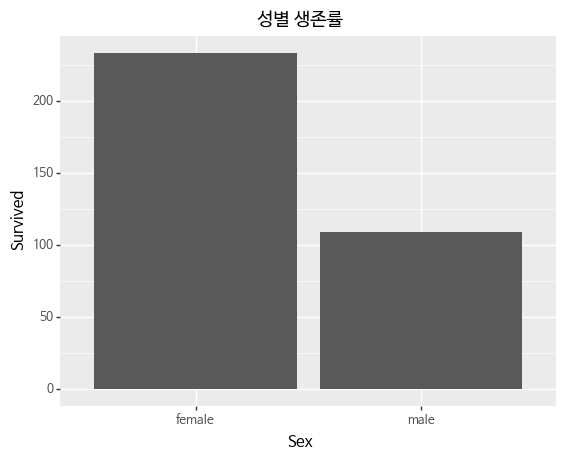
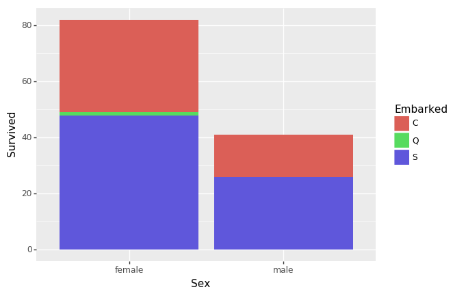
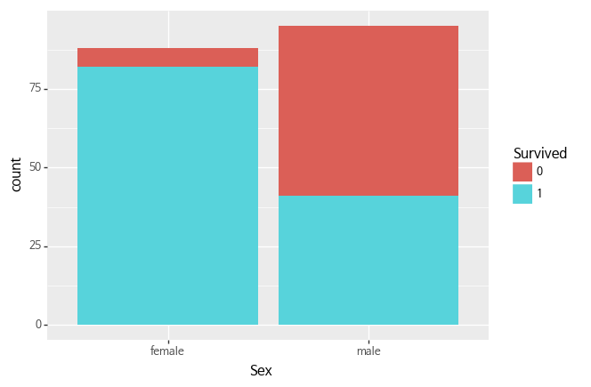
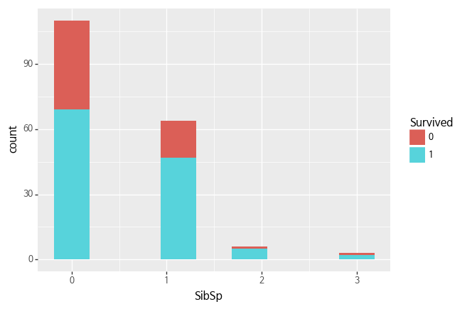
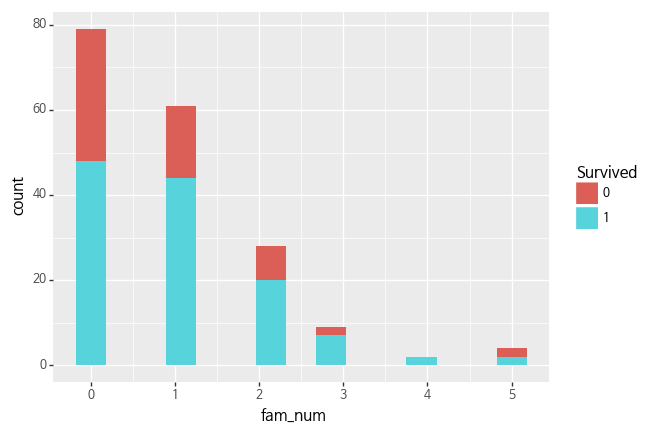

```python
import pandas as pd
import numpy as np
from plotnine import *
```


```python
cd 실습
```

    C:\Users\lunar\dataitgirls\실습
    


```python
train = pd.read_csv('data/train.csv')
train.shape
```


    (891, 12)


```python
test = pd.read_csv('data/test.csv')
test.shape
```


    (418, 11)


```python
(ggplot(train)
 + aes(x='Sex', y='Survived')
 + geom_col()
 + ggtitle('성별 생존률')
+ theme(text=element_text(family='NanumBarunGothic'))
)
```

    C:\Users\lunar\Anaconda3\lib\site-packages\plotnine\utils.py:281: FutureWarning: Method .as_matrix will be removed in a future version. Use .values instead.
      ndistinct = ids.apply(len_unique, axis=0).as_matrix()
    C:\Users\lunar\Anaconda3\lib\site-packages\pandas\core\generic.py:4384: FutureWarning: Attribute 'is_copy' is deprecated and will be removed in a future version.
      object.__getattribute__(self, name)
    C:\Users\lunar\Anaconda3\lib\site-packages\pandas\core\generic.py:4385: FutureWarning: Attribute 'is_copy' is deprecated and will be removed in a future version.
      return object.__setattr__(self, name, value)
    C:\Users\lunar\Anaconda3\lib\site-packages\plotnine\positions\position.py:188: FutureWarning: Method .as_matrix will be removed in a future version. Use .values instead.
      intervals = data[xminmax].drop_duplicates().as_matrix().flatten()
    





    <ggplot: (22174180349)>


```python
train = train.dropna()
```


```python
(ggplot(train)
 + aes(x='Sex', y='Survived', fill='Embarked')
 + geom_col()
)
```

    C:\Users\lunar\Anaconda3\lib\site-packages\plotnine\utils.py:281: FutureWarning: Method .as_matrix will be removed in a future version. Use .values instead.
      ndistinct = ids.apply(len_unique, axis=0).as_matrix()
    C:\Users\lunar\Anaconda3\lib\site-packages\pandas\core\generic.py:4384: FutureWarning: Attribute 'is_copy' is deprecated and will be removed in a future version.
      object.__getattribute__(self, name)
    C:\Users\lunar\Anaconda3\lib\site-packages\pandas\core\generic.py:4385: FutureWarning: Attribute 'is_copy' is deprecated and will be removed in a future version.
      return object.__setattr__(self, name, value)
    C:\Users\lunar\Anaconda3\lib\site-packages\plotnine\positions\position.py:188: FutureWarning: Method .as_matrix will be removed in a future version. Use .values instead.
      intervals = data[xminmax].drop_duplicates().as_matrix().flatten()
    





    <ggplot: (22181092949)>


```python
train.head()
```


<div>
<style scoped>
    .dataframe tbody tr th:only-of-type {
        vertical-align: middle;
    }

    .dataframe tbody tr th {
        vertical-align: top;
    }

    .dataframe thead th {
        text-align: right;
    }
</style>
<table border="1" class="dataframe">
  <thead>
    <tr style="text-align: right;">
      <th></th>
      <th>PassengerId</th>
      <th>Survived</th>
      <th>Pclass</th>
      <th>Name</th>
      <th>Sex</th>
      <th>Age</th>
      <th>SibSp</th>
      <th>Parch</th>
      <th>Ticket</th>
      <th>Fare</th>
      <th>Cabin</th>
      <th>Embarked</th>
    </tr>
  </thead>
  <tbody>
    <tr>
      <th>1</th>
      <td>2</td>
      <td>1</td>
      <td>1</td>
      <td>Cumings, Mrs. John Bradley (Florence Briggs Th...</td>
      <td>female</td>
      <td>38.0</td>
      <td>1</td>
      <td>0</td>
      <td>PC 17599</td>
      <td>71.2833</td>
      <td>C85</td>
      <td>C</td>
    </tr>
    <tr>
      <th>3</th>
      <td>4</td>
      <td>1</td>
      <td>1</td>
      <td>Futrelle, Mrs. Jacques Heath (Lily May Peel)</td>
      <td>female</td>
      <td>35.0</td>
      <td>1</td>
      <td>0</td>
      <td>113803</td>
      <td>53.1000</td>
      <td>C123</td>
      <td>S</td>
    </tr>
    <tr>
      <th>6</th>
      <td>7</td>
      <td>0</td>
      <td>1</td>
      <td>McCarthy, Mr. Timothy J</td>
      <td>male</td>
      <td>54.0</td>
      <td>0</td>
      <td>0</td>
      <td>17463</td>
      <td>51.8625</td>
      <td>E46</td>
      <td>S</td>
    </tr>
    <tr>
      <th>10</th>
      <td>11</td>
      <td>1</td>
      <td>3</td>
      <td>Sandstrom, Miss. Marguerite Rut</td>
      <td>female</td>
      <td>4.0</td>
      <td>1</td>
      <td>1</td>
      <td>PP 9549</td>
      <td>16.7000</td>
      <td>G6</td>
      <td>S</td>
    </tr>
    <tr>
      <th>11</th>
      <td>12</td>
      <td>1</td>
      <td>1</td>
      <td>Bonnell, Miss. Elizabeth</td>
      <td>female</td>
      <td>58.0</td>
      <td>0</td>
      <td>0</td>
      <td>113783</td>
      <td>26.5500</td>
      <td>C103</td>
      <td>S</td>
    </tr>
  </tbody>
</table>
</div>


```python
train['Pclass'] = train['Pclass'].astype('category')


(ggplot(train)
 + aes(x='Age', y='Fare', fill='Pclass')
 + geom_point()
 + ggtitle('생존 여부별 성별 요금 등급 분포')
 + facet_wrap('~Survived')
 + theme(text=element_text(family='NanumBarunGothic'))
)


```

    C:\Users\lunar\Anaconda3\lib\site-packages\ipykernel_launcher.py:1: SettingWithCopyWarning: 
    A value is trying to be set on a copy of a slice from a DataFrame.
    Try using .loc[row_indexer,col_indexer] = value instead
    
    See the caveats in the documentation: http://pandas.pydata.org/pandas-docs/stable/indexing.html#indexing-view-versus-copy
      """Entry point for launching an IPython kernel.
    C:\Users\lunar\Anaconda3\lib\site-packages\plotnine\utils.py:281: FutureWarning: Method .as_matrix will be removed in a future version. Use .values instead.
      ndistinct = ids.apply(len_unique, axis=0).as_matrix()
    C:\Users\lunar\Anaconda3\lib\site-packages\pandas\core\generic.py:4384: FutureWarning: Attribute 'is_copy' is deprecated and will be removed in a future version.
      object.__getattribute__(self, name)
    C:\Users\lunar\Anaconda3\lib\site-packages\pandas\core\generic.py:4385: FutureWarning: Attribute 'is_copy' is deprecated and will be removed in a future version.
      return object.__setattr__(self, name, value)
    


    <ggplot: (-9223372014673399303)>


```python
(ggplot(train)
 + aes(x='Sex', fill='Survived')
 + geom_bar()
 + theme(text=element_text(family='NanumBarunGothic'))
)

# position = "fill"
```

    C:\Users\lunar\Anaconda3\lib\site-packages\plotnine\utils.py:281: FutureWarning: Method .as_matrix will be removed in a future version. Use .values instead.
      ndistinct = ids.apply(len_unique, axis=0).as_matrix()
    C:\Users\lunar\Anaconda3\lib\site-packages\pandas\core\generic.py:4384: FutureWarning: Attribute 'is_copy' is deprecated and will be removed in a future version.
      object.__getattribute__(self, name)
    C:\Users\lunar\Anaconda3\lib\site-packages\pandas\core\generic.py:4385: FutureWarning: Attribute 'is_copy' is deprecated and will be removed in a future version.
      return object.__setattr__(self, name, value)
    C:\Users\lunar\Anaconda3\lib\site-packages\plotnine\positions\position.py:188: FutureWarning: Method .as_matrix will be removed in a future version. Use .values instead.
      intervals = data[xminmax].drop_duplicates().as_matrix().flatten()
    





    <ggplot: (-9223372014673630902)>


```python
C = Cherbourg, Q = Queenstown, S = Southampton

(ggplot(train) 
 + aes(fill='Survived')
 + geom_map(aes(map_id = id), map =world.ggmap, color = "white")
 + expand_limits(x = world.ggmap$long, y = world.ggmap$lat) 
 + theme(text=element_text(family='NanumBarunGothic'))
 + coord_map()
)
```


      File "<ipython-input-48-fc0ef8ce3dae>", line 4
        + expand_limits(x = world.ggmap$long, y = world.ggmap$lat)
                                       ^
    SyntaxError: invalid syntax
    


```python
from ggplot import coord_map
```

    C:\Users\lunar\Anaconda3\lib\site-packages\ggplot\utils.py:81: FutureWarning: pandas.tslib is deprecated and will be removed in a future version.
    You can access Timestamp as pandas.Timestamp
      pd.tslib.Timestamp,
    C:\Users\lunar\Anaconda3\lib\site-packages\ggplot\stats\smoothers.py:4: FutureWarning: The pandas.lib module is deprecated and will be removed in a future version. These are private functions and can be accessed from pandas._libs.lib instead
      from pandas.lib import Timestamp
    


    ---------------------------------------------------------------------------

    ImportError                               Traceback (most recent call last)

    <ipython-input-47-a05d3ce86027> in <module>()
    ----> 1 from ggplot import coord_map
    

    ~\Anaconda3\lib\site-packages\ggplot\__init__.py in <module>()
         18 
         19 from .geoms import geom_area, geom_blank, geom_boxplot, geom_line, geom_point, geom_jitter, geom_histogram, geom_density, geom_hline, geom_vline, geom_bar, geom_abline, geom_tile, geom_rect, geom_bin2d, geom_step, geom_text, geom_path, geom_ribbon, geom_now_its_art, geom_violin, geom_errorbar, geom_polygon
    ---> 20 from .stats import stat_smooth, stat_density
         21 
         22 from .facets import facet_wrap, facet_grid, Facet
    

    ~\Anaconda3\lib\site-packages\ggplot\stats\__init__.py in <module>()
          1 from .stat_density import stat_density
    ----> 2 from .stat_smooth import stat_smooth
    

    ~\Anaconda3\lib\site-packages\ggplot\stats\stat_smooth.py in <module>()
          3 
          4 from ..geoms.geom import geom
    ----> 5 from . import smoothers
          6 from ..utils import is_date
          7 
    

    ~\Anaconda3\lib\site-packages\ggplot\stats\smoothers.py in <module>()
          2                         unicode_literals)
          3 import numpy as np
    ----> 4 from pandas.lib import Timestamp
          5 import pandas as pd
          6 import statsmodels.api as sm
    

    ImportError: cannot import name 'Timestamp'


```python
train.describe()
```


<div>
<style scoped>
    .dataframe tbody tr th:only-of-type {
        vertical-align: middle;
    }

    .dataframe tbody tr th {
        vertical-align: top;
    }

    .dataframe thead th {
        text-align: right;
    }
</style>
<table border="1" class="dataframe">
  <thead>
    <tr style="text-align: right;">
      <th></th>
      <th>PassengerId</th>
      <th>Age</th>
      <th>SibSp</th>
      <th>Parch</th>
      <th>Fare</th>
    </tr>
  </thead>
  <tbody>
    <tr>
      <th>count</th>
      <td>183.000000</td>
      <td>183.000000</td>
      <td>183.000000</td>
      <td>183.000000</td>
      <td>183.000000</td>
    </tr>
    <tr>
      <th>mean</th>
      <td>455.366120</td>
      <td>35.674426</td>
      <td>0.464481</td>
      <td>0.475410</td>
      <td>78.682469</td>
    </tr>
    <tr>
      <th>std</th>
      <td>247.052476</td>
      <td>15.643866</td>
      <td>0.644159</td>
      <td>0.754617</td>
      <td>76.347843</td>
    </tr>
    <tr>
      <th>min</th>
      <td>2.000000</td>
      <td>0.920000</td>
      <td>0.000000</td>
      <td>0.000000</td>
      <td>0.000000</td>
    </tr>
    <tr>
      <th>25%</th>
      <td>263.500000</td>
      <td>24.000000</td>
      <td>0.000000</td>
      <td>0.000000</td>
      <td>29.700000</td>
    </tr>
    <tr>
      <th>50%</th>
      <td>457.000000</td>
      <td>36.000000</td>
      <td>0.000000</td>
      <td>0.000000</td>
      <td>57.000000</td>
    </tr>
    <tr>
      <th>75%</th>
      <td>676.000000</td>
      <td>47.500000</td>
      <td>1.000000</td>
      <td>1.000000</td>
      <td>90.000000</td>
    </tr>
    <tr>
      <th>max</th>
      <td>890.000000</td>
      <td>80.000000</td>
      <td>3.000000</td>
      <td>4.000000</td>
      <td>512.329200</td>
    </tr>
  </tbody>
</table>
</div>


```python
(ggplot(train)
 + aes(x='SibSp',  fill='Survived')
 + geom_histogram()
 + theme(text=element_text(family='NanumBarunGothic'))
)

```

    C:\Users\lunar\Anaconda3\lib\site-packages\plotnine\utils.py:281: FutureWarning: Method .as_matrix will be removed in a future version. Use .values instead.
      ndistinct = ids.apply(len_unique, axis=0).as_matrix()
    C:\Users\lunar\Anaconda3\lib\site-packages\plotnine\stats\stat_bin.py:90: UserWarning: 'stat_bin()' using 'bins = 9'. Pick better value with 'binwidth'.
      warn(msg.format(params['bins']))
    C:\Users\lunar\Anaconda3\lib\site-packages\pandas\core\generic.py:4384: FutureWarning: Attribute 'is_copy' is deprecated and will be removed in a future version.
      object.__getattribute__(self, name)
    C:\Users\lunar\Anaconda3\lib\site-packages\pandas\core\generic.py:4385: FutureWarning: Attribute 'is_copy' is deprecated and will be removed in a future version.
      return object.__setattr__(self, name, value)
    C:\Users\lunar\Anaconda3\lib\site-packages\plotnine\positions\position.py:188: FutureWarning: Method .as_matrix will be removed in a future version. Use .values instead.
      intervals = data[xminmax].drop_duplicates().as_matrix().flatten()
    





    <ggplot: (22174366966)>


```python
train['fam_num'] = train['SibSp'] + train['Parch']
```

    C:\Users\lunar\Anaconda3\lib\site-packages\ipykernel_launcher.py:1: SettingWithCopyWarning: 
    A value is trying to be set on a copy of a slice from a DataFrame.
    Try using .loc[row_indexer,col_indexer] = value instead
    
    See the caveats in the documentation: http://pandas.pydata.org/pandas-docs/stable/indexing.html#indexing-view-versus-copy
      """Entry point for launching an IPython kernel.
    


```python
train.head()
```


<div>
<style scoped>
    .dataframe tbody tr th:only-of-type {
        vertical-align: middle;
    }

    .dataframe tbody tr th {
        vertical-align: top;
    }

    .dataframe thead th {
        text-align: right;
    }
</style>
<table border="1" class="dataframe">
  <thead>
    <tr style="text-align: right;">
      <th></th>
      <th>PassengerId</th>
      <th>Survived</th>
      <th>Pclass</th>
      <th>Name</th>
      <th>Sex</th>
      <th>Age</th>
      <th>SibSp</th>
      <th>Parch</th>
      <th>Ticket</th>
      <th>Fare</th>
      <th>Cabin</th>
      <th>Embarked</th>
      <th>fam_num</th>
    </tr>
  </thead>
  <tbody>
    <tr>
      <th>1</th>
      <td>2</td>
      <td>1</td>
      <td>1</td>
      <td>Cumings, Mrs. John Bradley (Florence Briggs Th...</td>
      <td>female</td>
      <td>38.0</td>
      <td>1</td>
      <td>0</td>
      <td>PC 17599</td>
      <td>71.2833</td>
      <td>C85</td>
      <td>C</td>
      <td>1</td>
    </tr>
    <tr>
      <th>3</th>
      <td>4</td>
      <td>1</td>
      <td>1</td>
      <td>Futrelle, Mrs. Jacques Heath (Lily May Peel)</td>
      <td>female</td>
      <td>35.0</td>
      <td>1</td>
      <td>0</td>
      <td>113803</td>
      <td>53.1000</td>
      <td>C123</td>
      <td>S</td>
      <td>1</td>
    </tr>
    <tr>
      <th>6</th>
      <td>7</td>
      <td>0</td>
      <td>1</td>
      <td>McCarthy, Mr. Timothy J</td>
      <td>male</td>
      <td>54.0</td>
      <td>0</td>
      <td>0</td>
      <td>17463</td>
      <td>51.8625</td>
      <td>E46</td>
      <td>S</td>
      <td>0</td>
    </tr>
    <tr>
      <th>10</th>
      <td>11</td>
      <td>1</td>
      <td>3</td>
      <td>Sandstrom, Miss. Marguerite Rut</td>
      <td>female</td>
      <td>4.0</td>
      <td>1</td>
      <td>1</td>
      <td>PP 9549</td>
      <td>16.7000</td>
      <td>G6</td>
      <td>S</td>
      <td>2</td>
    </tr>
    <tr>
      <th>11</th>
      <td>12</td>
      <td>1</td>
      <td>1</td>
      <td>Bonnell, Miss. Elizabeth</td>
      <td>female</td>
      <td>58.0</td>
      <td>0</td>
      <td>0</td>
      <td>113783</td>
      <td>26.5500</td>
      <td>C103</td>
      <td>S</td>
      <td>0</td>
    </tr>
  </tbody>
</table>
</div>


```python
(ggplot(train)
 + aes(x='fam_num',  fill='Survived')
 + geom_histogram()
 + theme(text=element_text(family='NanumBarunGothic'))
)

```

    C:\Users\lunar\Anaconda3\lib\site-packages\plotnine\utils.py:281: FutureWarning: Method .as_matrix will be removed in a future version. Use .values instead.
      ndistinct = ids.apply(len_unique, axis=0).as_matrix()
    C:\Users\lunar\Anaconda3\lib\site-packages\plotnine\stats\stat_bin.py:90: UserWarning: 'stat_bin()' using 'bins = 15'. Pick better value with 'binwidth'.
      warn(msg.format(params['bins']))
    C:\Users\lunar\Anaconda3\lib\site-packages\pandas\core\generic.py:4384: FutureWarning: Attribute 'is_copy' is deprecated and will be removed in a future version.
      object.__getattribute__(self, name)
    C:\Users\lunar\Anaconda3\lib\site-packages\pandas\core\generic.py:4385: FutureWarning: Attribute 'is_copy' is deprecated and will be removed in a future version.
      return object.__setattr__(self, name, value)
    C:\Users\lunar\Anaconda3\lib\site-packages\plotnine\positions\position.py:188: FutureWarning: Method .as_matrix will be removed in a future version. Use .values instead.
      intervals = data[xminmax].drop_duplicates().as_matrix().flatten()
    





    <ggplot: (-9223372014673640262)>


```python
test['Survived'] = 0 
```


```python
test.shape
```


    (418, 12)


```python
test['Survived'] = (test['Sex'] == 'male') \
                    | (test['Age'] <= 30) \
                   | ( train['SibSp'] + train['Parch'] <= 1)
```


```python
test['Survived'].value_counts()
```


    True     351
    False     67
    Name: Survived, dtype: int64


```python
test.columns
```


    Index(['PassengerId', 'Pclass', 'Name', 'Sex', 'Age', 'SibSp', 'Parch',
           'Ticket', 'Fare', 'Cabin', 'Embarked', 'Survived'],
          dtype='object')


```python
submission = test[['PassengerId', 'Survived']]
```


```python
submission.head()
```


<div>
<style scoped>
    .dataframe tbody tr th:only-of-type {
        vertical-align: middle;
    }

    .dataframe tbody tr th {
        vertical-align: top;
    }

    .dataframe thead th {
        text-align: right;
    }
</style>
<table border="1" class="dataframe">
  <thead>
    <tr style="text-align: right;">
      <th></th>
      <th>PassengerId</th>
      <th>Survived</th>
    </tr>
  </thead>
  <tbody>
    <tr>
      <th>0</th>
      <td>892</td>
      <td>True</td>
    </tr>
    <tr>
      <th>1</th>
      <td>893</td>
      <td>True</td>
    </tr>
    <tr>
      <th>2</th>
      <td>894</td>
      <td>True</td>
    </tr>
    <tr>
      <th>3</th>
      <td>895</td>
      <td>True</td>
    </tr>
    <tr>
      <th>4</th>
      <td>896</td>
      <td>True</td>
    </tr>
  </tbody>
</table>
</div>


```python
submission['Survived'] = submission['Survived'].astype(int)
```

    C:\Users\lunar\Anaconda3\lib\site-packages\ipykernel_launcher.py:1: SettingWithCopyWarning: 
    A value is trying to be set on a copy of a slice from a DataFrame.
    Try using .loc[row_indexer,col_indexer] = value instead
    
    See the caveats in the documentation: http://pandas.pydata.org/pandas-docs/stable/indexing.html#indexing-view-versus-copy
      """Entry point for launching an IPython kernel.
    


```python
submission.to_csv('submissions/submission_male_30.csv', index=False)
```


```python
%ls submissions
```

     C 드라이브의 볼륨에는 이름이 없습니다.
     볼륨 일련 번호: 58AE-615E
    
     C:\Users\lunar\dataitgirls\실습\submissions 디렉터리
    
    2018-08-16  오후 04:39    <DIR>          .
    2018-08-16  오후 04:39    <DIR>          ..
    2018-08-16  오후 04:39             3,258 submission_female_9.csv
    2018-08-16  오후 04:39             3,258 submission_male_30.csv
    2018-08-13  오후 07:57             3,258 submissions.csv
                   3개 파일               9,774 바이트
                   2개 디렉터리  44,564,197,376 바이트 남음
    


```python
s = pd.read_csv('submissions/submission_male_30.csv', encoding='euc-kr')
s.head()
```


<div>
<style scoped>
    .dataframe tbody tr th:only-of-type {
        vertical-align: middle;
    }

    .dataframe tbody tr th {
        vertical-align: top;
    }

    .dataframe thead th {
        text-align: right;
    }
</style>
<table border="1" class="dataframe">
  <thead>
    <tr style="text-align: right;">
      <th></th>
      <th>PassengerId</th>
      <th>Survived</th>
    </tr>
  </thead>
  <tbody>
    <tr>
      <th>0</th>
      <td>892</td>
      <td>1</td>
    </tr>
    <tr>
      <th>1</th>
      <td>893</td>
      <td>1</td>
    </tr>
    <tr>
      <th>2</th>
      <td>894</td>
      <td>1</td>
    </tr>
    <tr>
      <th>3</th>
      <td>895</td>
      <td>1</td>
    </tr>
    <tr>
      <th>4</th>
      <td>896</td>
      <td>1</td>
    </tr>
  </tbody>
</table>
</div>


